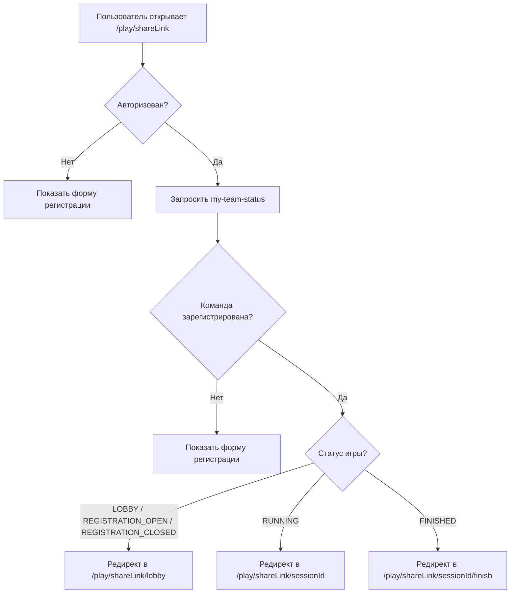
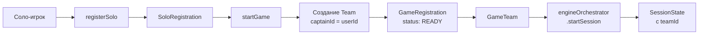

> **Дата:** 05.07.2026
> **Статус:** Утвержден
> **Версия:** 1.1
> **Класс:** Архитектурный контракт (10/10)
> **Цель:** Описать полный игровой процесс — от регистрации команды до финиша.

---

## 1. Общая схема
СОЗДАНИЕ → ПУБЛИКАЦИЯ → РЕГИСТРАЦИЯ → ОЖИДАНИЕ → ЗАПУСК → ИГРА → ФИНИШ → ОТЗЫВЫ
│ │ │ │
▼ ▼ ▼ ▼
Команды Лобби RUNNING Результаты
регистрир. (LOBBY) (игра) (FINISHED)

text

---

## 2. Роли в игровом процессе

| Роль | Кто | Что делает |
|------|-----|------------|
| **Организатор** | Создатель игры | Управляет игрой: запускает, завершает, видит статусы команд |
| **Капитан** | Игрок, создавший команду | Регистрирует команду, управляет составом |
| **Игрок** | Участник команды | Проходит задания, отвечает, получает очки |
| **Наблюдатель** | (опционально) | Может смотреть ход игры, но не участвовать |

---

## 3. Состояния игры

| Статус игры | Что видит игрок | Что делает организатор |
|-------------|-----------------|------------------------|
| **DRAFT** | Не видна (не в каталоге) | Редактирует настройки, сценарий; публикует игру |
| **PUBLISHED** | Игра в каталоге, можно регистрироваться | Управляет настройками, видит список команд |
| **REGISTRATION_OPEN** | Кнопка "Зарегистрировать команду" | Открывает/закрывает регистрацию |
| **REGISTRATION_CLOSED** | Регистрация закрыта, ожидание старта | Видит финальный состав, готовится к запуску |
| **LOBBY** | "Игра скоро начнется", чат с командой | Нажимает "Старт", когда команды готовы |
| **RUNNING** | Проходит задания, видит счёт и таймер | Видит прогресс команд, может завершить игру |
| **FINISHED** | Видит результаты, может оставить отзыв | Видит статистику, может завершить игру |

---

## 4. Путь игрока

### 4.1. Регистрация команды

1. Игрок находит игру в каталоге → переходит на страницу игры
2. Нажимает **"Зарегистрировать команду"**
3. Вводит название команды
4. (Опционально) Приглашает других игроков по ссылке
5. После регистрации — попадает в **лобби** игры

**Что видит игрок:**
┌──────────────────────────────────────┐
│ 🎮 Тайны старого города │
│ ───────────────────────────────────│
│ Статус: Ожидание начала │
│ Команда: "Ночные волки" │
│ Участники: Алексей (капитан), Мария│
│ │
│ Зарегистрированные команды: │
│ - Ночные волки (2 игрока) │
│ - Спецназ (3 игрока) │
│ │
│ [📤 Пригласить друга] │
│ [👋 Покинуть игру] │
└──────────────────────────────────────┘

text

### 4.2. Ожидание старта (LOBBY)

1. Игрок видит список всех команд
2. Может общаться в общем чате
3. Получает уведомление, когда организатор запускает игру

**Правила:**
- Игрок не может выйти из игры после старта
- Капитан может управлять составом до старта
- Организатор видит статус "готовности" команд

### 4.3. Прохождение игры (RUNNING)

1. После старта — игрок видит **первое задание**
2. Читает вопрос/описание
3. Вводит ответ (текст, код, фото, выбор и т.д.)
4. Нажимает **"Отправить"**
5. Получает мгновенный фидбек (правильно/неправильно)
6. Переходит к следующему заданию

**Интерфейс игрока:**
┌──────────────────────────────────────┐
│ 🎮 Тайны старого города │
│ ───────────────────────────────────│
│ Команда: Ночные волки │
│ Счёт: 30 | ⏱ 14:32 │
│ │
│ ┌────────────────────────────────┐ │
│ │ 📋 Задание 2 из 5 │ │
│ │ Найдите код на колонне │ │
│ │ 💡 Подсказка: колонна с львами│ │
│ │ ⏱ Осталось: 2:30 │ │
│ │ [ Введите код ] │ │
│ │ [ 📤 Отправить ] │ │
│ └────────────────────────────────┘ │
└──────────────────────────────────────┘

text

**Правила прохождения:**
- Задания выдаются последовательно (линейно)
- На каждое задание может быть ограничение по времени
- Использование подсказок — штраф (если настроено)
- При правильном ответе — начисляются очки
- При неправильном — можно попробовать снова (если разрешено)

### 4.4. Завершение игры (FINISHED)

1. Игрок проходит последнее задание → видит экран финиша
2. Итоговый счёт, время, место в рейтинге
3. Предложение оставить отзыв на игру
4. Ссылка на каталог игр

**Экран финиша:**
┌──────────────────────────────────────┐
│ 🏁 ПОЗДРАВЛЯЕМ! │
│ │
│ Вы прошли игру! │
│ │
│ ⭐ Счёт: 50 │
│ ⏱ Время: 1 час 15 минут │
│ 📍 Место: 3 из 8 команд │
│ │
│ Статистика: │
│ ✅ Правильных: 4 из 5 │
│ 💡 Подсказок: 1 │
│ │
│ [📝 Оставить отзыв] │
│ [🏠 Вернуться к списку игр] │
└──────────────────────────────────────┘

text

---

## 5. Путь организатора

### 5.1. До старта (LOBBY)

1. Организатор видит **все зарегистрированные команды**
2. Видит статус "готовности" каждой команды
3. Может **запустить игру**, когда готов

**Интерфейс организатора:**
┌──────────────────────────────────────┐
│ 🎮 Управление игрой │
│ ───────────────────────────────────│
│ Игра: Тайны старого города │
│ Статус: Ожидание старта │
│ │
│ Команды (4): │
│ ✅ Ночные волки (готовы) │
│ ⏳ Спецназ (не готовы) │
│ ✅ Странники (готовы) │
│ ⏳ Искатели (не готовы) │
│ │
│ [🚀 Запустить игру] │
└──────────────────────────────────────┘

text

### 5.2. Во время игры (RUNNING)

1. Организатор видит **прогресс всех команд**
2. Видит их ответы (особенно фото)
3. Может **отвечать на вопросы** игроков в чате
4. Может **принудительно завершить** игру

**Интерфейс организатора:**
┌──────────────────────────────────────┐
│ 📊 Прогресс игры │
│ ───────────────────────────────────│
│ Ночные волки ████████░░ 4/5 45 │
│ Спецназ ██████░░░░ 3/5 30 │
│ Странники ████░░░░░░ 2/5 20 │
│ │
│ 📷 Новые фото на проверку: 2 │
│ 💬 Вопросов от игроков: 1 │
│ │
│ [⏹ Завершить игру] │
└──────────────────────────────────────┘

text

### 5.3. После игры (FINISHED)

1. Организатор видит **итоговую статистику**
2. Результаты команд (счёт, время, место)
3. Может **сделать игру архивной** или **удалить**

---

## 6. Чат во время игры

| Режим | Кто пишет | Кто видит |
|-------|-----------|-----------|
| **До игры (LOBBY)** | Все | Все участники игры |
| **Во время игры (RUNNING)** | Только организатор → игроки (личные сообщения) | Получатель |
| **После игры (FINISHED)** | Все | Все участники игры |

---

## 7. Ошибки и их обработка

| Ситуация | Что видит игрок |
|----------|-----------------|
| Нет интернета | "Офлайн режим. Ответ будет отправлен при соединении" |
| Неправильный ответ | "❌ Неправильно. Попробуйте ещё раз" |
| Истекло время | "⏰ Время вышло. Переходим к следующему заданию" |
| Организатор завершил игру | "🏁 Игра завершена организатором" |

---

## 8. Сценарии повторного входа (Re-entry)

### 8.1. Проблема
Пользователь может:
- Закрыть вкладку после регистрации и вернуться позже
- Потерять соединение (телефон сел)
- Зайти с другого устройства
- Попасть на страницу регистрации, хотя команда уже зарегистрирована

### 8.2. Механизм

**Эндпоинт:** `GET /games/:id/my-team-status` (auth required)

Проверяет для текущего пользователя:
- Какие его команды зарегистрированы на эту игру
- Статус регистрации (REGISTERED/READY)
- Статус игры
- Если игра RUNNING — возвращает sessionId (последняя SessionState для teamId)

**Ответ:**
```json
{
  "registered": true,
  "teamId": "uuid",
  "teamName": "Команда",
  "registrationStatus": "REGISTERED",
  "gameStatus": "RUNNING",
  "sessionId": "uuid"
}
```

### 8.3. Логика страницы `/play/[shareLink]`



### 8.4. Эндпоинты для повторного входа

| Метод | Путь | Описание |
|-------|------|----------|
| GET | `/games/:id/my-team-status` | Статус команды пользователя |
| GET | `/sessions/by-team/:teamId/game/:gameId` | Получение sessionId для восстановления |

### 8.5. Сценарии

**Сценарий 1: Первая регистрация**
1. Пользователь открывает `/play/shareLink`
2. `my-team-status` → `registered: false`
3. Показывается форма регистрации
4. После регистрации → `router.replace(/play/shareLink/lobby)`

**Сценарий 2: Повторный вход до старта**
1. Пользователь закрыл вкладку после регистрации
2. Снова открывает `/play/shareLink`
3. `my-team-status` → `registered: true, gameStatus: LOBBY`
4. Авто-редирект в `/play/shareLink/lobby`

**Сценарий 3: Повторный вход во время игры**
1. Игра RUNNING, пользователь закрыл вкладку
2. Открывает `/play/shareLink` с другого устройства
3. `my-team-status` → `registered: true, gameStatus: RUNNING, sessionId: "uuid"`
4. Авто-редирект в `/play/shareLink/uuid`

**Сценарий 4: Повторный вход после игры**
1. Игра FINISHED
2. Пользователь открывает `/play/shareLink`
3. `my-team-status` → `registered: true, gameStatus: FINISHED, sessionId: "uuid"`
4. Авто-редирект в `/play/shareLink/uuid/finish`

---

## 9. Архитектурные правила

1. **Игра — Aggregate Root.** Все изменения проходят через Game Service.
2. **Engine — единственный источник истины.** Все состояния игроков хранятся в движке.
3. **Игрок не может начать игру до старта.** Старт только от организатора.
4. **Все ответы сохраняются.** Это нужно для аудита и аналитики.
5. **Игрок видит только свои задания.** Не может подглядывать за другими.
6. **Организатор видит всё.** Прогресс всех команд, ответы, чат.
7. **Повторный вход — через my-team-status.** Страница регистрации проверяет статус команды и редиректит.
8. **SessionId восстанавливается.** Если игра RUNNING, sessionId берётся из `state.sessionId` JSON-поля последней SessionState (не из `snapshot.id`).
9. **Сессии создаются при старте игры.** `startGame()` вызывает `engineOrchestrator.startSession()` для каждой зарегистрированной команды.
10. **Fallback-баннер.** Если авто-редирект не сработал, страница регистрации показывает кнопку "Перейти в лобби/игру".

### 9.1. Важное исправление: sessionId

`sessionId` для страницы прохождения (`/play/:shareLink/:sessionId`) — это Engine UUID, который генерируется в `engineOrchestrator.startSession()` и сохраняется внутри JSON-поля `state` как `state.sessionId`. Prisma `SessionState.id` — это другой UUID (ID записи в БД), он НЕ используется для навигации.

**Где берётся правильный sessionId:**
- `getMyTeamStatus()` — читает `snapshot.state.sessionId`
- `getMyActiveRegistrations()` — читает `snapshot.state.sessionId`
- `getSessionByTeamAndGame()` — читает `snapshot.state.sessionId`

### 9.2. Важное исправление: создание сессий

При запуске игры (`startGame()`) сессии создаются автоматически для всех зарегистрированных команд. Раньше сессии создавались только через `POST /sessions`, который никто не вызывал при старте.

```typescript
// В startGame() после обновления статуса на RUNNING:
const registrations = await this.prisma.gameRegistration.findMany({
  where: { gameId },
  include: { team: { select: { name: true } } },
});
for (const reg of registrations) {
  await this.engineOrchestrator.startSession(reg.teamId, gameId, reg.team.name, startNodeId);
}
```

---

## 10. Чек-лист для проверки

- [ ] Игрок может зарегистрировать команду
- [ ] Игрок видит лобби
- [ ] Организатор запускает игру
- [ ] Игрок видит первое задание
- [ ] Игрок отправляет ответ
- [ ] Игрок получает фидбек
- [ ] Игрок видит финиш
- [ ] Игрок оставляет отзыв
- [ ] Организатор видит прогресс команд
- [ ] Организатор завершает игру
- [ ] Повторный вход: зарегистрирован → редирект в лобби
- [ ] Повторный вход: RUNNING → редирект на сессию
- [ ] Повторный вход: FINISHED → редирект на финиш
- [ ] State Machine: PUBLISHED → RUNNING (прямой запуск)
- [ ] State Machine: REGISTRATION_OPEN → RUNNING (прямой запуск)
- [ ] sessionId = state.sessionId (не snapshot.id)
- [ ] startGame() создаёт сессии для всех команд
- [ ] Fallback-баннер на странице регистрации
- [ ] Бейдж "Вы участвуете" на GameCard
- [ ] MyActiveGames в сетке 4 колонки

---

## 11. Соло-режим (Solo Mode)

### 11.1. Концепция

Соло-режим позволяет игроку участвовать в игре **индивидуально**, без создания или вступления в команду. Организатор выбирает режим при создании игры (`TEAM | SOLO`), и он не может быть изменён после.

### 11.2. Модель данных

```prisma
enum GameMode {
  TEAM
  SOLO
}

model Game {
  // ... существующие поля
  mode              GameMode          @default(TEAM) @map("mode")
  soloRegistrations SoloRegistration[]
}

model SoloRegistration {
  id        String         @id @default(cuid())
  gameId    String
  userId    String
  status    SoloRegStatus  @default(REGISTERED)
  readyAt   DateTime?
  createdAt DateTime       @default(now())
  updatedAt DateTime       @updatedAt

  game Game @relation(fields: [gameId], references: [id], onDelete: Cascade)
  user User @relation(fields: [userId], references: [id], onDelete: Cascade)

  @@unique([gameId, userId])
  @@map("solo_registrations")
}

enum SoloRegStatus {
  REGISTERED
  READY
}
```

### 11.3. Архитектурное решение: виртуальные команды

**Проблема:** `EngineOrchestrator`, `SessionState`, `EventStore` и все плагины работают с `teamId`. Переписывать их для поддержки `userId` напрямую — слишком дорого и рискованно.

**Решение:** При `startGame()` для каждого соло-игрока создаётся **виртуальная команда** — одноразовая `Team` с `captainId = userId`. Это позволяет:

- Не менять `EngineOrchestrator` — он продолжает работать с `teamId`
- Не менять `SessionState` — состояние хранится по `teamId`
- Не менять плагины — все они получают `teamId`
- Не менять `EventStore` — события привязаны к `teamId`



### 11.4. Flow соло-игрока

```
СОЗДАНИЕ (mode: SOLO) → ПУБЛИКАЦИЯ → РЕГИСТРАЦИЯ → ЛОББИ → СТАРТ → ИГРА → ФИНИШ
                              ↓               ↓        ↓        ↓       ↓
                         Игрок видит     Кнопка     Список    Сессии   Результаты
                         игру в каталоге "Участвовать игроков   созданы  (как у команд)
                                           соло"               автом.
```

#### 11.4.1. Регистрация

1. Игрок находит игру в каталоге → переходит на страницу игры
2. Если `game.mode === 'SOLO'` → видит кнопку **"🎯 Участвовать соло"**
3. Нажимает → вызывается `POST /games/:id/register-solo`
4. Создаётся `SoloRegistration` со статусом `REGISTERED`
5. Редирект в `/play/:shareLink/lobby`

#### 11.4.2. Лобби (LOBBY)

- Игрок видит заголовок **"Зарегистрированные игроки"** (вместо "Команды")
- У каждого игрока бейдж **"✅ Зарегистрирован"** (без статуса готовности)
- Нет кнопки "Готов" — для соло-режима готовность не требуется
- Организатор видит тот же список в панели управления

#### 11.4.3. Старт игры (RUNNING)

При `startGame()` для каждого соло-игрока:

1. Создаётся `Team` с `captainId = userId` и именем `"Соло: {user.name}"`
2. Создаётся `GameRegistration` со статусом `READY`
3. Создаётся `GameTeam`
4. Вызывается `engineOrchestrator.startSession(teamId, gameId, teamName, startNodeId)`

Игрок получает `sessionId` через `getMyTeamStatus()` и переходит на страницу прохождения.

### 11.5. Эндпоинты

| Метод | Путь | Описание |
|-------|------|----------|
| POST | `/games/:id/register-solo` | Регистрация соло-игрока |
| GET | `/games/:id/my-team-status` | Возвращает `registered: true, teamId: null` для соло |
| GET | `/games/:id/teams-status` | Возвращает список соло-регистраций (для организатора) |
| GET | `/games/my-active-registrations` | Возвращает соло-регистрации с `teamId: null, teamName: 'Соло'` |

### 11.6. Изменения в существующих методах

| Метод | Изменение |
|-------|-----------|
| `createGame()` | Сохраняет `mode: 'TEAM' \| 'SOLO'` |
| `findOnePublic()` | Проверяет `SoloRegistration` для `isRegistered` |
| `startGame()` | Для SOLO: проверяет `soloRegistration.count()`, создаёт виртуальные команды |
| `getMyTeamStatus()` | Проверяет `SoloRegistration`, возвращает `teamId: null` |
| `getMyActiveRegistrations()` | Возвращает соло-регистрации + командные |
| `getTeamsStatus()` | Для SOLO: возвращает список соло-регистраций |
| `areAllTeamsReady()` | Для SOLO: всегда `true` |

### 11.7. Чек-лист для соло-режима

- [ ] Организатор может создать игру в SOLO-режиме
- [ ] Игрок видит кнопку "Участвовать соло" на странице игры
- [ ] Игрок может зарегистрироваться (POST register-solo)
- [ ] Игрок видит лобби со списком участников
- [ ] Организатор видит участников в панели управления
- [ ] При старте создаются виртуальные команды
- [ ] Игрок может проходить игру (сессия создана)
- [ ] Повторный вход работает (my-team-status → редирект)
- [ ] findOnePublic() корректно показывает isRegistered для соло
- [ ] MyActiveGames показывает соло-регистрации
- [ ] ActiveGameBanner показывает соло-регистрации