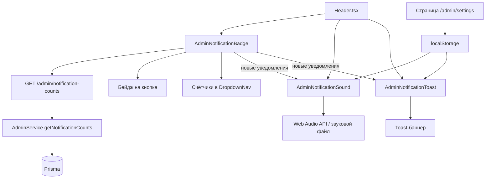
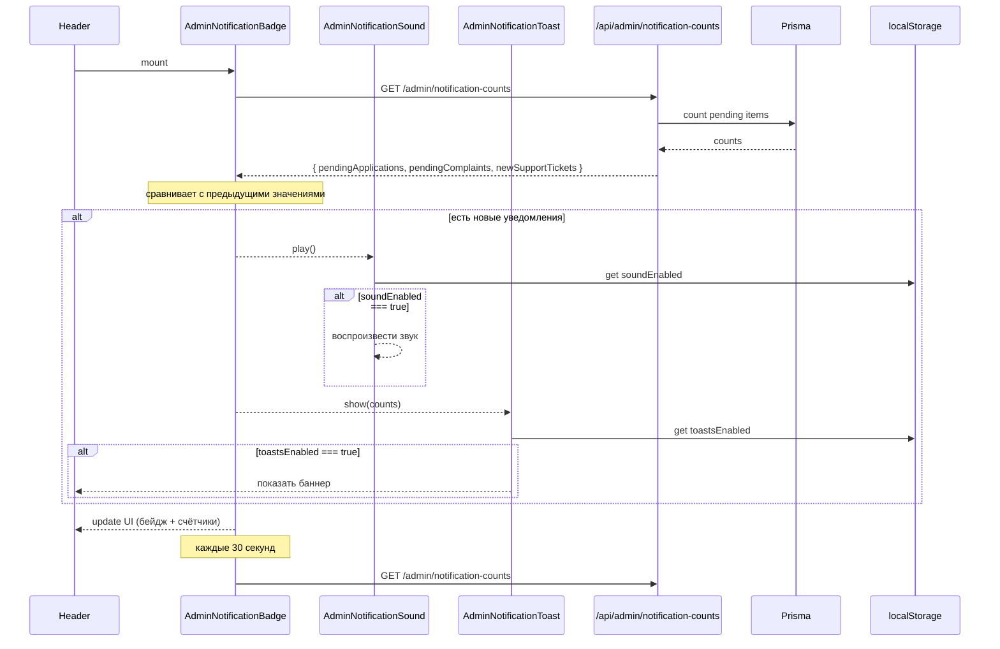

# План: Рефакторинг админ-панели и система уведомлений для администраторов

## 1. Текущая ситуация

### Проблемы:
1. **Страница заявок организаторов** находится по адресу `/admin/organizers/applications`, а должна быть по адресу `/admin/requests`
2. **В выпадающем списке "Администрирование"** в шапке нет пункта "Жалобы" (хотя страница `/admin/complaints` существует)
3. **Нет системы уведомлений** для администраторов/модераторов о новых поступлениях (заявки, жалобы, тикеты поддержки)
4. **Нет индикатора** в шапке, показывающего, что есть новые элементы в админке
5. **Нет звуковых оповещений** при новых админ-уведомлениях
6. **Нет баннеров** (toast-уведомлений) при новых поступлениях
7. **Нет настроек** для включения/отключения звука и баннеров

## 2. План изменений

---

### Задача 1: Переименовать роут заявок
**Суть**: Переместить страницу с `/admin/organizers/applications` на `/admin/requests`

**Действия**:
1. Создать директорию `apps/web/src/app/admin/requests/`
2. Создать файл `apps/web/src/app/admin/requests/page.tsx` — скопировать содержимое из `apps/web/src/app/admin/organizers/applications/page.tsx`
3. Обновить все внутренние ссылки в файле (если есть самоссылки)
4. Удалить старую директорию `apps/web/src/app/admin/organizers/applications/`

**Файлы**:
- `apps/web/src/app/admin/requests/page.tsx` — **создать**
- `apps/web/src/app/admin/organizers/applications/page.tsx` — **удалить**

---

### Задача 2: Обновить AdminNav
**Суть**: Исправить ссылку на заявки

**Действия**:
1. В `apps/web/src/components/admin/AdminNav.tsx` изменить `href: '/admin/organizers/applications'` на `href: '/admin/requests'`

**Файлы**:
- `apps/web/src/components/admin/AdminNav.tsx` — **изменить**

---

### Задача 3: Обновить Header — добавить "Жалобы"
**Суть**: Добавить пункт "Жалобы" в выпадающий список администрирования в шапке

**Действия**:
1. В `apps/web/src/components/ui/Header.tsx` в массив `adminDropdownItems` (строка 182) добавить:
   ```ts
   { label: 'Жалобы', href: '/admin/complaints' },
   ```
   после "Все игры" и перед "Заявки"

**Файлы**:
- `apps/web/src/components/ui/Header.tsx` — **изменить**

---

### Задача 4: Бэкенд — добавить `pendingComplaints` в stats
**Суть**: Добавить подсчёт новых жалоб в админской статистике

**Действия**:
1. В `apps/api/src/modules/admin/admin.service.ts` в метод `getStats()` добавить:
   ```ts
   const pendingComplaints = await this.prisma.complaint.count({
     where: { status: 'PENDING' },
   });
   ```
2. Добавить `pendingComplaints` в возвращаемый объект

**Файлы**:
- `apps/api/src/modules/admin/admin.service.ts` — **изменить**

---

### Задача 5: Бэкенд — новый эндпоинт `/admin/notification-counts`
**Суть**: Создать эндпоинт, который возвращает количества новых элементов для админ-панели

**Действия**:
1. В `AdminService` добавить метод `getNotificationCounts()`:
   ```ts
   async getNotificationCounts() {
     const [pendingApplications, pendingComplaints, newSupportTickets] = await Promise.all([
       this.prisma.organizerApplication.count({ where: { status: 'PENDING' } }),
       this.prisma.complaint.count({ where: { status: 'PENDING' } }),
       this.prisma.supportTicket.count({ where: { status: 'NEW' } }),
     ]);
     return { pendingApplications, pendingComplaints, newSupportTickets };
   }
   ```
2. В `AdminController` добавить эндпоинт:
   ```ts
   @Get('notification-counts')
   @Roles('ADMIN', 'MODERATOR')
   async getNotificationCounts() {
     return this.adminService.getNotificationCounts();
   }
   ```

**Файлы**:
- `apps/api/src/modules/admin/admin.service.ts` — **изменить**
- `apps/api/src/modules/admin/admin.controller.ts` — **изменить**

---

### Задача 6: Фронтенд — API-метод `getAdminNotificationCounts`
**Суть**: Добавить метод в ApiClient для получения количества уведомлений

**Действия**:
1. В `apps/web/src/lib/api/client.ts` добавить:
   ```ts
   async getAdminNotificationCounts(): Promise<ApiResponse<{
     pendingApplications: number;
     pendingComplaints: number;
     newSupportTickets: number;
   }>> {
     return this.request('/admin/notification-counts');
   }
   ```

**Файлы**:
- `apps/web/src/lib/api/client.ts` — **изменить**

---

### Задача 7: Фронтенд — компонент `AdminNotificationBadge`
**Суть**: Создать компонент, который отображает индикатор на кнопке "Администрирование" и бейджи в выпадающем списке

**Действия**:
1. Создать файл `apps/web/src/components/header/AdminNotificationBadge.tsx`
2. Компонент должен:
   - При монтировании и каждые 30 секунд запрашивать `GET /admin/notification-counts`
   - Показывать **красную точку/бейдж** на кнопке "Администрирование", если есть хотя бы одно новое уведомление
   - В выпадающем списке рядом с каждым пунктом показывать количество (например, "Жалобы — 2")
   - При клике на пункт сбрасывать счётчик для этой категории (опционально)

**Файлы**:
- `apps/web/src/components/header/AdminNotificationBadge.tsx` — **создать**

---

### Задача 8: Интеграция в Header
**Суть**: Добавить индикатор на кнопку "Администрирование" и бейджи в выпадающий список

**Действия**:
1. В `Header.tsx`:
   - Импортировать `AdminNotificationBadge`
   - В компоненте `DropdownNav` добавить пропс для counts
   - Модифицировать `adminDropdownItems` — добавить ключи для идентификации
   - В `DropdownNav` для админки показывать бейджи с количеством рядом с пунктами
   - На кнопке "Администрирование" показывать красную точку, если есть новые уведомления

**Файлы**:
- `apps/web/src/components/ui/Header.tsx` — **изменить**

---

### Задача 9: Обновить дашборд
**Суть**: Исправить ссылки на дашборде с `/admin/organizers/applications` на `/admin/requests`

**Действия**:
1. В `apps/web/src/app/admin/dashboard/page.tsx`:
   - Строка 140: `href="/admin/organizers/applications"` → `href="/admin/requests"`
   - Строка 195: `href="/admin/organizers/applications"` → `href="/admin/requests"`

**Файлы**:
- `apps/web/src/app/admin/dashboard/page.tsx` — **изменить**

---

### Задача 10: Звуковые уведомления и баннеры (NEW)
**Суть**: Добавить звуковое оповещение и всплывающие баннеры при новых админ-уведомлениях, с возможностью отключения в настройках

#### 10.1. Компонент `AdminNotificationSound`
**Файл**: `apps/web/src/components/header/AdminNotificationSound.tsx` — **создать**

Компонент, который:
- Подписывается на изменения `AdminNotificationBadge` (через контекст или пропсы)
- При появлении нового уведомления (когда count > 0 и предыдущий count был 0) воспроизводит звук
- Использует `localStorage` для хранения флага "звук включён"
- Звук — короткий WAV/MP3 файл (можно использовать Web Audio API для генерации простого звука без внешнего файла)

#### 10.2. Компонент `AdminNotificationToast`
**Файл**: `apps/web/src/components/header/AdminNotificationToast.tsx` — **создать**

Компонент, который:
- Показывает всплывающий баннер (toast) при новых уведомлениях
- Баннер содержит: иконку, текст ("Новая заявка организатора!", "Новая жалоба!", "Новый тикет поддержки!")
- Автоматически исчезает через 5-7 секунд
- Можно закрыть вручную (крестик)
- Использует `localStorage` для хранения флага "баннеры включены"

#### 10.3. Страница настроек уведомлений
**Файл**: `apps/web/src/app/admin/settings/page.tsx` — **создать**

Страница с настройками:
- Чекбокс "Звуковые уведомления" (on/off)
- Чекбокс "Всплывающие баннеры" (on/off)
- Кнопка "Тестовое уведомление" для проверки
- Настройки сохраняются в `localStorage`

**Либо** (альтернатива): добавить настройки прямо в выпадающее меню "Администрирование" — маленькая иконка ⚙️ внизу списка, которая ведёт на `/admin/settings`.

#### 10.4. Интеграция в Header
- `AdminNotificationSound` и `AdminNotificationToast` подключаются в `Header.tsx`
- Они получают данные о новых уведомлениях через общий контекст или через пропсы от `AdminNotificationBadge`

#### 10.5. Архитектура с React Context
**Файл**: `apps/web/src/contexts/AdminNotificationContext.tsx` — **создать**

Создать контекст, который:
- Хранит текущие counts
- Предоставляет метод `playSound()`
- Предоставляет метод `showToast(message)`
- Используется всеми компонентами (Badge, Sound, Toast)

**Либо** (альтернатива, проще): передавать данные через пропсы, т.к. `AdminNotificationBadge` уже будет в `Header.tsx` и может управлять дочерними компонентами.

---

## 3. Архитектура решения

### Компонентная схема:



### Поток данных:



## 4. Порядок выполнения

1. **Сначала бэкенд** (Задачи 4, 5) — чтобы API было готово
2. **Потом фронтенд** (Задачи 1, 2, 3, 6, 7, 8, 9) — переименование роутов
3. **Потом уведомления** (Задача 10) — звук, баннеры, настройки

## 5. Детали реализации звука

Для звука можно использовать Web Audio API без внешнего файла:

```typescript
function playNotificationSound() {
  const ctx = new (window.AudioContext || window.webkitAudioContext)();
  const oscillator = ctx.createOscillator();
  const gain = ctx.createGain();
  
  oscillator.connect(gain);
  gain.connect(ctx.destination);
  
  oscillator.frequency.value = 800;
  oscillator.type = 'sine';
  
  gain.gain.setValueAtTime(0.3, ctx.currentTime);
  gain.gain.exponentialRampToValueAtTime(0.01, ctx.currentTime + 0.5);
  
  oscillator.start(ctx.currentTime);
  oscillator.stop(ctx.currentTime + 0.5);
}
```

## 6. Детали реализации toast-баннера

```tsx
// Структура toast-уведомления
interface AdminToast {
  id: string;
  type: 'application' | 'complaint' | 'support';
  message: string;
  link: string;
  createdAt: number;
}

// Пример сообщений:
// - "📋 Новая заявка организатора!" → /admin/requests
// - "🚨 Новая жалоба!" → /admin/complaints
// - "📬 Новый тикет поддержки!" → /admin/support
```

## 7. Настройки (localStorage)

Ключи в `localStorage`:
- `admin_notifications_sound` — `'true'` | `'false'` (по умолчанию `'true'`)
- `admin_notifications_toasts` — `'true'` | `'false'` (по умолчанию `'true'`)

## 8. Риски и замечания

- Web Audio API может быть заблокирован браузером до первого взаимодействия пользователя с страницей
- Toast-уведомления должны быть неинвазивными — маленький баннер в углу
- Настройки хранятся в `localStorage` — если нужно будет переносить между устройствами, потребуется бэкенд
- Частота опроса — 30 секунд (как в `NotificationBell.tsx`), чтобы не нагружать сервер