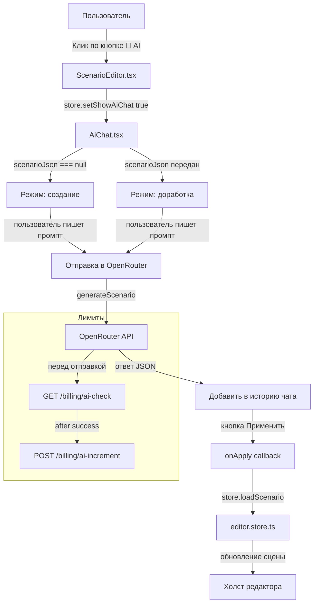

# План: Объединение AI-помощника и AI-доработки в единый AI-чат

## Текущая архитектура

### Два отдельных компонента:
1. **`AIAssistant.tsx`** — модалка для генерации сценария с нуля. Не использует OpenRouter, просто создаёт заглушку (Старт → Финиш).
2. **`AiEnhanceModal.tsx`** — модалка для доработки существующего сценария. Использует `generateScenario()` из `openrouter.ts`, который ходит в OpenRouter API.

### Два флага в сторе:
- `showAIAssistant` — открывает AIAssistant
- `showAiEnhance` — открывает AiEnhanceModal

### Две кнопки в тулбаре:
- `🤖 AI` — AI-помощник (генерация)
- `✨ AI Дор` — AI-доработка

### OpenRouter клиент (`openrouter.ts`):
- `generateScenario(prompt, currentScenarioJson)` — отправляет промпт + текущий JSON сценария в OpenRouter
- Лимиты: 3/день для FREE, проверка через API `/billing/ai-check`, инкремент через `/billing/ai-increment`
- Fallback на localStorage если API недоступен

### Бэкенд (`billing.service.ts`):
- `checkAiGenerationLimit(userId)` — проверяет лимиты
- `incrementAiGenerations(userId)` — увеличивает счётчик
- Эндпоинты: `GET /billing/ai-check`, `POST /billing/ai-increment`

---

## План изменений

### Шаг 1: Создать компонент `AiChat.tsx` — единый AI-чат

Новый компонент, который заменяет обе модалки. Это полноценный чат-интерфейс.

**Пропсы:**
```typescript
interface AiChatProps {
  scenarioJson: string | null;  // null = новый сценарий, string = доработка
  onApply: (data: any) => void;
  onClose: () => void;
}
```

**Структура:**
- Шапка: "🤖 AI-ассистент" + кнопка закрытия + счётчик лимитов
- История сообщений (чат): массив `{ role: 'user' | 'assistant', content: string }`
- Быстрые идеи (чипы) — при клике заполняют поле ввода
- Поле ввода + кнопка отправки
- Заглушка ответа AI (моковые данные для теста)

**Логика:**
- Если `scenarioJson === null` → режим "создание нового"
- Если `scenarioJson` передан → режим "доработка существующего"
- При отправке: вызываем `generateScenario()` из `openrouter.ts`
- Ответ AI добавляем в историю чата
- Кнопка "Применить" появляется после получения ответа AI

**Быстрые идеи (объединённые из обоих компонентов):**
```typescript
const QUICK_PROMPTS = [
  { icon: '🏙️', text: 'Городской квест по центру Москвы с 10 точками' },
  { icon: '🏫', text: 'Квест для школьников на знание истории' },
  { icon: '🎄', text: 'Новогодний квест для корпоратива' },
  { icon: '📈', text: 'Сделай задания сложнее' },
  { icon: '💡', text: 'Добавь подсказки' },
  { icon: '🎭', text: 'Добавь больше диалогов' },
];
```

### Шаг 2: Обновить `editor.store.ts`

- Заменить два флага `showAIAssistant` и `showAiEnhance` на один `showAiChat`
- Добавить метод `setShowAiChat(show: boolean)`
- В `EditorState` заменить поля:
  - `showAIAssistant: boolean` → удалить
  - `showAiEnhance: boolean` → удалить
  - `showAiChat: boolean` → добавить

### Шаг 3: Обновить `editor.types.ts`

- В интерфейсе `EditorState` заменить `showAIAssistant` и `showAiEnhance` на `showAiChat`
- В интерфейсе `EditorActions` заменить `setShowAIAssistant` и `setShowAiEnhance` на `setShowAiChat`

### Шаг 4: Обновить `ScenarioEditor.tsx`

- Удалить импорты `AIAssistant` и `AiEnhanceModal`
- Импортировать `AiChat`
- Заменить две кнопки в тулбаре на одну:
  ```tsx
  <button onClick={() => store.setShowAiChat(true)}
    className={tbBtn('bg-gradient-to-r from-primary/10 to-purple-500/10 hover:from-primary/20 hover:to-purple-500/20 border-primary/20')}
    title="AI-ассистент"
  >
    {tbContent('🤖', 'AI')}
  </button>
  ```
- Заменить два блока модалок на один:
  ```tsx
  {store.showAiChat && (
    <AiChat
      scenarioJson={store.scenes.length > 0 ? JSON.stringify({...}) : null}
      onApply={(data) => { store.loadScenario(data); }}
      onClose={() => store.setShowAiChat(false)}
    />
  )}
  ```

### Шаг 5: Удалить старые компоненты

- Удалить `AIAssistant.tsx`
- Удалить `AiEnhanceModal.tsx`

### Шаг 6: Моковые данные для теста

В `AiChat.tsx` сделать заглушку: если OpenRouter не отвечает, возвращать готовый JSON-сценарий (как сейчас в `AIAssistant.tsx`).

---

## Схема потока данных



---

## Файлы для изменений

| Файл | Действие |
|------|----------|
| `apps/web/src/components/editor-v2/AiChat.tsx` | **Создать** — новый компонент чата |
| `apps/web/src/components/editor-v2/AIAssistant.tsx` | **Удалить** |
| `apps/web/src/components/editor-v2/AiEnhanceModal.tsx` | **Удалить** |
| `apps/web/src/components/editor-v2/ScenarioEditor.tsx` | **Изменить** — заменить две кнопки/модалки на одну |
| `apps/web/src/lib/editor-store/editor.store.ts` | **Изменить** — заменить флаги |
| `apps/web/src/lib/editor-store/editor.types.ts` | **Изменить** — заменить поля в EditorState |

---

## Критерии готовности

- [ ] Одна кнопка "🤖 AI-ассистент" в тулбаре редактора вместо двух
- [ ] Чат-интерфейс открывается, есть история сообщений
- [ ] Быстрые идеи работают (заполняют поле ввода)
- [ ] Режим создания (нет сценария) и доработки (есть сценарий) определяются автоматически
- [ ] Заглушка с готовым ответом работает (мок)
- [ ] Лимиты отображаются в интерфейсе
- [ ] Старые компоненты удалены