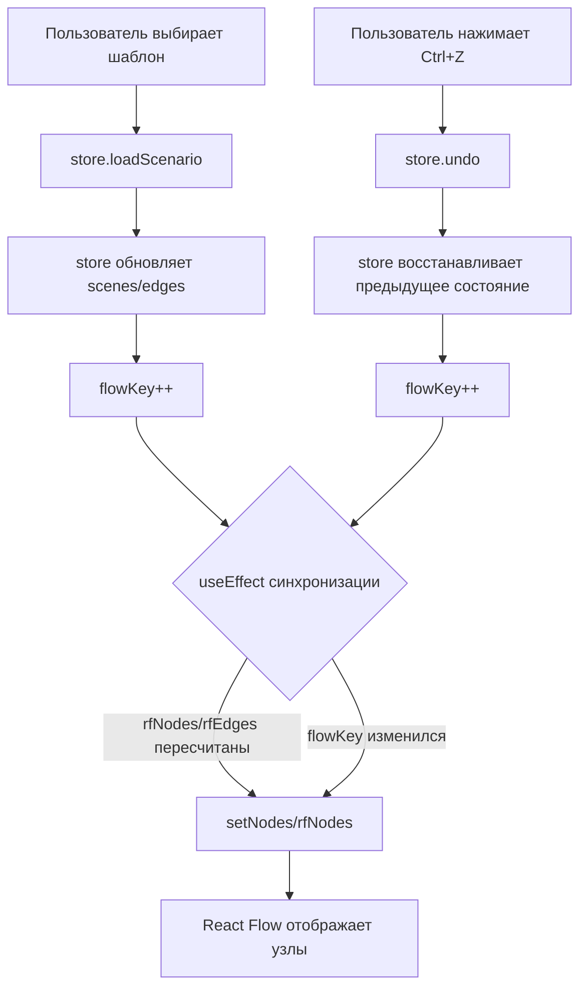

# План исправления проблем редактора сценариев

## Текущее состояние
- ✅ Drag блоков работает
- ✅ Соединения между блоками работают
- ✅ Камера двигается (Alt + ПКМ)
- ❌ Шаблоны: блоки загружаются в store, но не отображаются визуально на холсте
- ❌ Горячие клавиши (Ctrl+C, Ctrl+V, Delete) не работают
- ❌ Кнопка "Назад" (Undo) не работает
- ❌ Кнопка "Очистить холст" не работает

---

## Проблема 1: Шаблоны — блоки не отображаются визуально

### Корень проблемы
В [`ScenarioEditor.tsx:952-967`](apps/web/src/components/editor-v2/ScenarioEditor.tsx:952) при выборе шаблона вызывается `store.loadScenario(...)`, который обновляет `scenes` и `edges` в Zustand store. Однако `useNodesState` и `useEdgesState` — это локальное состояние React Flow, которое **не синхронизируется** с изменениями стора.

`rfNodes`/`rfEdges` вычисляются через `useMemo` с зависимостями `[storeScenes]`/`[storeEdges]`, но `useNodesState(rfNodes)` вызывается **один раз** при инициализации. Когда `storeScenes` меняется (после `loadScenario`), `rfNodes` пересчитывается, но `useNodesState` **не обновляет** своё внутреннее состояние — он использует то, что было передано при первом вызове.

### Решение
Добавить `useEffect`, который синхронизирует `setNodes`/`setEdges` при изменении `storeScenes`/`storeEdges`:

```typescript
// Синхронизация структуры узлов из store в React Flow
useEffect(() => {
  setNodes(rfNodes);
}, [rfNodes, setNodes]);

useEffect(() => {
  setEdges(rfEdges);
}, [rfEdges, setEdges]);
```

**Важно:** Этот `useEffect` уже существует в коде (строка 253), но нужно проверить, что он корректно срабатывает при `loadScenario`. Проблема может быть в том, что `loadScenario` обновляет `flowKey`, а `useEffect` не имеет этой зависимости.

### Файлы для изменения
- [`apps/web/src/components/editor-v2/ScenarioEditor.tsx`](apps/web/src/components/editor-v2/ScenarioEditor.tsx) — строка 253, `useEffect` синхронизации

---

## Проблема 2: Горячие клавиши не работают

### Корень проблемы
В [`ScenarioEditor.tsx:261-329`](apps/web/src/components/editor-v2/ScenarioEditor.tsx:261) обработчик `handleKeyDown` использует зависимости `[store.selectedNodes, store.selectedEdges]`. Это означает, что **замыкание** (closure) захватывает ссылки на `store.removeScene`, `store.copyNodes`, `store.pasteNodes` и т.д. на момент последнего рендера.

Когда `store` обновляется (например, после `loadScenario`), замыкание всё ещё указывает на старые методы стора. В результате вызовы `store.removeScene(id)` и т.д. могут не работать, потому что `store` в замыкании — это старая версия.

**Дополнительная проблема:** `store.selectedNodes` и `store.selectedEdges` — это массивы, которые при каждом изменении создаются заново (из-за иммутабельности Zustand). Это вызывает пересоздание обработчика `handleKeyDown` при каждом выделении/снятии выделения, но при этом `store` (полный объект) не включён в зависимости.

### Решение
Добавить `store` в зависимости `useEffect`:

```typescript
useEffect(() => {
  const handleKeyDown = (e: KeyboardEvent) => {
    // ... существующий код ...
  };
  window.addEventListener('keydown', handleKeyDown);
  return () => window.removeEventListener('keydown', handleKeyDown);
}, [store, store.selectedNodes, store.selectedEdges]);
//  ^^^^^ добавлен store
```

### Файлы для изменения
- [`apps/web/src/components/editor-v2/ScenarioEditor.tsx`](apps/web/src/components/editor-v2/ScenarioEditor.tsx) — строка 329, добавить `store` в зависимости

---

## Проблема 3: Кнопка "Назад" (Undo) не работает

### Корень проблемы
В [`ScenarioEditor.tsx:656`](apps/web/src/components/editor-v2/ScenarioEditor.tsx:656) кнопка Undo вызывает `store.undo()`. Проблема может быть в том, что `pushHistory()` не вызывается в нужных местах, или `undo()` не обновляет `useNodesState`/`useEdgesState`.

Проверим [`editor.store.ts:370-391`](apps/web/src/lib/editor-store/editor.store.ts:370):
- `pushHistory()` сохраняет текущее состояние в `undoStack`
- `undo()` восстанавливает предыдущее состояние из `undoStack`

Проблема: `undo()` обновляет `scenes` и `edges` в сторе, но **не синхронизирует** изменения с `useNodesState`/`useEdgesState`. То есть store обновляется, а React Flow продолжает показывать старые узлы.

### Решение
`undo()` обновляет `flowKey` (строка 735 в `loadScenario`), но в самом `undo()` этого может не быть. Нужно убедиться, что `undo()` и `redo()` тоже увеличивают `flowKey`, чтобы `useEffect` синхронизации сработал.

### Файлы для изменения
- [`apps/web/src/lib/editor-store/editor.store.ts`](apps/web/src/lib/editor-store/editor.store.ts) — метод `undo()` и `redo()`, добавить `flowKey: get().flowKey + 1`

---

## Проблема 4: Кнопка "Очистить холст" не работает

### Корень проблемы
В [`ScenarioEditor.tsx:681`](apps/web/src/components/editor-v2/ScenarioEditor.tsx:681) кнопка вызывает `setShowClearConfirm(true)`, что открывает `ConfirmModal`. После подтверждения вызывается `store.clearAll()`.

В [`editor.store.ts:774-808`](apps/web/src/lib/editor-store/editor.store.ts:774) `clearAll()`:
1. Вызывает `pushHistory()` — сохраняет текущее состояние для undo
2. Создаёт две сцены (Старт, Финиш)
3. Обновляет `scenes`, `edges`, `flowKey`

Проблема: `clearAll()` обновляет `flowKey`, но `useEffect` синхронизации (строка 253) может не сработать, если `flowKey` не включён в зависимости `useEffect`.

### Решение
Добавить `store.flowKey` в зависимости `useEffect` синхронизации:

```typescript
useEffect(() => {
  setNodes(rfNodes);
  setEdges(rfEdges);
}, [rfNodes, rfEdges, store.flowKey]);
```

### Файлы для изменения
- [`apps/web/src/components/editor-v2/ScenarioEditor.tsx`](apps/web/src/components/editor-v2/ScenarioEditor.tsx) — строка 253, добавить `store.flowKey` в зависимости

---

## Сводка изменений

| Файл | Изменение |
|------|-----------|
| `ScenarioEditor.tsx:253-258` | Добавить `store.flowKey` в зависимости `useEffect` синхронизации |
| `ScenarioEditor.tsx:329` | Добавить `store` в зависимости `useEffect` клавиатуры |
| `editor.store.ts:undo()` | Добавить `flowKey: get().flowKey + 1` |
| `editor.store.ts:redo()` | Добавить `flowKey: get().flowKey + 1` |

---

## Диаграмма потока данных



## Диаграмма зависимостей useEffect

```mermaid
flowchart LR
    subgraph "useEffect синхронизации строка 253"
        A[rfNodes] --> D[setNodes]
        B[rfEdges] --> E[setEdges]
        C[store.flowKey] --> D
        C --> E
    end
    
    subgraph "useEffect клавиатуры строка 261"
        F[store] --> G[handleKeyDown]
        H[store.selectedNodes] --> G
        I[store.selectedEdges] --> G
    end