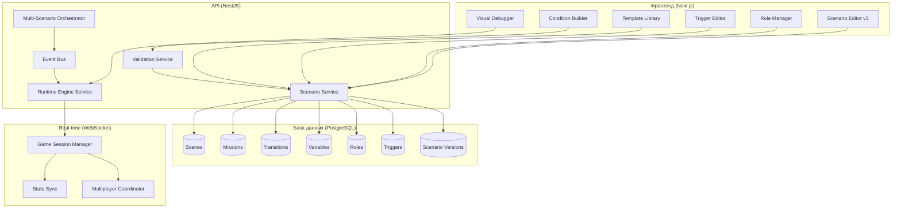

# План эволюции редактора сценариев: от конструктора квестов к Game Runtime Platform

> **Дата:** 01.07.2026
> **Цель:** Сделать редактор, в котором можно реализовать ЛЮБУЮ идею — от простого квиза до мафии на несколько городов

---

## Текущее состояние (v2.0)

Редактор уже мощный: есть визуальный холст, 22 типа блоков, переменные, инвентарь, достижения, AI-ассистент, рантайм-движок. Но функциональность ограничена линейными/древовидными сценариями.

---

## План развития (v3.0 — Game Runtime Platform)

### Этап 1: Фундамент для сложных игр (High Priority)

#### 1.1. Система ролей (Role System)
**Зачем:** Для мафии, RPG, корпоративов с разными ролями игроков.

- UI в редакторе: панель "Роли" в глобальных настройках
- Возможность создавать роли с разными правами и целями
- Блоки: "Назначить роль", "Проверить роль", "Если роль = X"
- Визуализация: разные цвета блоков для разных ролей

```typescript
interface RoleDefinition {
  id: string;
  name: string;
  description: string;
  team: 'red' | 'blue' | 'neutral'; // для командных игр
  permissions: string[]; // что может видеть/делать
  winCondition: ConditionGroup;
  visibility: 'all' | 'role_only' | 'hidden';
}
```

#### 1.2. Визуальный конструктор условий (Condition Builder)
**Зачем:** Сейчас условия задаются текстом. Нужен drag-and-drop конструктор как в Unreal Engine.

- Визуальное дерево условий с AND/OR узлами
- Drag-and-drop из палитры: переменные, операторы, значения
- Подсветка валидности условия в реальном времени
- Сохранение условий как AST (уже есть в типах)

#### 1.3. Система триггеров и событий (Event/Trigger System)
**Зачем:** Чтобы сценарий реагировал на действия игроков нелинейно.

- Панель "Триггеры" в редакторе
- Типы событий: onEnter, onExit, onTimer, onAnswer, onAchievement, onItemGet, onRoleAction
- Действия триггеров: изменить переменную, телепортировать, запустить таймер, показать уведомление
- Визуальное отображение триггеров на холсте (как невидимые блоки)

#### 1.4. Блок "Цикл" (Loop Block)
**Зачем:** Для повторяющихся действий (раунды в мафии, этапы квиза).

- Типы циклов: for (N раз), while (пока условие), forEach (по массиву)
- Визуальное отображение: блок с возвратной стрелкой
- Настройка: счётчик, условие выхода, действия после цикла

---

### Этап 2: Мульти-сценарная архитектура (High Priority)

#### 2.1. Параллельные сценарии (Multi-Scenario)
**Зачем:** Мафия — это несколько параллельных процессов (голосование, ночные действия, проверки).

- Возможность запускать несколько сценариев одновременно
- Каждый сценарий имеет свой state machine
- Синхронизация между сценариями через глобальные переменные
- Визуализация: вкладки с разными сценариями

```typescript
interface MultiScenarioSession {
  mainScenarioId: string;
  parallelScenarios: {
    scenarioId: string;
    status: 'running' | 'paused' | 'finished';
    currentSceneId: string;
    variables: Record<string, any>;
  }[];
  globalVariables: Record<string, any>;
  roles: Record<string, string>; // playerId -> roleId
}
```

#### 2.2. Глобальные переменные и меж-сценарный обмен
**Зачем:** Чтобы данные из одного сценария были доступны в другом.

- Глобальные переменные (scope: 'global') доступны всем сценариям
- События меж-сценарной коммуникации (broadcast, emit, on)
- Блоки: "Отправить событие в сценарий X", "Слушать событие"

#### 2.3. Вложенные сценарии (Sub-Scenarios)
**Зачем:** Для модульности и переиспользования (например, мини-игра внутри квеста).

- Блок "Запустить под-сценарий" с передачей переменных
- Под-сценарий возвращает результат (success/fail + данные)
- Визуализация: блок с иконкой "вложенности"

---

### Этап 3: Продвинутые механики (Medium Priority)

#### 3.1. Real-time Multiplayer механики
**Зачем:** Голосования, аукционы, одновременный выбор.

- Блок "Голосование" — все игроки выбирают вариант, результат по большинству
- Блок "Аукцион" — игроки делают ставки
- Блок "Одновременный выбор" — каждый выбирает, не видя выбор других
- Блок "Таймер с синхронизацией" — все видят один таймер

#### 3.2. Продвинутый инвентарь
**Зачем:** Крафт, обмен, использование предметов на других.

- Крафт: рецепты (ингредиенты -> результат)
- Обмен между игроками
- Использование предмета на другом игроке
- Предметы с эффектами (временные, постоянные)

#### 3.3. Система состояний и фаз игры
**Зачем:** Для пошаговых игр с разными фазами (день/ночь в мафии).

- Глобальное состояние игры: фаза, раунд, статус
- Блоки: "Установить фазу", "Проверить фазу", "Перейти к фазе"
- Визуализация: индикатор текущей фазы

---

### Этап 4: UX и инструменты (Medium Priority)

#### 4.1. Визуальный отладчик (Visual Debugger)
**Зачем:** Чтобы видеть, как выполняется сценарий, в реальном времени.

- Подсветка текущего блока при тестировании
- Поток данных: какие переменные меняются
- Breakpoints: остановка на определённом блоке
- Step-by-step выполнение

#### 4.2. История изменений и сравнение версий
**Зачем:** Чтобы можно было откатить изменения и видеть, что поменялось.

- Diff между версиями (подсветка изменённых блоков)
- Комментарии к версиям
- Возможность "форкнуть" версию

#### 4.3. Шаблоны сложных игр
**Зачем:** Чтобы пользователь мог начать с готовой архитектуры.

- Шаблон "Мафия" — с ролями, фазами дня/ночи, голосованием
- Шаблон "RPG-квест" — с инвентарём, NPC, диалогами
- Шаблон "Корпоратив" — с командами, челленджами, рейтингом
- Шаблон "Квиз-турнир" — с раундами, таймерами, лидербордом

---

### Этап 5: Бэкенд и инфраструктура (High Priority)

#### 5.1. Нормализация схемы данных
**Зачем:** JSON-поля в Prisma не позволяют эффективно делать запросы и миграции.

- Выделить Scene, Mission, Transition, Variable в отдельные таблицы
- Версионирование на уровне схемы (snapshot всей структуры)
- Индексы для быстрого поиска по сценариям

#### 5.2. Полноценная валидация на бэкенде
**Зачем:** Чтобы гарантировать, что сценарий корректен перед публикацией.

- Проверка циклов (граф должен быть ациклическим или с контролируемыми циклами)
- Проверка типов переменных
- Проверка достижимости всех сцен
- Проверка условий (ссылки на существующие переменные)
- Симуляция выполнения (прогнать сценарий с дефолтными значениями)

#### 5.3. Runtime Engine на бэкенде
**Зачем:** Сейчас движок только на фронтенде. Нужен серверный рантайм для реальных игр.

- Перенести ExecutionEngine на NestJS
- WebSocket для real-time синхронизации
- Event Sourcing для восстановления состояния
- Горизонтальное масштабирование (по gameId)

---

## Архитектурная схема v3.0



---

## Приоритеты реализации

| # | Фича | Приоритет | Зависимости | Сложность |
|---|------|-----------|-------------|-----------|
| 1 | Система ролей | 🔥 High | — | Medium |
| 2 | Condition Builder | 🔥 High | — | Medium |
| 3 | Trigger/Event System | 🔥 High | Condition Builder | High |
| 4 | Блок "Цикл" | 🔥 High | — | Low |
| 5 | Параллельные сценарии | 🔥 High | Trigger System | Very High |
| 6 | Глобальные переменные | 🔥 High | Параллельные сценарии | Medium |
| 7 | Вложенные сценарии | 🟡 Medium | — | Medium |
| 8 | Real-time механики | 🟡 Medium | WebSocket | High |
| 9 | Продвинутый инвентарь | 🟡 Medium | — | Medium |
| 10 | Система фаз/состояний | 🟡 Medium | Система ролей | Medium |
| 11 | Визуальный отладчик | 🟡 Medium | — | High |
| 12 | История версий | 🟡 Medium | — | Medium |
| 13 | Шаблоны сложных игр | 🔵 Low | Система ролей, Циклы | Medium |
| 14 | Нормализация схемы | 🔥 High | — | Very High |
| 15 | Валидация на бэкенде | 🔥 High | Нормализация схемы | High |
| 16 | Runtime Engine на бэкенде | 🔥 High | Нормализация схемы | Very High |

---

## Примеры игр, которые станут возможны

### Мафия на несколько городов
- **Роли:** Мирные, Мафия, Комиссар, Доктор
- **Параллельные сценарии:** Ночные действия (каждая роль), Дневное голосование, Проверки
- **Циклы:** Раунды день/ночь
- **Глобальные переменные:** alivePlayers, votes, mafiaTarget
- **Фазы:** Ночь -> Обсуждение -> Голосование -> Ночь

### RPG-квест с инвентарём и крафтом
- **Роли:** Воин, Маг, Разбойник
- **Инвентарь:** Оружие, зелья, ключи
- **Крафт:** Рецепты из ингредиентов
- **Ветвления:** В зависимости от выбора игрока
- **Под-сценарии:** Мини-игры (головоломки, битвы)

### Корпоратив с командами и челленджами
- **Параллельные сценарии:** Каждая команда проходит свой маршрут
- **Глобальные переменные:** leaderboard, teamScores
- **Real-time:** Аукцион подсказок, голосование за лучшую команду
- **Фазы:** Квест -> Обед -> Квест -> Финальный челлендж

### Квиз-турнир с несколькими раундами
- **Циклы:** Раунды (3-5 раундов)
- **Типы раундов:** Текстовый, Фото, Аудио, Видео
- **Система очков:** За правильный ответ, за скорость
- **Лидерборд:** В реальном времени

---

## Заключение

Текущий редактор — отличная основа. Он уже позволяет создавать линейные и ветвящиеся квесты. Но для того, чтобы стать "единственным продуктом на рынке", нужно добавить:

1. **Систему ролей** — основа для любых социальных и ролевых игр
2. **Триггеры и события** — чтобы сценарий "жил" и реагировал на игроков
3. **Циклы** — для повторяющихся механик
4. **Параллельные сценарии** — для сложных multi-player игр
5. **Визуальный конструктор условий** — чтобы не писать код

Эти 5 фич превратят редактор из "конструктора квестов" в "Game Runtime Platform", где можно реализовать любую идею.