# План: Экспорт/Импорт сценариев в JSON-файлы

## Текущее состояние

Функции сериализации/десериализации уже реализованы в [`scenario-json.ts`](apps/web/src/lib/scenario-json/scenario-json.ts):
- [`exportScenarioToJson(scenario)`](apps/web/src/lib/scenario-json/scenario-json.ts:641) — сериализует сценарий в JSON-строку
- [`importScenarioFromJson(jsonString)`](apps/web/src/lib/scenario-json/scenario-json.ts:646) — парсит JSON, валидирует, десериализует

Нужно добавить UI для вызова этих функций в двух местах:
1. Страница "Мои сценарии" (`/organizer/scenarios`)
2. Панель инструментов редактора (`ScenarioEditor.tsx`)

---

## Задача 1: Экспорт в JSON на странице "Мои сценарии"

**Файл:** [`apps/web/src/app/organizer/scenarios/page.tsx`](apps/web/src/app/organizer/scenarios/page.tsx)

**Что сделать:** Добавить кнопку "💾 Скачать JSON" в карточку каждого сценария (рядом с кнопками "Редактировать", "Опубликовать", "Удалить").

**Логика:**
1. При нажатии на кнопку — GET-запрос к API за полными данными сценария (nodes, edges, variables, settings)
2. Вызвать `exportScenarioToJson()` из `scenario-json.ts`
3. Создать Blob и скачать файл через `URL.createObjectURL` + `<a download>`
4. Имя файла: `{название-сценария}-{id}.json`

**Изменения:**
- Добавить импорт `exportScenarioToJson` из `@/lib/scenario-json/scenario-json`
- Добавить состояние `exportingId: string | null`
- Добавить функцию `handleExport(id, name)`:
  ```ts
  const handleExport = async (id: string, name: string) => {
    setExportingId(id);
    try {
      const token = localStorage.getItem('auth_token');
      const API_URL = process.env.NEXT_PUBLIC_API_URL || 'http://localhost:3000/api';
      const response = await fetch(`${API_URL}/scenarios/${id}`, {
        headers: { Authorization: `Bearer ${token}` },
      });
      const result = await response.json();
      const scenarioData = result?.data || result;
      
      // Собираем объект сценария для экспорта
      const scenario = {
        id: scenarioData.id,
        name: scenarioData.name,
        description: scenarioData.description || '',
        scenes: scenarioData.nodes || [],
        edges: scenarioData.edges || [],
        variables: scenarioData.metadata?.variables || [],
        settings: scenarioData.metadata?.settings || {},
        triggers: scenarioData.triggers || [],
        roles: scenarioData.roles || [],
        parallelScenarios: scenarioData.parallelScenarios || [],
        syncPoints: scenarioData.syncPoints || [],
      };
      
      const json = exportScenarioToJson(scenario as any);
      const blob = new Blob([json], { type: 'application/json' });
      const url = URL.createObjectURL(blob);
      const a = document.createElement('a');
      a.href = url;
      a.download = `${name.replace(/[^a-zA-Zа-яА-Я0-9]/g, '_')}-${id.slice(0, 8)}.json`;
      a.click();
      URL.revokeObjectURL(url);
    } catch (err) {
      setError('Не удалось экспортировать сценарий');
    } finally {
      setExportingId(null);
    }
  };
  ```
- Добавить кнопку в JSX карточки (после кнопки "Редактировать"):
  ```tsx
  <button
    onClick={() => handleExport(scenario.id, scenario.name)}
    disabled={exportingId === scenario.id}
    className="btn-outline text-sm px-2"
    title="Скачать JSON"
  >
    {exportingId === scenario.id ? '...' : '💾'}
  </button>
  ```

---

## Задача 2: Импорт из JSON на странице "Мои сценарии"

**Файл:** [`apps/web/src/app/organizer/scenarios/page.tsx`](apps/web/src/app/organizer/scenarios/page.tsx)

**Что сделать:** Добавить кнопку "📂 Импорт JSON" в хедер страницы (рядом с кнопкой "+ Создать сценарий").

**Логика:**
1. Скрытый `<input type="file" accept=".json">`
2. При выборе файла — читать его через `FileReader`
3. Вызвать `importScenarioFromJson()` для валидации
4. Если валидация успешна — создать сценарий через API (POST /scenarios) с данными из JSON
5. После создания — редирект на страницу редактирования `/organizer/scenarios/{newId}/edit`
6. Если ошибка — показать тост с ошибкой

**Изменения:**
- Добавить импорт `importScenarioFromJson` из `@/lib/scenario-json/scenario-json`
- Добавить ref: `const fileInputRef = useRef<HTMLInputElement>(null)`
- Добавить функцию `handleImport`:
  ```ts
  const handleImport = () => {
    fileInputRef.current?.click();
  };

  const handleFileSelected = async (e: React.ChangeEvent<HTMLInputElement>) => {
    const file = e.target.files?.[0];
    if (!file) return;
    
    try {
      const text = await file.text();
      const result = importScenarioFromJson(text);
      
      if (!result.validation.valid) {
        const msgs = result.validation.errors.map(e => e.message).join('; ');
        setError(`Ошибка валидации: ${msgs}`);
        return;
      }
      
      // Создаём сценарий через API
      const token = localStorage.getItem('auth_token');
      const API_URL = process.env.NEXT_PUBLIC_API_URL || 'http://localhost:3000/api';
      
      const response = await fetch(`${API_URL}/scenarios`, {
        method: 'POST',
        headers: {
          'Content-Type': 'application/json',
          Authorization: `Bearer ${token}`,
        },
        body: JSON.stringify({
          name: result.scenario.name || file.name.replace('.json', ''),
          description: result.scenario.description || '',
          nodes: result.scenario.scenes || [],
          edges: result.edges || [],
          metadata: {
            settings: result.scenario.settings || {},
            variables: result.scenario.variables || [],
          },
        }),
      });
      
      if (!response.ok) throw new Error('Ошибка при создании сценария');
      
      const apiResult = await response.json();
      const newId = apiResult?.data?.id || apiResult?.id;
      
      if (newId) {
        router.push(`/organizer/scenarios/${newId}/edit`);
      }
    } catch (err) {
      const message = err instanceof Error ? err.message : 'Ошибка импорта';
      setError(message);
    } finally {
      // Сбросить input, чтобы можно было выбрать тот же файл снова
      e.target.value = '';
    }
  };
  ```
- Добавить скрытый input и кнопку в JSX (рядом с "+ Создать сценарий"):
  ```tsx
  <input
    type="file"
    accept=".json"
    ref={fileInputRef}
    onChange={handleFileSelected}
    className="hidden"
  />
  <button onClick={handleImport} className="btn-outline">
    📂 Импорт JSON
  </button>
  <Link href="/organizer/scenarios/create" className="btn-primary">
    + Создать сценарий
  </Link>
  ```

---

## Задача 3: Экспорт/Импорт в тулбаре редактора

**Файл:** [`apps/web/src/components/editor-v2/ScenarioEditor.tsx`](apps/web/src/components/editor-v2/ScenarioEditor.tsx)

**Что сделать:** Добавить две кнопки в тулбар (после кнопки "📋" шаблонов или рядом с кнопками undo/redo):
- "💾 Экспорт JSON" — скачать текущий сценарий из стора
- "📂 Импорт JSON" — загрузить файл и заменить текущий сценарий

**Логика экспорта:**
```ts
const handleExportJson = useCallback(() => {
  const scenario = {
    id: store.scenarioId || '',
    name: store.name,
    description: store.description,
    scenes: store.scenes,
    edges: store.edges,
    variables: store.variables,
    settings: store.settings,
    triggers: store.triggers,
    roles: store.roles,
    parallelScenarios: store.parallelScenarios,
    syncPoints: store.syncPoints,
  };
  const json = exportScenarioToJson(scenario as any);
  const blob = new Blob([json], { type: 'application/json' });
  const url = URL.createObjectURL(blob);
  const a = document.createElement('a');
  a.href = url;
  a.download = `${store.name.replace(/[^a-zA-Zа-яА-Я0-9]/g, '_') || 'scenario'}.json`;
  a.click();
  URL.revokeObjectURL(url);
}, [store]);
```

**Логика импорта:**
```ts
const fileInputRef = useRef<HTMLInputElement>(null);

const handleImportJson = useCallback(() => {
  fileInputRef.current?.click();
}, []);

const handleFileSelected = useCallback(async (e: React.ChangeEvent<HTMLInputElement>) => {
  const file = e.target.files?.[0];
  if (!file) return;
  
  try {
    const text = await file.text();
    const result = importScenarioFromJson(text);
    
    if (!result.validation.valid) {
      const msgs = result.validation.errors.map(e => e.message).join('; ');
      alert(`Ошибка валидации: ${msgs}`);
      return;
    }
    
    // Загружаем в стор
    store.loadScenario({
      name: result.scenario.name || file.name.replace('.json', ''),
      description: result.scenario.description || '',
      scenes: result.scenario.scenes || [],
      edges: result.edges || [],
      variables: result.scenario.variables || [],
      settings: result.scenario.settings || {},
    });
    
    // Загружаем триггеры, роли, параллельные сценарии
    if (result.scenario.triggers) {
      store.clearTriggers();
      result.scenario.triggers.forEach((t: any) => store.addTrigger(t));
    }
    if (result.scenario.roles) {
      store.clearRoles();
      result.scenario.roles.forEach((r: any) => store.addRole(r));
    }
    if (result.scenario.parallelScenarios) {
      store.clearParallelScenarios();
      result.scenario.parallelScenarios.forEach((ps: any) => store.addParallelScenario(ps));
    }
    if (result.scenario.syncPoints) {
      store.clearSyncPoints();
      result.scenario.syncPoints.forEach((sp: any) => store.addSyncPoint(sp));
    }
  } catch (err) {
    alert('Ошибка при импорте файла');
  } finally {
    e.target.value = '';
  }
}, [store]);
```

**Изменения в JSX:**
- Добавить скрытый `<input type="file" accept=".json" ref={fileInputRef} onChange={handleFileSelected} className="hidden" />`
- Добавить кнопки в тулбар (после кнопки шаблонов `📋`):
  ```tsx
  <button onClick={handleExportJson} className={tbBtn()} title="Экспорт в JSON">
    {tbContent('💾', 'Экспорт')}
  </button>
  <button onClick={handleImportJson} className={tbBtn()} title="Импорт из JSON">
    {tbContent('📂', 'Импорт')}
  </button>
  ```

**Также нужно добавить в стор экшены** `clearTriggers`, `clearRoles`, `clearParallelScenarios`, `clearSyncPoints` в [`editor.store.ts`](apps/web/src/lib/editor-store/editor.store.ts), если их ещё нет.

---

## Задача 4: Проверка сборки

После всех изменений:
```bash
cd /Users/mkarych/questforge/apps/web
npx next build 2>&1 | tail -30
```

Убедиться, что нет ошибок TypeScript и ESLint.

---

## Диаграмма потока данных

```mermaid
flowchart TD
    subgraph "Страница Мои сценарии"
        A[Кнопка 💾 Скачать JSON] -->|GET /scenarios/:id| B[API]
        B -->|nodes, edges, metadata| C[exportScenarioToJson]
        C -->|JSON string| D[Blob → download]
        
        E[Кнопка 📂 Импорт JSON] -->|file input| F[FileReader]
        F -->|JSON string| G[importScenarioFromJson]
        G -->|валидация| H{Valid?}
        H -->|Нет| I[Показать ошибку]
        H -->|Да| J[POST /scenarios]
        J -->|newId| K[redirect to /edit]
    end
    
    subgraph "Редактор сценариев"
        L[Кнопка 💾 Экспорт] -->|store.scenes, edges, etc| M[exportScenarioToJson]
        M -->|JSON string| N[Blob → download]
        
        O[Кнопка 📂 Импорт] -->|file input| P[FileReader]
        P -->|JSON string| Q[importScenarioFromJson]
        Q -->|валидация| R{Valid?}
        R -->|Нет| S[alert ошибка]
        R -->|Да| T[store.loadScenario]
        T --> U[store.addTrigger / addRole / etc]
    end
```



---

## Порядок выполнения

1. **Сначала Задача 3** (редактор) — самый частый сценарий использования
2. **Потом Задача 1** (экспорт на странице списка)
3. **Потом Задача 2** (импорт на странице списка)
4. **Проверка сборки**