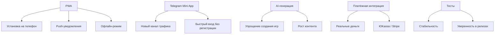

# Полный анализ проекта QuestForge / Adventure Engine

> **Дата:** 30.06.2026  
> **Цель:** Аудит текущего состояния, выявление пробелов, предложение новых фич  
> **Тип документа:** Стратегический анализ

---

## 1. Текущее состояние проекта

### 1.1. Общая архитектура

```
questforge/
├── apps/
│   ├── api/          # NestJS (Backend) — монолит
│   ├── web/          # Next.js (Frontend) — App Router
│   └── mobile/       # React Native — только в документации
├── packages/
│   ├── shared-types/ # Общие TypeScript типы
│   ├── ui-kit/       # Только в документации
│   └── sdk/          # Только в документации
├── prisma/           # Schema + migrations
├── docs/             # 50+ документов
└── infrastructure/   # Docker Compose
```

### 1.2. Реализованные бэкенд-модули (NestJS)

Все модули подключены в [`app.module.ts`](../apps/api/src/app.module.ts:8-28):

| Модуль | Статус | Примечание |
|--------|--------|------------|
| **Auth** | ✅ Реализован | JWT, Passport, стратегии |
| **Users** | ✅ Реализован | CRUD пользователей |
| **Games** | ✅ Реализован | CRUD игр, DTO, state-machine |
| **Scenarios** | ✅ Реализован | CRUD сценариев, валидация |
| **Sessions** | ✅ Реализован | Игровые сессии |
| **Teams** | ✅ Реализован | Команды, инвайты, заявки, передача прав |
| **Admin** | ✅ Реализован | Модерация игр и заявок |
| **Organizer** | ✅ Реализован | Заявки на организатора |
| **Upload** | ✅ Реализован | Загрузка файлов |
| **Home** | ✅ Реализован | Агрегированные данные для главной |
| **Notifications** | ✅ Реализован | CRUD уведомлений |
| **Achievements** | ✅ Реализован | Система достижений |
| **ActivityFeed** | ✅ Реализован | Лента активности |
| **Activity** | ✅ Реализован | Логи действий |
| **Billing** | ✅ Реализован | Тарифы, лимиты, платежи |
| **Support** | ✅ Реализован | Тикеты поддержки |
| **Realtime** | ✅ Реализован | WebSocket |
| **Search** | ✅ Реализован | Глобальный поиск |
| **Social** | ✅ Реализован | Друзья, чаты, блокировки |
| **Commerce** | ✅ Реализован | Маркетплейс, лицензии, выплаты |
| **Engine** | ✅ Реализован | Игровой движок (plugins, state-machine, event-store) |

### 1.3. Реализованные фронтенд-страницы (Next.js App Router)

| Маршрут | Страница | Статус |
|---------|----------|--------|
| `/` | Главная | ✅ |
| `/games` | Каталог игр | ✅ |
| `/games/[id]` | Страница игры | ✅ |
| `/play/[shareLink]` | Вход в игру (LOBBY) | ✅ |
| `/play/[shareLink]/[sessionId]` | Задание (RUNNING) | ✅ |
| `/play/[shareLink]/[sessionId]/finish` | Финиш | ✅ |
| `/auth/login` | Логин | ✅ |
| `/auth/register` | Регистрация | ✅ |
| `/auth/forgot-password` | Восстановление пароля | ✅ |
| `/teams` | Список команд | ✅ |
| `/teams/[id]` | Страница команды | ✅ |
| `/teams/create` | Создание команды | ✅ |
| `/profile/[id]` | Профиль пользователя | ✅ |
| `/profile/edit` | Редактирование профиля | ✅ |
| `/profile/achievements` | Достижения | ✅ |
| `/profile/activity` | Активность | ✅ |
| `/profile/analytics` | Аналитика | ✅ |
| `/profile/chats` | Чаты | ✅ |
| `/profile/favorites` | Избранное | ✅ |
| `/profile/following` | Подписки | ✅ |
| `/profile/friends` | Друзья | ✅ |
| `/profile/payouts` | Выплаты | ✅ |
| `/profile/scenarios` | Сценарии пользователя | ✅ |
| `/profile/teams` | Команды пользователя | ✅ |
| `/admin/dashboard` | Админ-дашборд | ✅ |
| `/admin/games` | Модерация игр | ✅ |
| `/admin/games/[id]` | Детали игры (админ) | ✅ |
| `/admin/organizers/applications` | Заявки организаторов | ✅ |
| `/admin/support` | Тикеты поддержки | ✅ |
| `/admin/teams` | Команды (админ) | ✅ |
| `/admin/teams/[id]` | Детали команды (админ) | ✅ |
| `/admin/users` | Пользователи (админ) | ✅ |
| `/cart` | Корзина | ✅ |
| `/checkout` | Оформление заказа | ✅ |
| `/notifications` | Уведомления | ✅ |
| `/support` | Поддержка | ✅ |
| `/upgrade` | Upgrade тарифа | ✅ |
| `/privacy` | Политика конфиденциальности | ✅ |
| `/debug/editor-test` | Тест редактора | ✅ |
| `/debug/engine-test` | Тест движка | ✅ |

### 1.4. Реализованные компоненты

| Компонент | Назначение |
|-----------|------------|
| **Header** | Шапка с поиском, уведомлениями, юзер-меню |
| **Footer** | Подвал |
| **GameCard** | Карточка игры |
| **StatusBadge** | Бейдж статуса |
| **LoadingSpinner** | Спиннер загрузки |
| **Skeleton** | Скелетон загрузки |
| **EmptyState** | Пустое состояние |
| **ErrorBoundary** | Граница ошибок |
| **ConfirmModal** | Модалка подтверждения |
| **ImageCropper** | Обрезка изображений |
| **ImageModal** | Модалка изображения |
| **AvatarUpload** | Загрузка аватара |
| **CookieBanner** | Баннер cookie |
| **ScrollToTop** | Кнопка "наверх" |
| **FAQ** | FAQ-компонент |
| **SupportForm** | Форма поддержки |
| **GameChat** | Чат в игре |
| **Timer** | Таймер |
| **ProgressBar** | Прогресс-бар |
| **HintsPanel** | Панель подсказок |
| **SessionPanel** | Панель сессии |
| **TeamReadyPanel** | Панель готовности команды |
| **GameManagementPanel** | Панель управления игрой |
| **Feedback** | Форма обратной связи |
| **CoverUploader** | Загрузка обложки |
| **InviteModal** | Модалка инвайта |
| **JoinRequestModal** | Модалка заявки |
| **ReviewModal** | Модалка отзыва |
| **ScenarioEditor (v2)** | Редактор сценариев (React Flow) |
| **AIAssistant** | AI-ассистент в редакторе |
| **BlockPalette** | Палитра блоков |
| **NodeSettings** | Настройки узла |
| **LivePreview** | Превью сценария |
| **VariablesPanel** | Панель переменных |
| **AssetPanel** | Панель ассетов |
| **AuthorAchievements** | Достижения автора |
| **ScenarioTemplatesModal** | Шаблоны сценариев |
| **TestModal** | Тестирование сценария |
| **PreviewModal** | Превью |
| **AiEnhanceModal** | AI-улучшение |
| **ToolbarSettingsModal** | Настройки тулбара |
| **HeroBlock** | Герой-блок |
| **StatsBar** | Статистика |
| **QuickSearch** | Быстрый поиск |
| **LiveActivity** | Живая лента |
| **GamesSection** | Секция игр |
| **TrendingSection** | Тренды |
| **CategoriesGrid** | Сетка категорий |
| **OrganizersSection** | Организаторы |
| **TeamsSection** | Команды |
| **WinnersSection** | Победители |
| **ReviewsSection** | Отзывы |
| **EventsCalendar** | Календарь событий |
| **MapPreview** | Карта |
| **WhyUs** | "Почему мы" |
| **FAQBlock** | FAQ-блок |
| **CTABlock** | CTA-блок |
| **Breadcrumbs** | Хлебные крошки |
| **CommandPalette** | Палитра команд |
| **LanguageSwitcher** | Переключатель языка |
| **NotificationBell** | Колокольчик уведомлений |
| **SearchBar** | Поисковая строка |
| **SystemStatusBar** | Статус системы |
| **ThemeSwitcher** | Переключатель темы |
| **UserMenu** | Меню пользователя |

---

## 2. Что уже реализовано (сильные стороны)

### 2.1. Бэкенд
- ✅ **Полный набор модулей** — 20+ NestJS модулей
- ✅ **Игровой движок** — plugins, state-machine, event-store, orchestrator
- ✅ **Commerce Module** — маркетплейс, лицензирование, выплаты, корзина, промокоды
- ✅ **Social Module** — друзья, чаты, блокировки, подписки
- ✅ **Billing** — тарифы (FREE/PRO/BUSINESS), лимиты, платежи, бухгалтерская книга
- ✅ **Search** — глобальный поиск
- ✅ **Notifications** — система уведомлений
- ✅ **Achievements** — система достижений
- ✅ **Activity Feed** — лента активности
- ✅ **Support** — тикеты поддержки
- ✅ **Realtime** — WebSocket
- ✅ **Rate limiting** — ThrottlerModule

### 2.2. Фронтенд
- ✅ **40+ страниц** — практически полный набор
- ✅ **Современный UI** — Tailwind CSS, тёмная тема
- ✅ **Редактор сценариев v2** — React Flow, AI-ассистент, шаблоны
- ✅ **Главная страница** — 15+ блоков (Hero, Stats, Search, LiveActivity, Games, Categories, Teams, Winners, Reviews, Calendar, Map, FAQ, CTA)
- ✅ **Профиль пользователя** — 10+ вкладок
- ✅ **Админ-панель** — игры, организаторы, пользователи, команды, поддержка
- ✅ **Игровой процесс** — лобби, задания, таймер, чат, подсказки, финиш

### 2.3. База данных
- ✅ **30+ моделей** — полная доменная модель
- ✅ **Event Store** — партиционированные события
- ✅ **Session State** — снапшоты состояний
- ✅ **Inventory & Resources** — инвентарь и ресурсы команд
- ✅ **Heatmap Data** — данные для тепловой карты

### 2.4. Документация
- ✅ **50+ документов** — от видения до технических спецификаций
- ✅ **Архитектурные контракты** — детальные спецификации каждого модуля

---

## 3. Пробелы и проблемы

### 3.1. Критические пробелы (нужно срочно)

| # | Проблема | Описание | Приоритет |
|---|----------|----------|-----------|
| 1 | **Нет мобильного приложения** | `apps/mobile/` существует только в документации. React Native не реализован. | 🔴 |
| 2 | **Нет PWA** | Нет Service Worker, манифеста, офлайн-режима. Игроки не могут добавить сайт на экран. | 🔴 |
| 3 | **Нет VK/Telegram бота** | В документации указан как фича v2.0, но код отсутствует. | 🔴 |
| 4 | **Нет AI-генерации сценариев** | `lib/ai/openrouter.ts` существует, но нет UI и полноценной интеграции. | 🔴 |
| 5 | **Нет полноценной платёжной интеграции** | Billing модуль есть, но нет реальной интеграции с ЮKassa/Stripe. | 🔴 |
| 6 | **Нет CI/CD** | В документации есть пример `.github/workflows/deploy.yml`, но реального файла нет. | 🔴 |

### 3.2. Функциональные пробелы

| # | Проблема | Описание | Приоритет |
|---|----------|----------|-----------|
| 7 | **Нет форума/обсуждений** | В `39-future-features.md` указан как средний приоритет. Нет ни API, ни UI. | 🟡 |
| 8 | **Нет рейтинговой системы** | Рейтинг игроков, команд и авторов — только в планах. | 🟡 |
| 9 | **Нет истории игр** | В профиле нет вкладки "История игр" (только activity). | 🟡 |
| 10 | **Нет чата в лобби** | Чат есть только внутри игры (`GameChat`), нет предстартового чата. | 🟡 |
| 11 | **Нет уведомлений в Telegram** | Уведомления только в приложении, нет интеграции с Telegram. | 🟡 |
| 12 | **Нет экспорта данных** | Нет возможности экспортировать статистику, результаты игр. | 🟡 |
| 13 | **Нет мультиязычности** | `LanguageSwitcher` есть, но переводов нет. | 🟡 |
| 14 | **Нет onboarding'а** | Нет туториала для новых пользователей. | 🟡 |
| 15 | **Нет системы жалоб** | Нет возможности пожаловаться на игру/пользователя. | 🟡 |

### 3.3. Технические пробелы

| # | Проблема | Описание | Приоритет |
|---|----------|----------|-----------|
| 16 | **Нет тестов** | В документации описаны тесты, но реальных тестов мало. | 🔴 |
| 17 | **Нет мониторинга** | Prometheus, Grafana, Loki, Jaeger — только в документации. | 🟡 |
| 18 | **Нет Kubernetes** | В документации указан как v2.0. | 🟡 |
| 19 | **Нет Terraform** | Инфраструктура не описана как код. | 🟡 |
| 20 | **Нет резервного копирования** | Нет стратегии backup'ов БД и файлов. | 🔴 |
| 21 | **Нет rate limiting на WebSocket** | Только HTTP rate limiting. | 🟡 |
| 22 | **Нет audit log для всех операций** | AuditLog есть в схеме, но не везде используется. | 🟡 |
| 23 | **Нет health checks** | Нет эндпоинтов для мониторинга здоровья сервисов. | 🟡 |
| 24 | **Нет API документации (Swagger)** | Нет OpenAPI/Swagger документации. | 🟡 |

### 3.4. Пробелы в shared-types

| # | Проблема | Описание | Приоритет |
|---|----------|----------|-----------|
| 25 | **Нет типов для Commerce** | В `shared-types` нет типов для маркетплейса, лицензий, выплат. | 🟡 |
| 26 | **Нет типов для Billing** | Нет типов для тарифов, лимитов, платежей. | 🟡 |
| 27 | **Нет типов для Notifications** | Нет типов для уведомлений. | 🟡 |
| 28 | **Нет типов для Social** | Нет типов для друзей, чатов, блокировок. | 🟡 |
| 29 | **Нет типов для Search** | Нет типов для поисковых запросов/результатов. | 🟡 |
| 30 | **Нет типов для Support** | Нет типов для тикетов поддержки. | 🟡 |
| 31 | **Нет типов для Activity Feed** | Нет типов для ленты активности. | 🟡 |
| 32 | **Нет типов для Achievements** | Нет типов для достижений. | 🟡 |

### 3.5. Пробелы в packages

| # | Проблема | Описание | Приоритет |
|---|----------|----------|-----------|
| 33 | **`packages/ui-kit/` не существует** | Только в документации. Компоненты дублируются в `apps/web`. | 🟡 |
| 34 | **`packages/sdk/` не существует** | Только в документации. Нет SDK для внешних разработчиков. | 🟡 |

---

## 4. Новые фичи, которые можно добавить

### 4.1. 🔥 Высокий приоритет (быстрая победа)

| # | Фича | Описание | Зачем |
|---|------|----------|-------|
| F1 | **PWA (Progressive Web App)** | Service Worker, манифест, офлайн-режим, push-уведомления | Игроки смогут установить приложение на экран телефона |
| F2 | **Telegram Mini App** | Игра через Telegram без установки приложения | Огромная аудитория Telegram |
| F3 | **AI-генерация сценариев (UI)** | Интерфейс для генерации сценария по промпту | Упрощение создания игр |
| F4 | **Рейтинг игроков/команд/авторов** | Глобальные таблицы лидеров | Соревновательный дух |
| F5 | **История игр в профиле** | Список пройденных игр с результатами | Личный кабинет |
| F6 | **Система жалоб** | Жалобы на игры, пользователей, комментарии | Безопасность |
| F7 | **Onboarding / Туториал** | Интерактивное обучение для новых пользователей | Удержание пользователей |
| F8 | **Экспорт результатов** | PDF/CSV с результатами игры для организатора | Полезно для бизнеса |

### 4.2. 🟡 Средний приоритет

| # | Фича | Описание |
|---|------|----------|
| F9 | **Форум / Обсуждения** | Раздел обсуждений для каждой игры, города, автора |
| F10 | **Чат в лобби** | Предстартовый чат для всех зарегистрированных команд |
| F11 | **Мультиязычность (i18n)** | Полноценная поддержка EN/RU и других языков |
| F12 | **Telegram-уведомления** | Уведомления о старте игры, результатах через Telegram |
| F13 | **Календарь игр (Google Calendar)** | Экспорт дат игр в Google/Apple Calendar |
| F14 | **Избранные авторы** | Подписка на авторов с уведомлениями о новых играх |
| F15 | **Глобальная карта игр** | Карта с ближайшими играми (уже есть MapPreview) |
| F16 | **Турниры** | Серии игр с общим зачётом |
| F17 | **Корпоративные лицензии** | Специальные условия для компаний |
| F18 | **API для разработчиков** | Публичное API для интеграций |

### 4.3. 🔵 Низкий приоритет (v3.0+)

| # | Фича | Описание |
|---|------|----------|
| F19 | **AR-объекты** | Дополненная реальность в заданиях |
| F20 | **Мультиплеер в реальном времени** | Игроки видят друг друга на карте |
| F21 | **AI-NPC** | Живые диалоги с AI-персонажами |
| F22 | **Экшн-игры** | Интеграция с реальными действиями (водные сражения и т.д.) |
| F23 | **События в реальном времени** | Погода, время суток влияют на игру |
| F24 | **White Label** | Брендирование платформы для компаний |

---

## 5. Разрыв между документацией и реализацией

### 5.1. Модули, которые есть в документации, но НЕ реализованы

| Модуль | Документ | Статус в коде |
|--------|----------|---------------|
| **VK Bot Service** | `28-system-architecture.md` | ❌ Нет реализации |
| **AI Service** | `28-system-architecture.md` | ❌ Нет полноценной реализации |
| **Mobile App** | `52-mobile-runtime-spec.md` | ❌ Нет реализации |
| **Plugin System SDK** | `35-plugin-sdk-spec.md` | ❌ Нет SDK для внешних разработчиков |
| **Time Travel (Replay)** | `28-system-architecture.md` | ⚠️ `replay-engine` есть в структуре, но не в коде |

### 5.2. Фичи из `39-future-features.md`, которые уже реализованы

| Фича | Статус |
|------|--------|
| Достижения (8 штук) | ✅ Реализовано |
| Профиль игрока | ✅ Реализовано |
| Платные игры | ✅ Реализовано (Commerce Module) |
| Маркетплейс сценариев | ✅ Реализовано |
| Подписка PRO | ✅ Реализовано (Billing Module) |
| Уведомления | ✅ Реализовано |
| История игр | ⚠️ Частично (есть activity, нет отдельной вкладки) |

---

## 6. Рекомендации по улучшению

### 6.1. Критические действия (сделать в первую очередь)



### 6.2. Среднесрочные действия

1. **Рейтинговая система** — глобальные таблицы лидеров
2. **Система жалоб** — модерация контента
3. **Onboarding** — удержание пользователей
4. **Мультиязычность** — выход на международный рынок
5. **Форум** — комьюнити
6. **API документация (Swagger)** — для разработчиков

### 6.3. Технический долг

1. **Shared-types** — добавить типы для всех модулей (Commerce, Billing, Social, Notifications, Search, Support, Activity Feed, Achievements)
2. **UI Kit** — вынести общие компоненты в `packages/ui-kit/`
3. **SDK** — создать `packages/sdk/` для внешних разработчиков
4. **Тесты** — unit, integration, e2e
5. **CI/CD** — GitHub Actions
6. **Мониторинг** — Prometheus + Grafana

---

## 7. Итоговая статистика

| Метрика | Значение |
|---------|----------|
| Бэкенд-модулей | 20 ✅ |
| Фронтенд-страниц | 40+ ✅ |
| UI-компонентов | 70+ ✅ |
| Моделей БД | 30+ ✅ |
| Документов | 50+ ✅ |
| Критических пробелов | 6 🔴 |
| Функциональных пробелов | 9 🟡 |
| Технических пробелов | 9 🟡/🔴 |
| Потенциальных новых фич | 24 |

---

## 8. Вывод

**QuestForge / Adventure Engine — это уже очень зрелый проект с огромным функционалом.** 

Сильные стороны:
- Полноценный бэкенд с 20+ модулями
- Богатый фронтенд с 40+ страницами
- Современный стек (NestJS, Next.js, Tailwind, Prisma)
- Детальная документация (50+ документов)
- Реализованный игровой движок с плагинами
- Commerce + Billing + Social модули

Основные точки роста:
1. **PWA** — быстро даст мобильный опыт без нативного приложения
2. **Telegram Mini App** — откроет доступ к огромной аудитории
3. **AI-генерация** — упростит создание контента
4. **Платёжная интеграция** — запустит реальную монетизацию
5. **Тесты + CI/CD** — обеспечит стабильность разработки
6. **Shared-types** — нужно синхронизировать с реализованными модулями