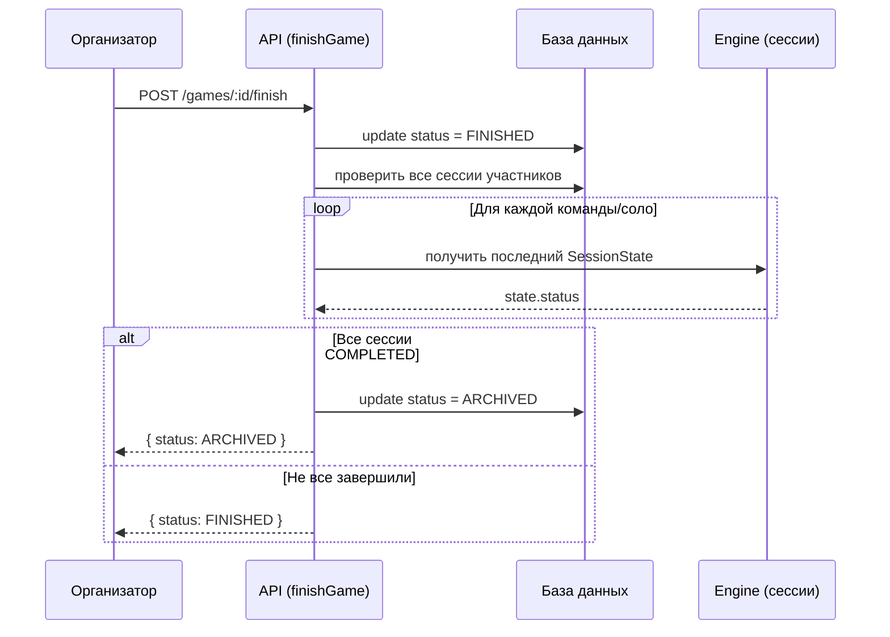
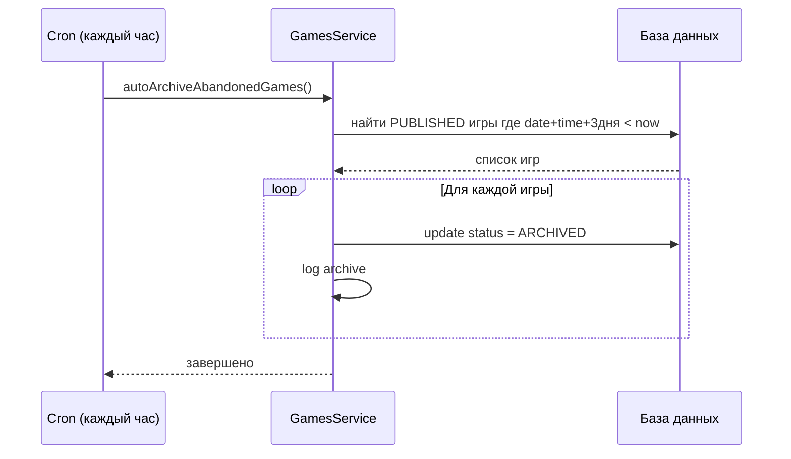

# План: Архив игр (Game Archive)

## 1. Логика архивации

### Условие 1: Архивация завершённой игры (после прохождения всех участников)
Игра переходит в статус `ARCHIVED` автоматически, когда выполнены **все** условия:
1. Игра была запущена (была в статусе `RUNNING`)
2. Организатор завершил игру (текущий статус `FINISHED`)
3. **Все участники прошли игру** — их сессии имеют статус `COMPLETED`

### Условие 2: Архивация заброшенной игры (не начата вовремя)
Игра переходит в статус `ARCHIVED` автоматически, когда:
1. Игра находится в статусе `PUBLISHED` (опубликована, но не начата)
2. С момента запланированного времени старта (`date + time`) прошло **3 дня**
3. Организатор не предпринял никаких действий (не открыл регистрацию, не запустил, не перенёс)

**Механизм:** Cron-задача (Schedule), запускается раз в час.

### Как определить "все участники прошли"
- Для **командного режима**: все `GameRegistration` для данной игры имеют соответствующие `SessionState` со статусом `FINISHED` (проверяется через `sessionState.state.status === 'FINISHED'`)
- Для **соло-режима**: все `SoloRegistration` имеют соответствующие сессии со статусом `FINISHED`

### Момент срабатывания
Триггер при вызове `finishGame()`:
1. Организатор нажимает "Завершить игру"
2. `finishGame()` переводит игру в `FINISHED`
3. Сразу после этого вызывается `tryAutoArchive(gameId)`
4. `tryAutoArchive` проверяет все сессии участников
5. Если все сессии `COMPLETED` — игра переводится в `ARCHIVED`
6. Если не все — игра остаётся в `FINISHED`, и архивация не происходит

### State Machine
Текущее разрешённое состояние: `FINISHED → ARCHIVED` (уже есть в `ALLOWED_TRANSITIONS`)

Ничего менять в state machine не нужно.

---

## 2. Изменения в бэкенде (API)

### 2.1. GamesService — новый метод `tryAutoArchive`

```typescript
// apps/api/src/modules/games/games.service.ts

/**
 * Проверяет, все ли участники завершили игру, и если да — архивирует.
 * Вызывается после finishGame().
 */
private async tryAutoArchive(gameId: string): Promise<void> {
  const game = await this.prisma.game.findUnique({
    where: { id: gameId },
    select: { mode: true, status: true },
  });

  if (!game || game.status !== 'FINISHED') return;

  let allCompleted = false;

  if (game.mode === 'SOLO') {
    // Соло-режим: проверяем сессии соло-игроков
    const soloRegs = await this.prisma.soloRegistration.findMany({
      where: { gameId },
    });

    if (soloRegs.length === 0) {
      allCompleted = true; // нет участников — можно архивировать
    } else {
      const results = await Promise.all(
        soloRegs.map(async (reg) => {
          const soloTeam = await this.prisma.team.findFirst({
            where: {
              captainId: reg.userId,
              registrations: { some: { gameId } },
            },
          });
          if (!soloTeam) return false;
          return this.isTeamSessionCompleted(soloTeam.id);
        }),
      );
      allCompleted = results.every(Boolean);
    }
  } else {
    // Командный режим
    const registrations = await this.prisma.gameRegistration.findMany({
      where: { gameId },
    });

    if (registrations.length === 0) {
      allCompleted = true;
    } else {
      const results = await Promise.all(
        registrations.map((reg) => this.isTeamSessionCompleted(reg.teamId)),
      );
      allCompleted = results.every(Boolean);
    }
  }

  if (allCompleted) {
    await this.prisma.game.update({
      where: { id: gameId },
      data: { status: GAME_STATUS.ARCHIVED },
    });
    this.logger.log(`Game auto-archived: ${gameId} — all participants completed`);
  }
}

/**
 * Проверяет, завершена ли сессия команды.
 */
private async isTeamSessionCompleted(teamId: string): Promise<boolean> {
  const snapshot = await this.prisma.sessionState.findFirst({
    where: { teamId },
    orderBy: { sequence: 'desc' },
  });

  if (!snapshot) return false;

  const state = snapshot.state as Record<string, unknown> | null;
  return state?.status === 'FINISHED';
}
```

### 2.2. GamesService — модификация `finishGame`

В конец метода `finishGame`, после `updatedGame`, добавить вызов:

```typescript
// После успешного перевода в FINISHED
await this.tryAutoArchive(gameId);
```

### 2.3. GamesController — новый эндпоинт `GET /games/archive`

```typescript
// apps/api/src/modules/games/games.controller.ts

@Get('archive')
@UseGuards(JwtAuthGuard)
async getArchivedGames(
  @Query('city') city?: string,
  @Query('limit') limit?: number,
  @Query('offset') offset?: number,
) {
  return this.gamesService.getArchivedGames({
    city,
    limit: Number(limit) || 20,
    offset: Number(offset) || 0,
  });
}
```

### 2.4. GamesService — метод `getArchivedGames`

```typescript
// apps/api/src/modules/games/games.service.ts

async getArchivedGames(params: {
  city?: string;
  limit?: number;
  offset?: number;
}) {
  const where: Record<string, unknown> = {
    deletedAt: null,
    status: GAME_STATUS.ARCHIVED,
  };

  if (params.city) {
    where.city = params.city;
  }

  const [games, total] = await Promise.all([
    this.prisma.game.findMany({
      where,
      take: params.limit || 20,
      skip: params.offset || 0,
      orderBy: { finishedAt: 'desc' },
      select: {
        id: true,
        slug: true,
        title: true,
        description: true,
        city: true,
        date: true,
        time: true,
        duration: true,
        price: true,
        maxTeams: true,
        shareLink: true,
        imageUrl: true,
        bannerUrl: true,
        tags: true,
        status: true,
        finishedAt: true,
        organizer: {
          select: {
            id: true,
            name: true,
            avatarUrl: true,
          },
        },
        _count: {
          select: {
            gameTeams: true,
            reviews: true,
            comments: true,
          },
        },
      },
    }),
    this.prisma.game.count({ where }),
  ]);

  return {
    data: games.map((g) => ({
      ...g,
      averageRating: 0,
      reviewsCount: g._count.reviews,
      teamsCount: g._count.gameTeams,
      commentsCount: g._count.comments,
    })),
    meta: {
      total,
      limit: params.limit || 20,
      offset: params.offset || 0,
    },
  };
}
```

### 2.5. Обновление `findAllPublic` — исключить `ARCHIVED`

Текущий код уже исключает `ARCHIVED`:
```typescript
status: { notIn: ['DRAFT', 'CANCELLED', 'ARCHIVED', 'HIDDEN', 'BLOCKED'] },
```
Ничего менять не нужно.

### 2.6. Обновление `findOnePublic` — разрешить просмотр ARCHIVED

Текущий код исключает `ARCHIVED`:
```typescript
status: { notIn: ['DRAFT', 'CANCELLED', 'ARCHIVED', 'HIDDEN', 'BLOCKED'] },
```

Нужно убрать `ARCHIVED` из этого списка, чтобы страница игры открывалась для архивных игр:
```typescript
status: { notIn: ['DRAFT', 'CANCELLED', 'HIDDEN', 'BLOCKED'] },
```

### 2.7. API Client — добавить метод `getArchivedGames`

```typescript
// apps/web/src/lib/api/client.ts

async getArchivedGames(params?: {
  city?: string;
  limit?: number;
  offset?: number;
}): Promise<ApiResponse<{ data: Game[]; meta: { total: number; limit: number; offset: number } }>> {
  const queryParams = new URLSearchParams();
  if (params?.city) queryParams.set('city', params.city);
  if (params?.limit) queryParams.set('limit', String(params.limit));
  if (params?.offset) queryParams.set('offset', String(params.offset));
  return this.request(`/games/archive?${queryParams.toString()}`);
}
```

И экспорт:
```typescript
export const getArchivedGames = (params?: { city?: string; limit?: number; offset?: number }) =>
  apiClient.getArchivedGames(params);
```

---

## 3. Изменения во фронтенде

### 3.1. Новая страница `/games/archive`

Создать файл `apps/web/src/app/games/archive/page.tsx`:

```tsx
'use client';

import { useEffect, useState } from 'react';
import { getArchivedGames, type Game } from '@/lib/api/client';
import GameCard from '@/components/ui/GameCard';
import Header from '@/components/ui/Header';

export default function ArchivedGamesPage() {
  const [games, setGames] = useState<Game[]>([]);
  const [loading, setLoading] = useState(true);
  const [error, setError] = useState<string | null>(null);
  const [selectedCity, setSelectedCity] = useState<string>('');
  const [cities, setCities] = useState<string[]>([]);

  useEffect(() => {
    async function loadArchivedGames() {
      try {
        const response = await getArchivedGames();
        setGames(response.data.data);
        const uniqueCities = Array.from(new Set(response.data.data.map((g) => g.city)));
        setCities(uniqueCities);
      } catch (err) {
        setError(err instanceof Error ? err.message : 'Не удалось загрузить архив игр');
      } finally {
        setLoading(false);
      }
    }

    loadArchivedGames();
  }, []);

  const filteredGames = selectedCity
    ? games.filter((g) => g.city === selectedCity)
    : games;

  return (
    <div className="min-h-screen">
      <Header />
      <div className="container mx-auto px-4 py-8">
        <h1 className="text-3xl font-bold mb-2 text-text-primary">Архив игр</h1>
        <p className="text-text-secondary mb-6">
          Завершённые игры, в которых можно посмотреть результаты, отзывы и обсуждения
        </p>

        {/* Filters */}
        {cities.length > 0 && (
          <div className="card mb-6">
            <div className="flex flex-wrap gap-4">
              <div className="flex-1 min-w-[200px]">
                <label className="label">Город</label>
                <select
                  value={selectedCity}
                  onChange={(e) => setSelectedCity(e.target.value)}
                  className="input-field"
                >
                  <option value="">Все города</option>
                  {cities.map((city) => (
                    <option key={city} value={city}>{city}</option>
                  ))}
                </select>
              </div>
            </div>
          </div>
        )}

        {/* Games Grid */}
        {loading ? (
          <div className="grid grid-cols-1 md:grid-cols-2 lg:grid-cols-3 gap-6">
            {[1, 2, 3, 4, 5, 6].map((i) => (
              <div key={i} className="card animate-pulse">
                <div className="h-48 bg-surface-elevated rounded-lg mb-4" />
                <div className="h-6 bg-surface-elevated rounded mb-2 w-3/4" />
                <div className="h-4 bg-surface-elevated rounded mb-2 w-full" />
                <div className="h-4 bg-surface-elevated rounded w-1/2" />
              </div>
            ))}
          </div>
        ) : error ? (
          <div className="card text-center py-12">
            <p className="text-error mb-4">{error}</p>
          </div>
        ) : filteredGames.length === 0 ? (
          <div className="card text-center py-12">
            <p className="text-text-secondary">
              {selectedCity
                ? `В городе "${selectedCity}" пока нет завершённых игр`
                : 'В архиве пока нет игр'}
            </p>
          </div>
        ) : (
          <div className="grid grid-cols-1 md:grid-cols-2 lg:grid-cols-3 gap-6">
            {filteredGames.map((game) => (
              <GameCard key={game.id} game={game} />
            ))}
          </div>
        )}
      </div>
    </div>
  );
}
```

### 3.2. Обновить страницу `/games/[id]` для архивных игр

На странице деталей игры нужно:
1. Убрать `ARCHIVED` из фильтра исключения в `findOnePublic` (уже сделано в п. 2.6)
2. Для статуса `ARCHIVED` показывать блоки:
   - Комментарии (обсуждение) — **доступны для чтения и добавления**
   - Отзывы — **доступны для чтения**
   - Информация об игре (дата, город, длительность)
   - **Не показывать** кнопки регистрации, старта и т.д.

На странице `apps/web/src/app/games/[id]/page.tsx` нужно добавить обработку статуса `ARCHIVED`:

В секции отображения статуса (строка 694):
```tsx
<span className="text-sm">
  {game.status === 'REGISTRATION_OPEN' || game.status === 'PUBLISHED' 
    ? 'Регистрация открыта' 
    : game.status === 'RUNNING' 
    ? 'Идёт игра' 
    : game.status === 'FINISHED' 
    ? 'Завершена' 
    : game.status === 'ARCHIVED'
    ? 'В архиве'
    : game.status === 'LOBBY' 
    ? 'Ожидание старта' 
    : game.status}
</span>
```

В секции сайдбара (после панели организатора) добавить блок для архивных игр:
```tsx
{game.status === 'ARCHIVED' && (
  <div className="text-center">
    <p className="text-text-secondary text-sm mb-3">📦 Игра в архиве</p>
    <p className="text-text-muted text-xs">
      Игра завершена. Вы можете оставить комментарий в обсуждении.
    </p>
  </div>
)}
```

### 3.3. Добавить ссылку в Header

В компоненте Header добавить ссылку на `/games/archive`. Нужно найти файл Header и добавить пункт меню.

---

## 4. Схема потока архивации



## 5. Схема потока архивации заброшенных игр



## 6. Структура изменяемых файлов

| Файл | Изменение |
|------|-----------|
| `apps/api/src/modules/games/games.service.ts` | Добавить `tryAutoArchive`, `isTeamSessionCompleted`, `getArchivedGames`. Модифицировать `finishGame`. Убрать `ARCHIVED` из `findOnePublic`. **Добавить `autoArchiveAbandonedGames`, `getArchiveInfo`** |
| `apps/api/src/modules/games/games.module.ts` | **Добавить ScheduleModule** для cron |
| `apps/api/src/modules/games/games.controller.ts` | Добавить `GET /games/archive`. **Добавить `GET /games/:id/archive-info`** |
| `apps/web/src/lib/api/client.ts` | Добавить `getArchivedGames`. **Добавить `getArchiveInfo`** |
| `apps/web/src/app/games/archive/page.tsx` | **Новый файл** — страница архива |
| `apps/web/src/app/games/[id]/page.tsx` | Добавить отображение статуса `ARCHIVED`, блоки для архивных игр |
| `apps/web/src/components/ui/Header.tsx` | Добавить ссылку на архив |
| `apps/web/src/app/organizer/games/[id]/page.tsx` | **Добавить предупреждение об архивации для статуса PUBLISHED** |

## 7. Детали реализации: авто-архивация заброшенных игр

### 7.1. GamesService — метод `autoArchiveAbandonedGames`

```typescript
// apps/api/src/modules/games/games.service.ts

/**
 * ARCHIVE_AFTER_DAYS: через сколько дней после запланированной даты
 * игра в статусе PUBLISHED автоматически уходит в архив.
 */
private readonly ARCHIVE_AFTER_DAYS = 3;

/**
 * autoArchiveAbandonedGames: находит все игры в статусе PUBLISHED,
 * у которых запланированная дата + время + 3 дня уже прошли,
 * и переводит их в ARCHIVED.
 * Вызывается по расписанию (cron) раз в час.
 */
async autoArchiveAbandonedGames(): Promise<number> {
  const now = new Date();
  const threeDaysAgo = new Date(now.getTime() - this.ARCHIVE_AFTER_DAYS * 24 * 60 * 60 * 1000);

  // Находим игры в статусе PUBLISHED, у которых date + time < threeDaysAgo
  // Используем сырой SQL или фильтрацию через Prisma
  const abandonedGames = await this.prisma.game.findMany({
    where: {
      status: GAME_STATUS.PUBLISHED,
      deletedAt: null,
      date: { lte: threeDaysAgo },
    },
    select: { id: true, title: true, date: true, time: true },
  });

  let archivedCount = 0;

  for (const game of abandonedGames) {
    // Вычисляем полное время старта: date + time
    const startTime = this.calculateStartTime(game.date, game.time);
    const archiveTime = new Date(startTime.getTime() + this.ARCHIVE_AFTER_DAYS * 24 * 60 * 60 * 1000);

    // Проверяем, что archiveTime действительно в прошлом
    if (archiveTime <= now) {
      await this.prisma.game.update({
        where: { id: game.id },
        data: { status: GAME_STATUS.ARCHIVED },
      });
      archivedCount++;
      this.logger.log(`Abandoned game auto-archived: ${game.id} "${game.title}" — not started within ${this.ARCHIVE_AFTER_DAYS} days after scheduled time`);
    }
  }

  if (archivedCount > 0) {
    this.logger.log(`Auto-archived ${archivedCount} abandoned games`);
  }

  return archivedCount;
}
```

### 7.2. Schedule (Cron) — подключение

В `games.module.ts` нужно импортировать `ScheduleModule` и добавить декоратор `@Cron`:

```typescript
// apps/api/src/modules/games/games.module.ts
import { ScheduleModule } from '@nestjs/schedule';

@Module({
  imports: [ScheduleModule.forRoot()], // если ещё не добавлен глобально
  // ...
})
```

В `games.service.ts` добавить метод с декоратором:

```typescript
import { Cron, CronExpression } from '@nestjs/schedule';

@Cron(CronExpression.EVERY_HOUR)
async handleAbandonedGamesCron() {
  const count = await this.autoArchiveAbandonedGames();
  if (count > 0) {
    this.logger.log(`[Cron] Auto-archived ${count} abandoned games`);
  }
}
```

### 7.3. GamesService — метод `getArchiveInfo`

Возвращает информацию о том, когда игра будет архивирована (для предупреждения на фронтенде):

```typescript
// apps/api/src/modules/games/games.service.ts

/**
 * getArchiveInfo: возвращает информацию об архивации для игры.
 * Для PUBLISHED — показывает, через сколько игра уйдёт в архив.
 */
async getArchiveInfo(gameId: string) {
  const game = await this.findGameOrThrow(gameId);

  const result: {
    willBeArchived: boolean;
    archiveAt: string | null;
    remainingMs: number | null;
    reason: string | null;
  } = {
    willBeArchived: false,
    archiveAt: null,
    remainingMs: null,
    reason: null,
  };

  if (game.status === GAME_STATUS.PUBLISHED) {
    const startTime = this.calculateStartTime(game.date, game.time);
    const archiveTime = new Date(startTime.getTime() + this.ARCHIVE_AFTER_DAYS * 24 * 60 * 60 * 1000);
    const now = new Date();

    result.willBeArchived = true;
    result.archiveAt = archiveTime.toISOString();
    result.remainingMs = Math.max(0, archiveTime.getTime() - now.getTime());
    result.reason = `Игра будет автоматически архивирована через ${this.ARCHIVE_AFTER_DAYS} дня после запланированной даты, если не будет запущена`;
  }

  return result;
}
```

### 7.4. GamesController — эндпоинт `GET /games/:id/archive-info`

```typescript
// apps/api/src/modules/games/games.controller.ts

@Get(':id/archive-info')
@UseGuards(JwtAuthGuard)
async getArchiveInfo(@Param('id') gameId: string) {
  return this.gamesService.getArchiveInfo(gameId);
}
```

### 7.5. API Client — метод `getArchiveInfo`

```typescript
// apps/web/src/lib/api/client.ts

async getArchiveInfo(gameId: string): Promise<ApiResponse<{
  willBeArchived: boolean;
  archiveAt: string | null;
  remainingMs: number | null;
  reason: string | null;
}>> {
  return this.request(`/games/${gameId}/archive-info`);
}
```

### 7.6. Фронтенд — предупреждение на странице организатора

На странице `apps/web/src/app/organizer/games/[id]/page.tsx` добавить:

1. Загрузку `archiveInfo` при статусе `PUBLISHED`
2. Блок-предупреждение в сайдбаре (перед блоком "Действия"):

```tsx
// Предупреждение об архивации — только для PUBLISHED
{archiveInfo?.willBeArchived && (
  <div className="card border-warning/50 bg-warning/5">
    <div className="flex items-start gap-3">
      <span className="text-xl shrink-0 mt-0.5">⚠️</span>
      <div>
        <h3 className="font-medium text-text-primary text-sm mb-1">
          Игра будет архивирована
        </h3>
        <p className="text-text-secondary text-xs mb-2">
          {archiveInfo.reason}
        </p>
        {archiveInfo.remainingMs !== null && archiveInfo.remainingMs > 0 ? (
          <div className="flex items-center gap-2">
            <span className="text-xs text-text-muted">
              Осталось: {formatRemainingTime(archiveInfo.remainingMs)}
            </span>
          </div>
        ) : (
          <p className="text-xs text-error font-medium">
            Игра будет архивирована в ближайшее время!
          </p>
        )}
        <div className="mt-2 flex gap-2">
          <Link
            href={`/organizer/games/${gameId}/edit`}
            className="btn-primary text-xs px-3 py-1.5"
          >
            ✏️ Перенести
          </Link>
          <button
            className="btn-secondary text-xs px-3 py-1.5"
            onClick={() => handleAction('openRegistration', () => openRegistration(gameId))}
            disabled={actionLoading === 'openRegistration'}
          >
            📝 Открыть регистрацию
          </button>
        </div>
      </div>
    </div>
  </div>
)}
```

Функция форматирования оставшегося времени:

```typescript
const formatRemainingTime = (ms: number): string => {
  const totalHours = Math.floor(ms / (1000 * 60 * 60));
  const days = Math.floor(totalHours / 24);
  const hours = totalHours % 24;
  
  if (days > 0) {
    return `${days} дн. ${hours} ч.`;
  }
  if (hours > 0) {
    const minutes = Math.floor((ms % (1000 * 60 * 60)) / (1000 * 60));
    return `${hours} ч. ${minutes} мин.`;
  }
  const minutes = Math.floor(ms / (1000 * 60));
  return `${minutes} мин.`;
};
```

## 8. Важные замечания

1. **ARCHIVED уже есть в enum** `GameStatus` — миграция БД не требуется
2. **State machine** уже поддерживает `FINISHED → ARCHIVED` — изменений не требуется
3. **Комментарии** (`GameComment`) и **отзывы** (`Review`) уже привязаны к Game и будут доступны автоматически
4. **Безопасность**: эндпоинт `GET /games/archive` доступен только авторизованным пользователям (`JwtAuthGuard`)
5. **Страница игры** для `ARCHIVED` будет доступна через существующий `GET /games/public/:id` (после удаления `ARCHIVED` из исключений)