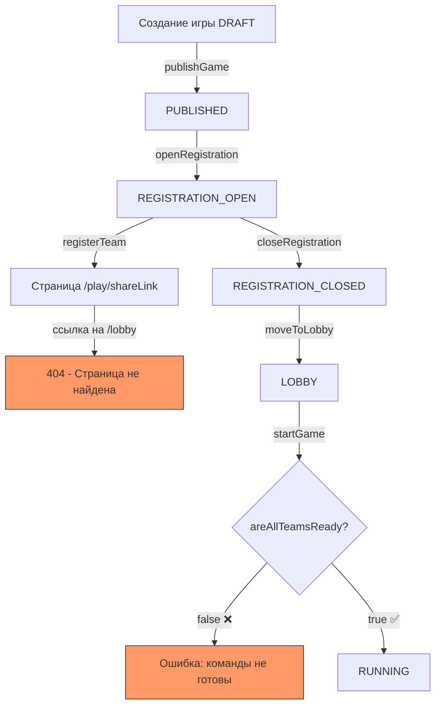
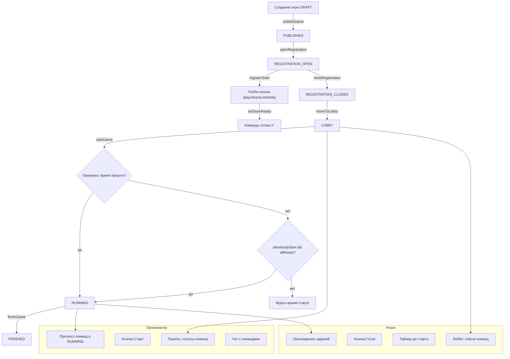
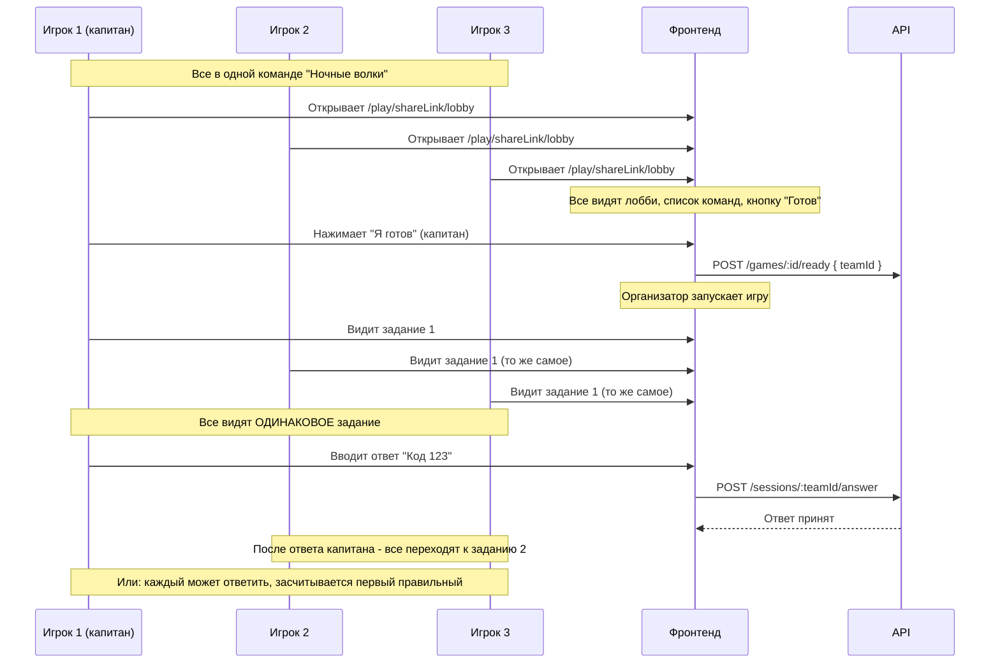
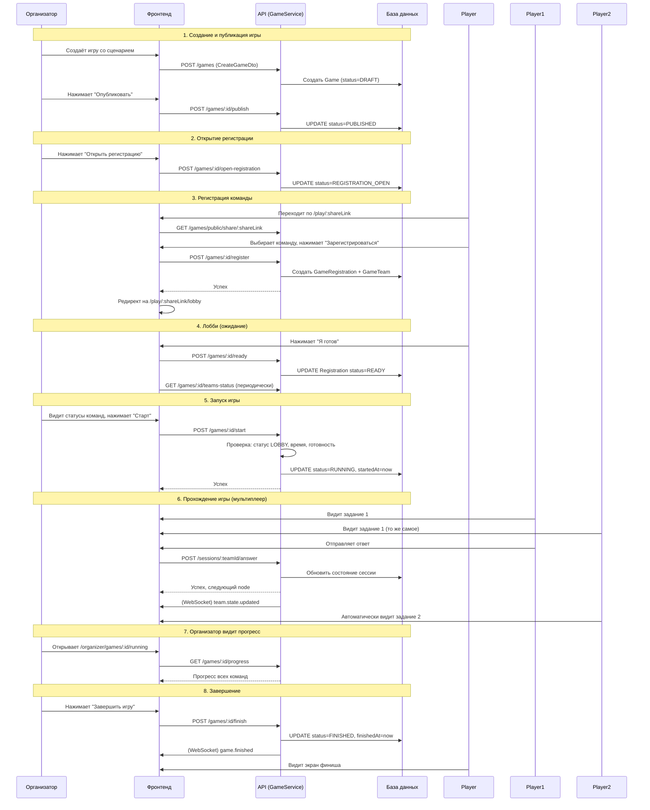

# План исправления игрового процесса (Gameplay Flow Fixes)

## Проблема

После создания игры и регистрации команды игровой процесс ломается:
1. Команда регистрируется, но её перекидывает на несуществующую страницу лобби
2. На странице регистрации снова видна кнопка "Зарегистрироваться" (хотя команда уже зарегистрирована)
3. Организатор не может запустить игру, т.к. команды не могут нажать "Готов"
4. Отсутствует полноценная панель управления игрой для организатора
5. Нет страницы для организатора во время RUNNING (прогресс команд, чат)
6. Непонятно, как работает мультиплеер (10 человек в команде с разных устройств)

---

## 1. Текущая архитектура (AS-IS)



## 2. Целевая архитектура (TO-BE)



---

## 3. План работ

### 3.1. Бэкенд: Исправления в API

#### 3.1.1. Исправить `registerTeam()` — добавить создание `GameTeam`

**Файл:** `apps/api/src/modules/games/games.service.ts`

**Проблема:** `registerTeam()` создаёт только `GameRegistration`, но не создаёт `GameTeam`. `registerTeamByName()` делает и то, и другое.

**Решение:** Добавить создание `GameTeam` в `registerTeam()` после создания регистрации.

```typescript
// После создания registration добавить:
await this.prisma.gameTeam.create({
  data: {
    gameId,
    teamId,
  },
});
```

#### 3.1.2. Исправить State Machine — убрать прямые переходы в RUNNING

**Файл:** `apps/api/src/modules/games/state-machine/game-state-machine.ts`

**Проблема:** Сейчас разрешены переходы `PUBLISHED → RUNNING` и `REGISTRATION_OPEN → RUNNING`, что противоречит логике `startGame()`, которая требует статус `LOBBY`.

**Решение:** Убрать `RUNNING` из списка разрешённых переходов для `PUBLISHED` и `REGISTRATION_OPEN`.

```typescript
const ALLOWED_TRANSITIONS: Record<string, string[]> = {
  PUBLISHED: ['REGISTRATION_OPEN', 'CANCELLED', 'RESCHEDULED', 'DRAFT'], // убрали RUNNING
  REGISTRATION_OPEN: ['REGISTRATION_CLOSED', 'CANCELLED', 'RESCHEDULED'], // убрали RUNNING
  // ...
};
```

#### 3.1.3. Добавить эндпоинт для получения статуса регистрации команды

**Файл:** `apps/api/src/modules/games/games.service.ts` + `games.controller.ts`

**Нужно:** Чтобы фронтенд понимал, зарегистрирована ли уже команда на игру, и показывал соответствующий UI.

**Добавить метод:**
```typescript
async getTeamRegistrationStatus(gameId: string, teamId: string) {
  const registration = await this.prisma.gameRegistration.findUnique({
    where: { gameId_teamId: { gameId, teamId } },
  });
  return { isRegistered: !!registration, status: registration?.status || null };
}
```

**Эндпоинт:** `GET /games/:id/registration-status/:teamId`

#### 3.1.4. Добавить эндпоинт для получения прогресса всех команд (для организатора)

**Файл:** `apps/api/src/modules/games/games.service.ts` + `games.controller.ts`

**Нужно:** Чтобы организатор видел прогресс всех команд во время RUNNING.

**Новый метод:**
```typescript
async getGameProgress(gameId: string) {
  const game = await this.findGameOrThrow(gameId);
  
  const teams = await this.prisma.gameTeam.findMany({
    where: { gameId },
    include: {
      team: {
        select: { id: true, name: true, slug: true, avatar: true },
      },
    },
  });

  // Для каждой команды получаем состояние сессии
  const progress = await Promise.all(
    teams.map(async (gt) => {
      const snapshot = await this.prisma.sessionState.findFirst({
        where: { teamId: gt.teamId },
        orderBy: { sequence: 'desc' },
      });
      
      const state = snapshot?.state as SessionState | null;
      
      return {
        teamId: gt.teamId,
        teamName: gt.team.name,
        score: state?.score || 0,
        penalties: state?.penalties || 0,
        currentNodeId: state?.currentNodeId || null,
        currentNodeIndex: state?.history?.length || 0,
        status: state?.status || 'not_started',
        startedAt: state?.startedAt || null,
      };
    }),
  );

  return progress;
}
```

**Эндпоинт:** `GET /games/:id/progress` (только для организатора)

---

### 3.2. Фронтенд: Страница лобби для игрока

#### 3.2.1. Создать страницу `/play/[shareLink]/lobby/page.tsx`

**Новый файл:** `apps/web/src/app/play/[shareLink]/lobby/page.tsx`

**Функционал:**
- Отображает информацию об игре (название, город, дата)
- Показывает выбранную команду и её участников
- Показывает список всех зарегистрированных команд и их статус готовности
- Кнопка **"Я готов"** (вызывает `setTeamReady(gameId, teamId)`)
- Таймер до старта игры (если игра в статусе LOBBY)
- Если игра уже RUNNING — редирект на страницу прохождения `/play/${shareLink}/${sessionId}`
- Авто-обновление статусов команд (polling каждые 5-10 секунд)

**API-вызовы:**
- `GET /games/public/share/${shareLink}` — получить игру
- `GET /games/${gameId}/teams-status` — получить статусы команд
- `POST /games/${gameId}/ready` — нажать "Готов"
- `GET /games/${gameId}/timer` — получить таймер

#### 3.2.2. Исправить страницу регистрации `/play/[shareLink]/page.tsx`

**Файл:** `apps/web/src/app/play/[shareLink]/page.tsx`

**Изменения:**
- После успешной регистрации редиректить на `/play/${shareLink}/lobby` вместо показа ссылки
- Если команда уже зарегистрирована — сразу редиректить в лобби
- Убрать ссылку "Продолжить игру" (она ведёт на `/play/${shareLink}/existing`, которого нет)

---

### 3.3. Фронтенд: Панель организатора (управление игрой)

#### 3.3.1. Обновить страницу управления игрой `/organizer/games/[id]/page.tsx`

**Файл:** `apps/web/src/app/organizer/games/[id]/page.tsx`

**Добавить кнопки управления статусами (в зависимости от текущего статуса):**

| Статус | Кнопки |
|--------|--------|
| DRAFT | Опубликовать, Редактировать, Удалить |
| PUBLISHED | Открыть регистрацию, Отменить |
| REGISTRATION_OPEN | Закрыть регистрацию, Отменить |
| REGISTRATION_CLOSED | Перейти в лобби, Отменить |
| LOBBY | Запустить игру, Отменить |
| RUNNING | Завершить игру |
| FINISHED | (только просмотр) |

**Добавить таблицу команд со статусами:**
- Загружать `GET /games/${gameId}/teams-status`
- Показывать: название команды, статус (REGISTERED/READY), время готовности
- Для статуса LOBBY: показывать таймер до старта
- Авто-обновление (polling каждые 5 секунд)

**API-вызовы для организатора:**
- `POST /games/${gameId}/open-registration`
- `POST /games/${gameId}/close-registration`
- `POST /games/${gameId}/move-to-lobby`
- `POST /games/${gameId}/start`
- `POST /games/${gameId}/finish`
- `POST /games/${gameId}/cancel`
- `GET /games/${gameId}/teams-status`
- `GET /games/${gameId}/timer`
- `GET /games/${gameId}/can-start`

---

### 3.4. Фронтенд: Страница организатора во время RUNNING

#### 3.4.1. Создать/обновить страницу `/organizer/games/[id]/running/page.tsx`

**Новый файл:** `apps/web/src/app/organizer/games/[id]/running/page.tsx`

**Функционал:**
- Отображается, когда игра в статусе RUNNING
- Показывает **прогресс всех команд**:
  - Название команды
  - Текущий счёт (score)
  - Штрафы (penalties)
  - Текущее задание (currentNodeId/index)
  - Статус (играет / завершила)
- **Чат с командами** (организатор может писать сообщения конкретной команде или всем)
- **Кнопка "Завершить игру"** (с подтверждением)
- Авто-обновление (polling каждые 5-10 секунд)

**API-вызовы:**
- `GET /games/${gameId}/progress` — прогресс всех команд
- `GET /games/${gameId}/chat/organizer` — сообщения чата
- `POST /games/${gameId}/chat/organizer` — отправить сообщение
- `POST /games/${gameId}/finish` — завершить игру

**Макет интерфейса:**
```
┌─────────────────────────────────────────────────────┐
│ 📊 Прогресс игры: "Тайны старого города"           │
│ Статус: RUNNING                                     │
│                                                     │
│ Команды (3):                                        │
│ ┌─────────────────────────────────────────────────┐ │
│ │ Ночные волки    ████████░░ 4/5  Счёт: 45  ⏱ 12:30│ │
│ │ Спецназ         ██████░░░░ 3/5  Счёт: 30  ⏱ 14:15│ │
│ │ Странники       ████░░░░░░ 2/5  Счёт: 20  ⏱ 16:00│ │
│ └─────────────────────────────────────────────────┘ │
│                                                     │
│ 💬 Чат с командами                                   │
│ ┌─────────────────────────────────────────────────┐ │
│ │ Команда: Все │ Ночные волки │ Спецназ │ ...    │ │
│ │─────────────────────────────────────────────────│ │
│ │ [Сообщение...]                          [Отправить]│ │
│ └─────────────────────────────────────────────────┘ │
│                                                     │
│ [⏹ Завершить игру]                                  │
└─────────────────────────────────────────────────────┘
```

---

### 3.5. Мультиплеер: 10 человек в команде с разных устройств

#### 3.5.1. Текущая ситуация

Сейчас сессия создаётся на **команду** (teamId), а не на игрока. Это значит:
- Все члены команды используют один и тот же `teamId`
- Состояние игры (текущее задание, счёт) — общее для всей команды
- Ответы отправляются от имени команды

**Проблема:** Страница прохождения `/play/[shareLink]/[sessionId]/page.tsx` использует `sessionId` как параметр, но сессия привязана к `teamId`. Если 10 человек откроют одну и ту же ссылку, они увидят одно и то же.

#### 3.5.2. Как должно работать



**Ключевые моменты:**
1. **Сессия общая для всей команды** — все 10 человек видят одно и то же задание
2. **Ответ может отправить любой член команды** — первый правильный ответ засчитывается
3. **После правильного ответа** — все члены команды автоматически переходят к следующему заданию
4. **Капитан может управлять** — но любой член команды может отвечать

#### 3.5.3. Что нужно сделать для мультиплеера

**Бэкенд:**
- [ ] В `submitAnswer()` убрать проверку `captainId` (сейчас проверяет, что только капитан может отвечать)
- [ ] Добавить WebSocket или Server-Sent Events для real-time синхронизации состояния команды
- [ ] При изменении `currentNodeId` у команды — уведомлять всех членов команды

**Фронтенд:**
- [ ] Страница прохождения должна поддерживать real-time обновления (через WebSocket или polling)
- [ ] При получении ответа от другого члена команды — автоматически обновлять интерфейс
- [ ] Показывать, кто из команды сейчас онлайн

**WebSocket события:**
```
Server → Client:
  team.state.updated { teamId, currentNodeId, score, history }
  team.member.answered { teamId, memberName, answer }
  game.finished { gameId }

Client → Server:
  (не нужно — все запросы через REST API)
```

---

### 3.6. Полный Flow после исправлений



---

## 4. Чек-лист задач

### Бэкенд (API)
- [ ] Исправить `registerTeam()` — добавить создание `GameTeam`
- [ ] Исправить State Machine — убрать `PUBLISHED → RUNNING` и `REGISTRATION_OPEN → RUNNING`
- [ ] Добавить эндпоинт `GET /games/:id/registration-status/:teamId`
- [ ] Добавить эндпоинт `GET /games/:id/progress` (прогресс всех команд для организатора)
- [ ] Убрать проверку `captainId` в `submitAnswer()` (чтобы любой член команды мог ответить)
- [ ] Добавить WebSocket для real-time синхронизации состояния команды

### Фронтенд — Страница лобби игрока
- [ ] Создать `/play/[shareLink]/lobby/page.tsx`
- [ ] Отображать информацию об игре и команде
- [ ] Показывать список команд со статусами
- [ ] Кнопка "Я готов" (setTeamReady)
- [ ] Таймер до старта
- [ ] Авто-редирект на страницу игры, если статус RUNNING
- [ ] Авто-обновление статусов (polling)

### Фронтенд — Страница регистрации
- [ ] После успешной регистрации редиректить в лобби
- [ ] Проверять, зарегистрирована ли уже команда
- [ ] Убрать битые ссылки

### Фронтенд — Панель организатора (управление игрой)
- [ ] Добавить кнопки управления статусами игры
- [ ] Добавить таблицу команд со статусами готовности
- [ ] Добавить таймер до старта
- [ ] Добавить кнопку "Запустить игру" с проверкой canStart
- [ ] Добавить кнопку "Завершить игру" для статуса RUNNING

### Фронтенд — Страница организатора во время RUNNING
- [ ] Создать `/organizer/games/[id]/running/page.tsx`
- [ ] Показывать прогресс всех команд (счёт, текущее задание)
- [ ] Чат с командами (выбор команды-получателя)
- [ ] Кнопка "Завершить игру"
- [ ] Авто-обновление (polling)

### Фронтенд — Мультиплеер (10 человек с разных устройств)
- [ ] Страница прохождения должна поддерживать real-time обновления
- [ ] При ответе одного члена команды — все видят обновление
- [ ] Показывать, кто из команды онлайн

---

## 5. Приоритеты

1. **Критично (блокирует игровой процесс):**
   - Создать страницу лобби для игрока
   - Добавить кнопку "Готов" для команды
   - Добавить кнопки управления игрой для организатора
   - Исправить редирект после регистрации

2. **Важно (корректность работы):**
   - Исправить registerTeam (добавить GameTeam)
   - Исправить State Machine
   - Страница организатора во время RUNNING
   - Убрать проверку captainId в submitAnswer

3. **Улучшения (UX):**
   - Таймер до старта
   - Авто-обновление статусов команд
   - Чат в лобби
   - WebSocket для real-time синхронизации
   - Индикация онлайн-участников команды