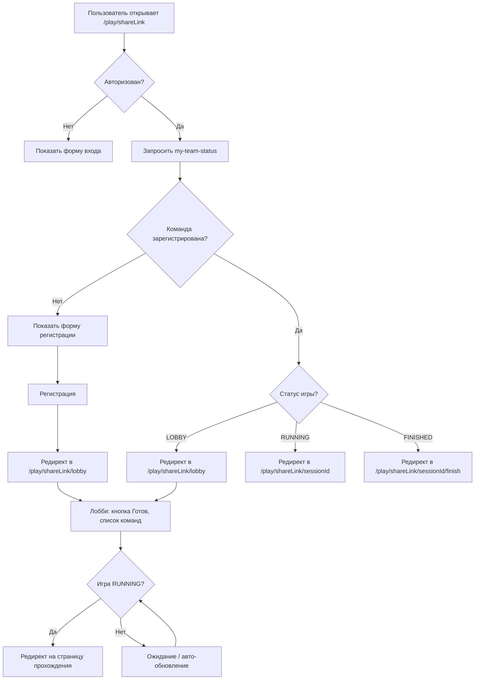

# План исправления игрового процесса (Hotfix)

## Проблемы

### Проблема 1: Редирект после регистрации не срабатывает
**Файл:** [`apps/web/src/app/play/[shareLink]/page.tsx`](apps/web/src/app/play/[shareLink]/page.tsx:58)

**Текущий код:**
```typescript
const handleRegister = async () => {
  // ...
  const response = await registerTeam(game.id, selectedTeamId);
  localStorage.setItem('currentTeamId', selectedTeamId);
  router.push(`/play/${shareLink}/lobby`);  // ← этот код выполняется
};
```

**Почему не срабатывает:** `router.push()` вызывается, но на странице есть блок `{success ? (...)}`, который **не** показывается (success = null). Проблема в том, что `router.push` может не успевать выполниться до ререндера, и Next.js показывает ту же страницу. Нужно убрать блок `success` полностью и сделать редирект безусловным.

**Решение:**
1. Убрать состояние `success` и весь блок `{success ? (...)}`
2. После `registerTeam()` сразу делать `router.push()`
3. Добавить `router.refresh()` перед push для сброса кэша

---

### Проблема 2: State Machine не позволяет PUBLISHED→RUNNING и REGISTRATION_OPEN→RUNNING
**Файл:** [`apps/api/src/modules/games/state-machine/game-state-machine.ts`](apps/api/src/modules/games/state-machine/game-state-machine.ts:9)

**Текущие разрешённые переходы:**
```
PUBLISHED: ['REGISTRATION_OPEN', 'CANCELLED', 'RESCHEDULED', 'DRAFT']
REGISTRATION_OPEN: ['REGISTRATION_CLOSED', 'CANCELLED', 'RESCHEDULED']
LOBBY: ['RUNNING', 'CANCELLED', 'RESCHEDULED']
```

**Проблема:** `startGame()` (games.service.ts:1335) вызывает `validateTransition(game.status, GAME_STATUS.RUNNING)`. Если игра в статусе `PUBLISHED` или `REGISTRATION_OPEN`, переход в `RUNNING` запрещён. Но `startGame()` сам проверяет все условия (регистрации, время, готовность команд) — ему не нужен полный цикл статусов.

**Решение:** Вернуть прямые переходы в RUNNING:
```
PUBLISHED: ['REGISTRATION_OPEN', 'RUNNING', 'CANCELLED', 'RESCHEDULED', 'DRAFT']
REGISTRATION_OPEN: ['REGISTRATION_CLOSED', 'RUNNING', 'CANCELLED', 'RESCHEDULED']
```

---

### Проблема 3: Нет сценариев повторного входа для команд

**Сценарии:**
1. Команда зарегистрировалась, закрыла вкладку → заходит по ссылке → должна попасть в лобби
2. Игра RUNNING, телефон сел → заходят с другого устройства → должны попасть на страницу прохождения
3. Игра FINISHED → должны видеть результаты

**Текущая архитектура:**
- Страница `/play/[shareLink]` (page.tsx) — показывает форму регистрации, **не проверяет**, зарегистрирована ли уже команда
- Страница `/play/[shareLink]/lobby` (lobby/page.tsx) — лобби, но нет редиректа на сессию при RUNNING
- Нет эндпоинта для получения sessionId по teamId+gameId

**Решение — многослойное:**

#### 3.1. Бэкенд: Новый эндпоинт `GET /games/:id/my-team-status`
Проверяет для текущего пользователя:
- Какие его команды зарегистрированы на эту игру
- Статус регистрации (REGISTERED/READY)
- Статус игры
- Если игра RUNNING — возвращает sessionId (последняя SessionState для teamId)

**Ответ:**
```json
{
  "registered": true,
  "teamId": "uuid",
  "teamName": "Команда",
  "registrationStatus": "REGISTERED" | "READY",
  "gameStatus": "LOBBY" | "RUNNING" | "FINISHED",
  "sessionId": "uuid | null" // только если RUNNING
}
```

#### 3.2. Бэкенд: Новый эндпоинт `GET /sessions/by-team/:teamId/game/:gameId`
Возвращает последнюю сессию команды для данной игры (нужен для восстановления sessionId).

#### 3.3. Фронтенд: Страница регистрации `/play/[shareLink]`
При загрузке:
1. Загрузить игру по shareLink
2. Если пользователь авторизован — запросить `GET /games/:id/my-team-status`
3. Если команда уже зарегистрирована:
   - Статус LOBBY → редирект в `/play/[shareLink]/lobby`
   - Статус RUNNING → редирект в `/play/[shareLink]/[sessionId]`
   - Статус FINISHED → редирект в `/play/[shareLink]/[sessionId]/finish`
4. Если не зарегистрирована — показать форму регистрации

#### 3.4. Фронтенд: Страница лобби `/play/[shareLink]/lobby`
При загрузке:
1. Проверить статус игры
2. Если RUNNING — получить sessionId и редиректнуть на страницу прохождения
3. Если FINISHED — редиректнуть на финиш

---

## Полный Flow после исправлений



---

## Детальный план изменений

### 1. Бэкенд: State Machine
**Файл:** [`apps/api/src/modules/games/state-machine/game-state-machine.ts`](apps/api/src/modules/games/state-machine/game-state-machine.ts:9)

Добавить `'RUNNING'` в разрешённые переходы для `PUBLISHED` и `REGISTRATION_OPEN`:
```typescript
const ALLOWED_TRANSITIONS: Record<string, string[]> = {
  PUBLISHED: ['REGISTRATION_OPEN', 'RUNNING', 'CANCELLED', 'RESCHEDULED', 'DRAFT'],
  REGISTRATION_OPEN: ['REGISTRATION_CLOSED', 'RUNNING', 'CANCELLED', 'RESCHEDULED'],
  // ... остальное без изменений
};
```

### 2. Бэкенд: Новый эндпоинт `GET /games/:id/my-team-status`
**Файл:** [`apps/api/src/modules/games/games.service.ts`](apps/api/src/modules/games/games.service.ts)

Добавить метод `getMyTeamStatus(gameId: string, userId: string)`:
- Найти все команды пользователя (TeamMember)
- Для каждой проверить GameRegistration
- Если регистрация найдена — проверить статус игры
- Если игра RUNNING — найти последнюю SessionState для teamId
- Вернуть результат

**Файл:** [`apps/api/src/modules/games/games.controller.ts`](apps/api/src/modules/games/games.controller.ts)

Добавить эндпоинт:
```typescript
@Get(':id/my-team-status')
@UseGuards(JwtAuthGuard)
async getMyTeamStatus(@Param('id') gameId: string, @Request() req: any) {
  return this.gamesService.getMyTeamStatus(gameId, req.user.userId);
}
```

### 3. Бэкенд: Новый эндпоинт `GET /sessions/by-team/:teamId/game/:gameId`
**Файл:** [`apps/api/src/modules/sessions/sessions.service.ts`](apps/api/src/modules/sessions/sessions.service.ts)

Добавить метод `getSessionByTeamAndGame(teamId: string, gameId: string)`:
- Найти последнюю SessionState для teamId
- Вернуть sessionId и статус

**Файл:** [`apps/api/src/modules/sessions/sessions.controller.ts`](apps/api/src/modules/sessions/sessions.controller.ts)

Добавить эндпоинт:
```typescript
@Get('by-team/:teamId/game/:gameId')
@UseGuards(JwtAuthGuard)
async getSessionByTeamAndGame(
  @Param('teamId') teamId: string,
  @Param('gameId') gameId: string,
) {
  return this.sessionsService.getSessionByTeamAndGame(teamId, gameId);
}
```

### 4. Фронтенд: ApiClient — новые методы
**Файл:** [`apps/web/src/lib/api/client.ts`](apps/web/src/lib/api/client.ts)

Добавить:
- `getMyTeamStatus(gameId: string)` — вызов `GET /games/:id/my-team-status`
- `getSessionByTeamAndGame(teamId: string, gameId: string)` — вызов `GET /sessions/by-team/:teamId/game/:gameId`

### 5. Фронтенд: Страница регистрации — редирект и авто-проверка
**Файл:** [`apps/web/src/app/play/[shareLink]/page.tsx`](apps/web/src/app/play/[shareLink]/page.tsx)

Изменения:
1. В `useEffect` после загрузки игры — проверить `getMyTeamStatus`
2. Если команда уже зарегистрирована — редирект в зависимости от статуса игры
3. Убрать состояние `success` и блок `{success ? (...)}`
4. В `handleRegister` — только `router.push` без `setSuccess`

### 6. Фронтенд: Страница лобби — редирект на сессию
**Файл:** [`apps/web/src/app/play/[shareLink]/lobby/page.tsx`](apps/web/src/app/play/[shareLink]/lobby/page.tsx)

Изменения:
1. При загрузке, если игра RUNNING — получить sessionId через `getSessionByTeamAndGame`
2. Редиректнуть на `/play/[shareLink]/[sessionId]`

---

## Чек-лист для проверки

### Сценарий 1: Первая регистрация
1. Пользователь открывает `/play/shareLink`
2. Видит форму регистрации
3. Выбирает команду, нажимает "Зарегистрироваться"
4. **Ожидание:** редирект в лобби
5. В лобби видит кнопку "Я готов!"
6. Нажимает "Я готов!" — статус меняется на READY

### Сценарий 2: Повторный вход до старта
1. Пользователь закрыл вкладку после регистрации
2. Снова открывает `/play/shareLink`
3. **Ожидание:** автоматический редирект в лобби (без формы регистрации)

### Сценарий 3: Повторный вход во время игры
1. Игра RUNNING, пользователь закрыл вкладку
2. Открывает `/play/shareLink` с другого устройства
3. **Ожидание:** автоматический редирект на страницу прохождения

### Сценарий 4: Запуск игры организатором
1. Организатор создал игру → DRAFT
2. Опубликовал → PUBLISHED
3. Нажал "Запустить игру" → **Ожидание:** игра запускается (RUNNING)
4. Или: открыл регистрацию → REGISTRATION_OPEN → закрыл → REGISTRATION_CLOSED → лобби → LOBBY → запуск → RUNNING

### Сценарий 5: Организатор завершает игру
1. Игра RUNNING
2. Организатор нажимает "Завершить игру"
3. **Ожидание:** статус FINISHED

---

## Приоритеты выполнения

1. **🔴 Критично (блокирует игровой процесс):**
   - State Machine: вернуть прямые переходы в RUNNING
   - Страница регистрации: исправить редирект (убрать success)

2. **🟡 Важно (UX):**
   - Бэкенд: эндпоинт my-team-status
   - Бэкенд: эндпоинт get-session-by-team
   - Фронтенд: авто-редирект на странице регистрации

3. **🟢 Улучшения:**
   - Фронтенд: редирект из лобби на сессию при RUNNING
   - Документация: обновить gameplay-flow.md