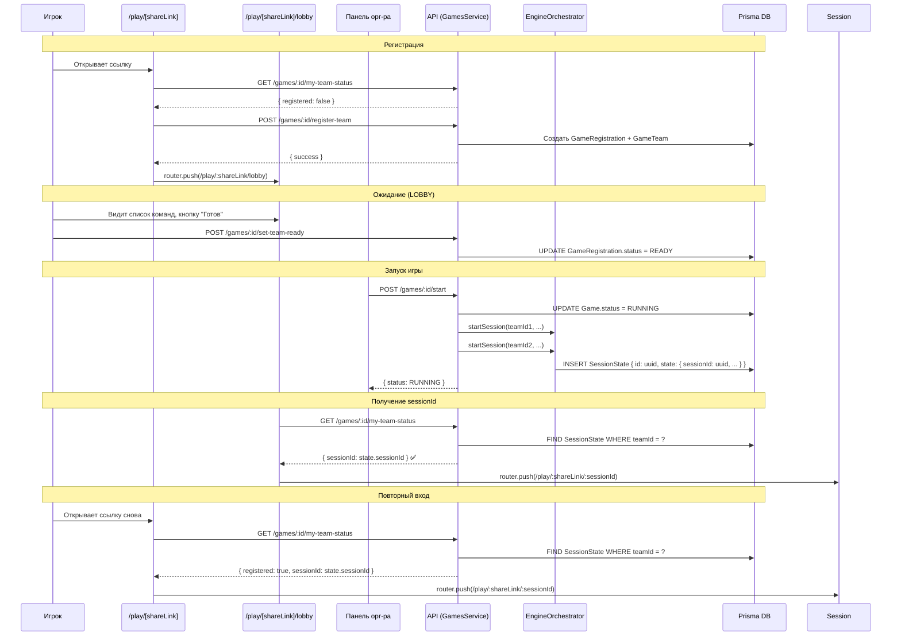

# План исправления gameplay flow — финальные правки

## Проблемы

### 0. UI: MyActiveGames не соответствует сетке главной страницы

**Проблема:** Компонент `MyActiveGames` использует:
- Собственный `container mx-auto px-4 py-8` (дублирует контейнер из `main`)
- `max-w-4xl mx-auto` (ограничивает ширину до ~900px, из-за чего секция уже остальных)
- Сетку `grid-cols-1 md:grid-cols-2 gap-4` (только 2 карточки в ряд)

В то время как `GamesSection` (Доступные игры, Популярные игры и т.д.) использует:
- Сетку `grid-cols-1 md:grid-cols-2 lg:grid-cols-4 gap-6` (4 карточки в ряд)
- Без `max-w-4xl` — на всю ширину контейнера
- Заголовок `text-xl md:text-2xl` со ссылкой "Смотреть все →"

**Где исправить:** `apps/web/src/components/game/MyActiveGames.tsx`

**Что изменить:**
1. Убрать внешний `container mx-auto px-4 py-8` — оставить только `section.mb-12` (как в GamesSection)
2. Убрать `max-w-4xl mx-auto` — не ограничивать ширину
3. Сетку: `grid-cols-1 md:grid-cols-2 lg:grid-cols-4 gap-6` (как в GamesSection)
4. Заголовок: `text-xl md:text-2xl` со ссылкой "Смотреть все →" на `/games?my=active`
5. Карточки сделать в едином стиле с GameCard (использовать `GameCardComponent` вместо кастомной вёрстки)

### 1. "Сессия не найдена" — неверный sessionId

**Корень:** В трёх местах возвращается `snapshot.id` (Prisma ID записи SessionState) вместо Engine `sessionId` (который хранится внутри JSON-поля `state` как `state.sessionId`).

**Где исправить:**

#### 1.1. `getMyTeamStatus()` — `games.service.ts:1936`

```typescript
// БЫЛО (строка 1936):
sessionId = snapshot?.id || null;

// СТАЛО:
const state = snapshot?.state as Record<string, unknown> | null;
sessionId = (state?.sessionId as string) || null;
```

#### 1.2. `getMyActiveRegistrations()` — `games.service.ts:2023`

```typescript
// БЫЛО (строка 2023):
sessionId = snapshot?.id || null;

// СТАЛО:
const state = snapshot?.state as Record<string, unknown> | null;
sessionId = (state?.sessionId as string) || null;
```

#### 1.3. `getSessionByTeamAndGame()` — `sessions.service.ts:457`

```typescript
// БЫЛО (строка 457):
sessionId: snapshot.id,

// СТАЛО:
const state = snapshot.state as Record<string, unknown>;
sessionId: (state?.sessionId as string) || snapshot.id,
// fallback на snapshot.id если state.sessionId отсутствует
```

### 2. Сессии не создаются при `startGame()`

**Корень:** `games.service.ts:startGame()` (строка 1335) меняет статус игры на `RUNNING`, но **НЕ вызывает** `engineOrchestrator.startSession()` для каждой зарегистрированной команды. Сессии создаются только через `sessions.service.ts:create()` (эндпоинт `POST /sessions`), который никто не вызывает при старте игры.

**Где исправить:**

#### 2.1. `startGame()` — `games.service.ts:1385`

После обновления статуса игры на `RUNNING` нужно:
1. Найти все зарегистрированные команды (`GameRegistration`)
2. Для каждой команды получить `GameTeam` (чтобы узнать teamName)
3. Вызвать `engineOrchestrator.startSession(teamId, gameId, teamName, startNodeId)`
4. Обновить статус регистрации каждой команды на `READY` (опционально)

```typescript
// После обновления статуса игры (после строки 1391):
// Создаём сессии для всех зарегистрированных команд
const registrations = await this.prisma.gameRegistration.findMany({
  where: { gameId },
  include: { team: { select: { name: true } } },
});

const scenario = await this.prisma.scenario.findUnique({
  where: { id: game.scenarioId! },
});

const startNodeId = scenario?.nodes?.[0]?.id || 'start';

for (const reg of registrations) {
  try {
    await this.engineOrchestrator.startSession(
      reg.teamId,
      gameId,
      reg.team.name,
      startNodeId,
    );
    this.logger.log(`Session started for team ${reg.teamId} in game ${gameId}`);
  } catch (err) {
    this.logger.error(`Failed to start session for team ${reg.teamId}: ${err}`);
    // Не прерываем запуск игры — продолжаем с остальными командами
  }
}
```

**Важно:** `engineOrchestrator` нужно внедрить в `GamesService` через DI:

```typescript
// В constructor GamesService добавить:
private readonly engineOrchestrator: EngineOrchestrator,
```

И зарегистрировать `EngineOrchestrator` в `GamesModule`.

### 3. Тесты для gameplay flow

Нужно написать тесты, покрывающие весь критический путь:

#### 3.1. Unit-тесты для `games.service.ts`

| Тест | Описание |
|------|----------|
| `registerTeam → создаёт GameTeam` | Проверить, что после `registerTeam()` создаётся запись в `GameTeam` |
| `registerTeam → возвращает правильный ответ` | Проверить структуру ответа |
| `getMyTeamStatus → возвращает state.sessionId` | Проверить, что sessionId берётся из JSON-поля state |
| `getMyTeamStatus → registered: false если не зарегистрирован` | Проверить для незарегистрированной команды |
| `getMyActiveRegistrations → возвращает state.sessionId` | Проверить для RUNNING игры |
| `startGame → вызывает startSession для каждой команды` | Mock `engineOrchestrator.startSession` и проверить вызовы |

#### 3.2. Unit-тесты для `sessions.service.ts`

| Тест | Описание |
|------|----------|
| `getSessionByTeamAndGame → возвращает state.sessionId` | Проверить, что sessionId из JSON-поля state |
| `getSessionByTeamAndGame → not_started если нет snapshot` | Проверить случай без сессии |

#### 3.3. Интеграционные тесты (E2E)

| Тест | Описание |
|------|----------|
| Полный flow: регистрация → лобби → RUNNING → sessionId | Симулировать полный цикл через API |
| Повторный вход: зарегистрироваться → закрыть → открыть снова | Проверить авто-редирект |
| State Machine: все разрешённые переходы | Проверить `validateTransition()` |

### 4. UI-доработки

#### 4.1. Бейдж "Вы участвуете" на GameCard

**Где:** `apps/web/src/components/game/GameCard.tsx` (или аналогичный компонент)

**Что сделать:**
- Добавить проп `isParticipating?: boolean`
- Если `true` — показывать бейдж "Вы участвуете" в углу карточки
- На странице каталога (`/games/page.tsx`) для каждой карточки проверять через `getMyActiveRegistrations()`, участвует ли пользователь

**Примерный код бейджа:**
```tsx
{isParticipating && (
  <span className="absolute top-2 right-2 bg-green-500 text-white text-xs px-2 py-1 rounded-full">
    Вы участвуете
  </span>
)}
```

#### 4.2. Fallback-кнопка на странице регистрации

**Где:** `apps/web/src/app/play/[shareLink]/page.tsx`

**Что сделать:**
- Если `getMyTeamStatus()` вернул `registered: true`, но редирект не сработал (например, из-за ошибки router.push), показать кнопку "Перейти в лобби"
- Добавить состояние `showFallback: boolean`
- В блоке ошибки или в отдельном блоке отобразить кнопку-ссылку

```tsx
// В состоянии:
const [showFallback, setShowFallback] = useState(false);
const [fallbackInfo, setFallbackInfo] = useState<{ gameStatus: string; sessionId: string | null } | null>(null);

// В loadData(), после успешного getMyTeamStatus():
if (statusResponse.data?.registered) {
  setShowFallback(true);
  setFallbackInfo({
    gameStatus: statusResponse.data.gameStatus,
    sessionId: statusResponse.data.sessionId,
  });
  // Пробуем редирект, но не блокируем
  try {
    await redirectBasedOnStatus(statusResponse.data);
  } catch {
    // fallback уже показан
  }
}

// В JSX:
{showFallback && fallbackInfo && (
  <div className="bg-yellow-50 border border-yellow-200 rounded-lg p-4 mb-6">
    <p className="text-yellow-800 font-medium">Вы уже зарегистрированы!</p>
    <Link
      href={fallbackInfo.gameStatus === 'RUNNING' && fallbackInfo.sessionId
        ? `/play/${shareLink}/${fallbackInfo.sessionId}`
        : `/play/${shareLink}/lobby`}
      className="mt-2 inline-block bg-yellow-500 text-white px-4 py-2 rounded-lg hover:bg-yellow-600"
    >
      {fallbackInfo.gameStatus === 'RUNNING' ? 'Перейти к игре' : 'Перейти в лобби'}
    </Link>
  </div>
)}
```

## Полный список изменений

### Бэкенд (API)

| Файл | Изменение | Приоритет |
|------|-----------|-----------|
| `apps/api/src/modules/games/games.service.ts:1936` | `snapshot.id` → `state.sessionId` | 🔴 |
| `apps/api/src/modules/games/games.service.ts:2023` | `snapshot.id` → `state.sessionId` | 🔴 |
| `apps/api/src/modules/sessions/sessions.service.ts:457` | `snapshot.id` → `state.sessionId` | 🔴 |
| `apps/api/src/modules/games/games.service.ts:1385-1406` | Добавить вызов `startSession()` для каждой команды | 🔴 |
| `apps/api/src/modules/games/games.module.ts` | Добавить `EngineOrchestrator` в DI | 🔴 |
| `apps/api/test/unit/games/games.service.test.ts` | Новые тесты | 🟡 |
| `apps/api/test/unit/sessions/sessions.service.test.ts` | Новые тесты | 🟡 |
| `apps/api/test/e2e/gameplay-flow.test.ts` | E2E тесты | 🟡 |

### Фронтенд

| Файл | Изменение | Приоритет |
|------|-----------|-----------|
| `apps/web/src/components/game/MyActiveGames.tsx` | Исправить сетку на `lg:grid-cols-4 gap-6`, убрать `max-w-4xl`, унифицировать с GamesSection | 🟢 |
| `apps/web/src/components/game/GameCard.tsx` | Добавить бейдж "Вы участвуете" | 🟢 |
| `apps/web/src/app/games/page.tsx` | Передавать `isParticipating` в GameCard | 🟢 |
| `apps/web/src/app/play/[shareLink]/page.tsx` | Добавить fallback-кнопку | 🟢 |

### Документация

| Файл | Изменение | Приоритет |
|------|-----------|-----------|
| `docs/active/56-gameplay-flow.md` | Обновить раздел 8 (сценарии повторного входа) | 🟢 |

## Диаграмма: Полный flow с исправлениями



## Порядок выполнения

1. **🔴 Исправить sessionId** — 3 места, 10 минут
2. **🔴 Добавить startSession() в startGame()** — 30 минут (нужно разобраться с DI)
3. **🟡 Написать тесты** — 2-3 часа
4. **🟢 UI: MyActiveGames — сетка и стили** — 30 минут
5. **🟢 UI: бейдж "Вы участвуете" + fallback-кнопка** — 1 час
6. **🟢 Документация** — 30 минут