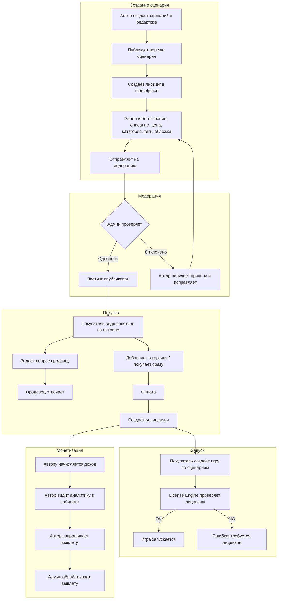
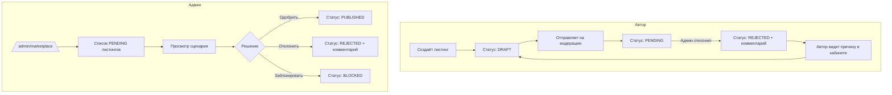

# План доработки Marketplace-модуля (v2 — с кабинетом продавца)

## 1. Текущее состояние (анализ)

### Что уже реализовано (бэкенд — NestJS):
- ✅ `MarketplaceService` — CRUD листингов, поиск, фильтры, пагинация, избранное, модерация
- ✅ `PurchaseService` — покупка с транзакцией (создание Purchase + UserLicense + AuthorEarning)
- ✅ `LicenseEngineService` — валидация лицензий, фиксация запусков, отзыв лицензий
- ✅ `ReviewService` — CRUD отзывов с модерацией (PENDING → APPROVED/REJECTED)
- ✅ `CartService` — корзина (add/remove/clear/checkout)
- ✅ `PromoService` — промокоды
- ✅ `PayoutService` — выплаты авторам (баланс, запрос, обработка)
- ✅ `AnalyticsService` — аналитика по листингам (сводка, по периодам, по листингам)
- ✅ `MarketplaceController` — все эндпоинты (публичные, авторские, админские)
- ✅ Prisma-схема — все модели (MarketplaceListing, UserLicense, Purchase, AuthorEarning, Payout, Cart, CartItem, PromoCode, FavoriteListing, ScenarioRun, MarketplaceReview, MarketplaceAnalytics)

### Что уже реализовано (фронтенд — Next.js):
- ✅ `/marketplace` — список листингов с фильтрами и пагинацией
- ✅ `/marketplace/[id]` — детальная страница листинга
- ✅ `/marketplace/create` — создание листинга
- ✅ `/marketplace/edit/[id]` — редактирование листинга
- ✅ `/profile/analytics` — аналитика (базовая)
- ✅ `/profile/payouts` — выплаты (базовая)
- ✅ `/profile/favorites` — избранное (базовое)
- ✅ API-клиент (`client.ts`) — все методы для работы с marketplace

### Проблемы и ошибки:
1. **❌ Ошибка на странице `/marketplace/[id]`** — `reviews.map is not a function`. API возвращает `{ items, total, limit, offset }`, а фронт ожидает массив.
2. **❌ Отсутствуют страницы:**
   - `/organizer/listings` — мои листинги (ссылка есть на marketplace, но страницы нет)
   - `/marketplace/me/purchases` — мои покупки
   - `/marketplace/me/licenses` — мои лицензии
3. **❌ Нет кабинета продавца** — единой страницы, где автор видит всё: листинги, аналитику, доходы, вопросы
4. **❌ Нет флоу "Вопросы к продавцу"** — покупатель не может задать вопрос по сценарию
5. **❌ Checkout в корзине** — `cart.service.ts` checkout не вызывает `purchaseService.purchase()`, просто очищает корзину
6. **❌ Нет интеграции License Engine с Game Engine** — при запуске игры не проверяется лицензия
7. **❌ Флоу выкладки сценария неочевиден** — автор публикует сценарий в редакторе, но не понимает, как выставить на продажу

---

## 2. Архитектура решения

### 2.1. User Flow (полный цикл)



### 2.2. Кабинет продавца (Seller Dashboard)

```mermaid
flowchart TD
    subgraph "Навигация продавца"
        SD[/organizer/seller\] --> OV[Обзор: доход, продажи, просмотры]
        SD --> SL[/organizer/listings\] -- Мои листинги
        SD --> SA[/organizer/seller/analytics\] -- Детальная аналитика
        SD --> SQ[/organizer/seller/questions\] -- Вопросы покупателей
        SD --> SP[/organizer/seller/payouts\] -- Выплаты
    end
    
    subgraph "Страницы покупателя"
        MP[/marketplace\] --> MD[/marketplace/:id\]
        MD --> MQ[Задать вопрос]
        C[/cart\] --> CH[/checkout\]
        MPUR[/marketplace/me/purchases\]
        MLIC[/marketplace/me/licenses\]
    end
```

### 2.3. Модерация (Admin Flow)



---

## 3. Пошаговый план реализации

### Шаг 1: Исправить ошибку с отзывами
**Файлы:** `apps/web/src/app/marketplace/[id]/page.tsx`
**Проблема:** API возвращает `{ items, total, limit, offset }`, а фронт ожидает массив.
**Решение:** Изменить строку 50: `setReviews(res.data?.data || res.data || [])` → `setReviews(res.data?.items || res.data?.data || [])`

### Шаг 2: Создать страницу "Мои листинги" (`/organizer/listings`)
**Файлы:** `apps/web/src/app/organizer/listings/page.tsx`
**API:** `GET /marketplace/me/listings`
**Что должно быть:**
- Таблица/список всех листингов автора
- Статус (DRAFT, PENDING, PUBLISHED, REJECTED) с цветовой индикацией
- Кнопки: редактировать, отправить на модерацию, опубликовать/снять, удалить
- Статистика (просмотры, продажи, избранное, рейтинг)
- Ссылка на создание нового листинга
- Если листинг REJECTED — показывать комментарий модератора

### Шаг 3: Создать страницу "Мои покупки" (`/marketplace/me/purchases`)
**Файлы:** `apps/web/src/app/marketplace/me/purchases/page.tsx`
**API:** `GET /marketplace/me/purchases`
**Что должно быть:**
- Список купленных сценариев
- Дата покупки, цена, тип лицензии
- Статус лицензии (активна/отозвана)
- Кнопка "Создать игру" (если лицензия активна)
- Кнопка "Написать отзыв"

### Шаг 4: Создать страницу "Мои лицензии" (`/marketplace/me/licenses`)
**Файлы:** `apps/web/src/app/marketplace/me/licenses/page.tsx`
**API:** `GET /marketplace/me/licenses`
**Что должно быть:**
- Список активных лицензий
- Тип лицензии, оставшиеся запуски, срок действия
- Версия сценария
- Статус (ACTIVE, EXPIRED, REVOKED)

### Шаг 5: Создать кабинет продавца (`/organizer/seller`)
**Файлы:** `apps/web/src/app/organizer/seller/page.tsx`
**API:** `GET /marketplace/me/analytics/summary`, `GET /marketplace/me/earnings`, `GET /marketplace/me/listings`
**Что должно быть:**
- **Обзорная панель:**
  - Крупные цифры: доход (всего/за месяц), продажи, просмотры, средний рейтинг
  - График продаж/просмотров за последние 30 дней
  - Список последних продаж
- **Боковая навигация:**
  - Мои листинги → `/organizer/listings`
  - Аналитика → `/organizer/seller/analytics`
  - Вопросы → `/organizer/seller/questions`
  - Выплаты → `/organizer/seller/payouts`
- **Быстрые действия:**
  - Создать листинг
  - Посмотреть непрочитанные вопросы

### Шаг 6: Создать страницу вопросов к продавцу (`/organizer/seller/questions`)
**Файлы:**
- `apps/web/src/app/organizer/seller/questions/page.tsx` — список вопросов
- `apps/web/src/app/marketplace/[id]/ask/page.tsx` — форма вопроса
**API:** Новый бэкенд-сервис `ListingQuestionService`
**Модель данных (Prisma):**
```prisma
model ListingQuestion {
  id          String   @id @default(uuid()) @db.Uuid
  listingId   String   @map("listing_id") @db.Uuid
  userId      String   @map("user_id") @db.Uuid
  question    String   @db.Text
  answer      String?  @db.Text
  answeredAt  DateTime? @map("answered_at")
  answeredBy  String?  @map("answered_by") @db.Uuid
  createdAt   DateTime @default(now()) @map("created_at")
  updatedAt   DateTime @updatedAt @map("updated_at")
  
  listing MarketplaceListing @relation(fields: [listingId], references: [id])
  user    User               @relation(fields: [userId], references: [id])
  
  @@index([listingId])
  @@index([userId])
  @@map("listing_questions")
}
```
**Что должно быть:**
- Список вопросов к листингам продавца
- Фильтр: отвеченные / неотвеченные
- Форма ответа на вопрос
- Уведомление покупателю об ответе

### Шаг 7: Исправить checkout в корзине
**Файлы:** `apps/api/src/modules/commerce/cart/cart.service.ts`
**Проблема:** `checkout()` не вызывает `purchaseService.purchase()`, просто очищает корзину.
**Решение:** Внедрить `PurchaseService` в `CartService` и в цикле по товарам вызывать `purchaseService.purchase()`.

### Шаг 8: Создать страницу аналитики для продавца (`/organizer/seller/analytics`)
**Файлы:** `apps/web/src/app/organizer/seller/analytics/page.tsx`
**API:** `GET /marketplace/me/analytics`, `GET /marketplace/me/analytics/summary`
**Что должно быть:**
- Детальная аналитика по каждому листингу
- Графики: просмотры, продажи, доход по дням/неделям/месяцам
- Конверсия (sales/views)
- Сравнение листингов между собой
- Экспорт данных (CSV)

### Шаг 9: Создать страницу выплат для продавца (`/organizer/seller/payouts`)
**Файлы:** `apps/web/src/app/organizer/seller/payouts/page.tsx`
**API:** `GET /marketplace/me/balance`, `POST /marketplace/me/payouts`, `GET /marketplace/me/payouts`
**Что должно быть:**
- Текущий баланс (доступно, ожидает, всего заработано)
- Форма запроса выплаты с валидацией
- История выплат со статусами
- История доходов по продажам

### Шаг 10: Реализовать флоу модерации
**Файлы:**
- `apps/web/src/app/admin/marketplace/page.tsx` — админ-панель модерации
- `apps/web/src/app/organizer/listings/page.tsx` — кнопка "Отправить на модерацию"
**API:** `GET /marketplace/admin/pending`, `PATCH /marketplace/admin/:id/moderate`
**Что должно быть:**
- Админ видит список листингов на модерации с превью
- Может одобрить/отклонить с комментарием
- Автор видит статус и комментарий модератора в кабинете

### Шаг 11: Интегрировать License Engine с Game Engine
**Файлы:** `apps/api/src/modules/games/games.service.ts`
**Что должно быть:**
- При создании игры со сценарием из marketplace проверять лицензию через `LicenseEngineService.validateLicense()`
- При запуске игры фиксировать запуск через `LicenseEngineService.recordRun()`
- Добавить поля `scenarioLicenseId` и `scenarioRunId` в Game

### Шаг 12: Проверить и доработать флоу выкладки сценария
**Проблема:** Сейчас флоу разорван:
1. Автор создаёт сценарий в редакторе → публикует версию
2. Идёт в `/marketplace/create` → создаёт листинг
3. Листинг создаётся в статусе DRAFT
4. Нужно вручную опубликовать

**Решение:**
- В `/organizer/scenarios` добавить кнопку "Выставить на продажу" для опубликованных сценариев
- Кнопка ведёт в `/marketplace/create?scenarioId=xxx` с предзаполненным сценарием
- После создания листинга показывать сообщение "Листинг создан! Отправьте на модерацию"
- В `/organizer/listings` показывать все листинги и их статусы

### Шаг 13: Проверить навигацию и ссылки
- Исправить ссылку "Мои листинги" на marketplace → `/organizer/listings`
- Исправить ссылку "Мои лицензии" на детальной странице → `/marketplace/me/licenses`
- Исправить ссылку "Мои покупки" на checkout → `/marketplace/me/purchases`
- Добавить в хедер ссылку на кабинет продавца (для авторов)
- Добавить в профиль ссылки на marketplace-страницы

---

## 4. Детальная спецификация страниц

### 4.1. `/organizer/seller` — Кабинет продавца (Dashboard)

```
┌──────────────────────────────────────────────────────────────────┐
│  Кабинет продавца                              [Создать листинг] │
├──────────────────────────────────────────────────────────────────┤
│ ┌──────────┐ ┌──────────┐ ┌──────────┐ ┌──────────┐             │
│ │ Доход    │ │ Продажи  │ │Просмотры │ │ Рейтинг  │             │
│ │ 12 500 ₽ │ │   24     │ │  1 340   │ │  4.7 ★   │             │
│ └──────────┘ └──────────┘ └──────────┘ └──────────┘             │
│                                                                  │
│  ┌─ Навигация ─────────────────────────────────────────────┐    │
│  │ 📦 Мои листинги     (3 черновика, 2 на модерации)       │    │
│  │ 📊 Аналитика        (просмотры, конверсия, доход)       │    │
│  │ ❓ Вопросы          (2 неотвеченных)                    │    │
│  │ 💰 Выплаты          (доступно: 8 500 ₽)                │    │
│  └─────────────────────────────────────────────────────────┘    │
│                                                                  │
│  ┌─ Последние продажи ──────────────────────────────────────┐   │
│  │ Квест в лесу          +500 ₽  12.06.2026  Иван П.       │   │
│  │ Детектив на районе    +300 ₽  11.06.2026  Анна С.       │   │
│  │ Хоррор в заброшке     +400 ₽  10.06.2026  Петр К.       │   │
│  └─────────────────────────────────────────────────────────┘   │
│                                                                  │
│  ┌─ График продаж (30 дней) ───────────────────────────────┐   │
│  │  ██▄▄██▄▄▄▄██▄▄▄▄▄▄██▄▄▄▄▄▄▄▄██▄▄▄▄▄▄▄▄▄▄███          │   │
│  └─────────────────────────────────────────────────────────┘   │
└──────────────────────────────────────────────────────────────────┘
```

### 4.2. `/organizer/listings` — Мои листинги

```
┌─────────────────────────────────────────────────────────────┐
│  Мои листинги                              [Создать листинг] │
├─────────────────────────────────────────────────────────────┤
│ ┌─────────────────────────────────────────────────────────┐ │
│ │ Название    Статус       Цена   Продажи Просмотры Действ │ │
│ ├─────────────────────────────────────────────────────────┤ │
│ │ Квест в...  ✅ PUBLISHED  500₽   12      340       [ред] │ │
│ │             [снять с публикации]              [аналитика] │ │
│ ├─────────────────────────────────────────────────────────┤ │
│ │ Детектив... ⏳ PENDING    300₽   0       0              │ │
│ │             [ожидает модерации]                          │ │
│ ├─────────────────────────────────────────────────────────┤ │
│ │ Хоррор...   ❌ REJECTED   400₽   0       0        [ред] │ │
│ │             Причина: не хватает описания                 │ │
│ ├─────────────────────────────────────────────────────────┤ │
│ │ Городской...📝 DRAFT      250₽   0       0        [ред] │ │
│ │             [отправить на модерацию]                     │ │
│ └─────────────────────────────────────────────────────────┘ │
└─────────────────────────────────────────────────────────────┘
```

### 4.3. `/organizer/seller/questions` — Вопросы покупателей

```
┌─────────────────────────────────────────────────────────────┐
│  Вопросы покупателей                                        │
├─────────────────────────────────────────────────────────────┤
│  [Все] [Неотвеченные (2)] [Отвеченные]                      │
├─────────────────────────────────────────────────────────────┤
│ ┌─────────────────────────────────────────────────────────┐ │
│ │ ❓ Иван П. — Квест в лесу                   12.06.2026  │ │
│ │   "Сколько игроков может участвовать одновременно?"     │ │
│ │   [Ответить]                                             │ │
│ ├─────────────────────────────────────────────────────────┤ │
│ │ ❓ Анна С. — Детектив на районе             11.06.2026  │ │
│ │   "Можно ли использовать на телефоне?"                  │ │
│ │   [Ответить]                                             │ │
│ ├─────────────────────────────────────────────────────────┤ │
│ │ ✅ Петр К. — Хоррор в заброшке             10.06.2026  │ │
│ │   "Есть ли поддержка AR?"                               │ │
│ │   Ответ: "Пока нет, но в планах на следующий релиз"     │ │
│ └─────────────────────────────────────────────────────────┘ │
└─────────────────────────────────────────────────────────────┘
```

### 4.4. `/marketplace/me/purchases` — Мои покупки

```
┌─────────────────────────────────────────────────────────────┐
│  Мои покупки                                                │
├─────────────────────────────────────────────────────────────┤
│ ┌─────────────────────────────────────────────────────────┐ │
│ │ 📦 Квест в лесу                    500₽  12.06.2026    │ │
│ │   Лицензия: Single · Активна · Запусков: 0/1            │ │
│ │   [Создать игру] [Написать отзыв] [Задать вопрос]       │ │
│ ├─────────────────────────────────────────────────────────┤ │
│ │ 📦 Детектив на районе              Бесплатно 10.06.2026 │ │
│ │   Лицензия: Single · Активна · Запусков: 1/1            │ │
│ │   [Создать игру]                                        │ │
│ └─────────────────────────────────────────────────────────┘ │
└─────────────────────────────────────────────────────────────┘
```

---

## 5. API Endpoints (полный список)

### Существующие (уже работают):

| Метод | URL | Описание |
|-------|-----|----------|
| GET | `/marketplace` | Поиск листингов |
| GET | `/marketplace/categories` | Категории |
| GET | `/marketplace/types` | Типы лицензий |
| GET | `/marketplace/:id` | Детали листинга |
| POST | `/marketplace/:id/views` | Инкремент просмотров |
| GET | `/marketplace/:id/reviews` | Отзывы листинга |
| POST | `/marketplace` | Создать листинг |
| PATCH | `/marketplace/:id` | Обновить листинг |
| POST | `/marketplace/:id/publish` | Опубликовать |
| POST | `/marketplace/:id/unpublish` | Снять с публикации |
| GET | `/marketplace/me/listings` | Мои листинги |
| GET | `/marketplace/me/sales` | Мои продажи |
| GET | `/marketplace/me/earnings` | Мои доходы |
| GET | `/marketplace/me/analytics` | Аналитика |
| GET | `/marketplace/me/analytics/summary` | Сводка аналитики |
| POST | `/marketplace/:id/purchase` | Купить |
| POST | `/marketplace/:id/favorite` | В избранное |
| DELETE | `/marketplace/:id/favorite` | Из избранного |
| GET | `/marketplace/me/purchases` | Мои покупки |
| GET | `/marketplace/me/licenses` | Мои лицензии |
| GET | `/marketplace/me/favorites` | Моё избранное |
| GET | `/marketplace/cart` | Корзина |
| POST | `/marketplace/cart` | В корзину |
| DELETE | `/marketplace/cart/:itemId` | Из корзины |
| POST | `/marketplace/cart/checkout` | Оформить корзину |
| POST | `/marketplace/:id/review` | Отзыв |
| GET | `/marketplace/me/balance` | Баланс |
| POST | `/marketplace/me/payouts` | Запросить выплату |
| GET | `/marketplace/me/payouts` | История выплат |
| GET | `/marketplace/admin/pending` | На модерации (админ) |
| PATCH | `/marketplace/admin/:id/moderate` | Модерация (админ) |

### Новые (нужно создать):

| Метод | URL | Описание |
|-------|-----|----------|
| GET | `/marketplace/:id/questions` | Вопросы к листингу |
| POST | `/marketplace/:id/questions` | Задать вопрос |
| PATCH | `/marketplace/questions/:id/answer` | Ответить на вопрос |
| GET | `/marketplace/me/questions` | Мои вопросы (покупатель) |
| GET | `/marketplace/seller/questions` | Вопросы к моим листингам (продавец) |
| GET | `/marketplace/seller/questions/unanswered` | Неотвеченные вопросы |

---

## 6. Приоритеты выполнения

### 🔴 Критично (сейчас не работает):
1. Исправить ошибку с отзывами на `[id]/page.tsx`
2. Исправить checkout в корзине (не вызывает purchase)

### 🟡 Высокий (отсутствует функциональность):
3. Страница "Мои листинги" `/organizer/listings`
4. Страница "Мои покупки" `/marketplace/me/purchases`
5. Страница "Мои лицензии" `/marketplace/me/licenses`
6. Кабинет продавца `/organizer/seller` (dashboard)
7. Флоу выкладки сценария (кнопка "Выставить на продажу" из редактора)

### 🟢 Средний (улучшение UX):
8. Вопросы к продавцу (бэкенд + фронтенд)
9. Страница вопросов продавца `/organizer/seller/questions`
10. Флоу модерации (админ-панель + кнопка отправки)
11. Страница аналитики продавца `/organizer/seller/analytics`
12. Страница выплат продавца `/organizer/seller/payouts`

### 🔵 Низкий (косметика):
13. Интеграция License Engine с Game Engine
14. Навигация и ссылки
15. Страница избранного (доработка)

---

## 7. Структура новых файлов

```
apps/web/src/app/
├── organizer/
│   ├── listings/
│   │   └── page.tsx                    # Мои листинги
│   └── seller/
│       ├── page.tsx                    # Dashboard продавца
│       ├── analytics/
│       │   └── page.tsx                # Детальная аналитика
│       ├── questions/
│       │   └── page.tsx                # Вопросы покупателей
│       └── payouts/
│           └── page.tsx                # Выплаты
├── marketplace/
│   ├── me/
│   │   ├── purchases/
│   │   │   └── page.tsx                # Мои покупки
│   │   └── licenses/
│   │       └── page.tsx                # Мои лицензии
│   └── [id]/
│       └── ask/
│           └── page.tsx                # Задать вопрос
└── admin/
    └── marketplace/
        └── page.tsx                    # Модерация листингов

apps/api/src/modules/commerce/
├── questions/
│   ├── questions.service.ts            # Сервис вопросов
│   └── questions.controller.ts         # Контроллер вопросов
└── commerce.module.ts                  # Обновить (добавить QuestionsModule)
```

---

## 8. Ключевые моменты для реализации

1. **Кабинет продавца** — это единая точка входа для авторов. Все страницы продавца должны быть доступны через боковую навигацию.
2. **Вопросы** — простая модель: вопрос + ответ. Без чата, без уведомлений (в MVP). Только текст.
3. **Флоу выкладки:** Редактор сценариев → публикация версии → кнопка "Выставить на продажу" → создание листинга с предзаполненными данными → отправка на модерацию.
4. **Модерация:** Админ проверяет листинг, может одобрить или отклонить с комментарием. Автор видит статус.
5. **Checkout:** Исправить, чтобы покупка из корзины работала как и прямая покупка.