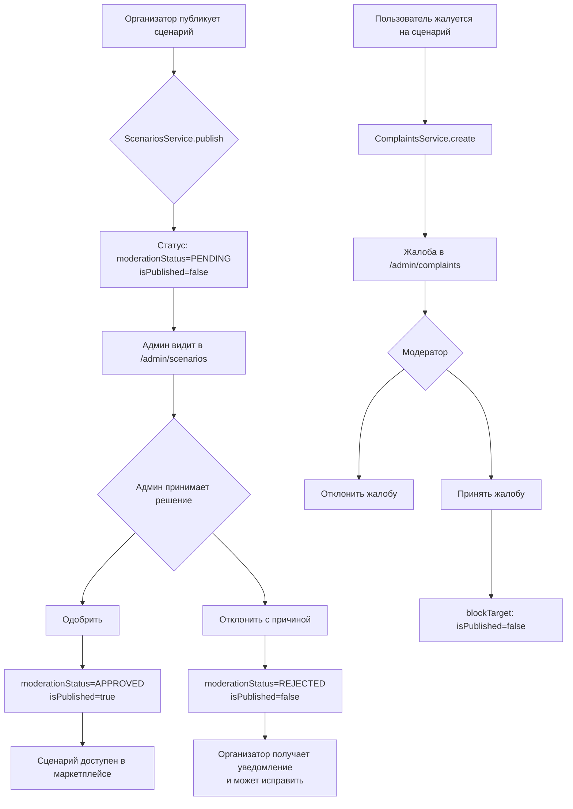

# План: Модерация сценариев и жалобы

## Текущее состояние

### ✅ Уже работает (жалобы)
- `ComplaintTargetType.SCENARIO` уже есть в `CreateComplaintDto`
- `ComplaintsService.getTargetInfo()` уже умеет получать информацию о сценарии
- `ComplaintsService.blockTarget()` уже умеет блокировать сценарий (`isPublished: false`, `deletedAt`)
- Страница `/admin/complaints` уже отображает жалобы на сценарии и умеет их модерировать
- `TARGET_TYPE_LABELS` уже содержит `SCENARIO: 'Сценарий'`

### ❌ Чего не хватает (модерация перед публикацией)
Сейчас сценарий публикуется сразу (`isPublished: true`) без модерации. Нужно:
1. Добавить статус модерации в модель Scenario
2. Изменить флоу публикации: отправка на модерацию → проверка админом → публикация
3. Создать админ-страницу для модерации сценариев
4. Добавить виджет на дашборд и пункт в навигацию

---

## Шаг 1: Prisma — добавить поле `moderationStatus` в модель Scenario

**Файл:** `prisma/schema.prisma` (строка ~560)

Добавить поле после `validationErrors`:
```prisma
moderationStatus String? @default("APPROVED") @map("moderation_status") @db.VarChar(50)
```

> **Важно:** Ставим `@default("APPROVED")`, чтобы существующие сценарии не сломались. Для новых сценариев при публикации будем явно устанавливать `PENDING`.

После применения миграции — перегенерировать Prisma Client.

---

## Шаг 2: Бэкенд — изменить `ScenariosService.publish()` на отправку на модерацию

**Файл:** `apps/api/src/modules/scenarios/scenarios.service.ts`

Изменить метод `publish()` (строка 196):
- Вместо `isPublished: true` устанавливать `moderationStatus: 'PENDING'` и `isPublished: false`
- Добавить проверку: если сценарий уже на модерации — возвращать ошибку

```typescript
async publish(userId: string, scenarioId: string, price?: number, licenseType?: string) {
  const scenario = await this.prisma.scenario.findUnique({ where: { id: scenarioId } });
  if (!scenario) throw new NotFoundException('Scenario not found');
  if (scenario.authorId !== userId) throw new ForbiddenException('Access denied');
  if (scenario.moderationStatus === 'PENDING') {
    throw new BadRequestException('Сценарий уже отправлен на модерацию');
  }

  const updated = await this.prisma.scenario.update({
    where: { id: scenarioId },
    data: {
      moderationStatus: 'PENDING',
      isPublished: false,
      publishedAt: new Date(),
      ...(price !== undefined && { price }),
      ...(licenseType !== undefined && { licenseType }),
    },
  });

  // Создаём событие активности
  // ...
  return updated;
}
```

---

## Шаг 3: Бэкенд — добавить админские методы в `ScenariosService`

**Файл:** `apps/api/src/modules/scenarios/scenarios.service.ts`

Добавить методы:

### `adminGetPending(limit, offset)` — получить сценарии на модерации
```typescript
async adminGetPending(limit = 20, offset = 0) {
  const [items, total] = await Promise.all([
    this.prisma.scenario.findMany({
      where: { moderationStatus: 'PENDING', deletedAt: null },
      orderBy: { publishedAt: 'desc' },
      take: limit,
      skip: offset,
      include: {
        author: { select: { id: true, name: true, email: true } },
      },
    }),
    this.prisma.scenario.count({ where: { moderationStatus: 'PENDING', deletedAt: null } }),
  ]);
  return { items, total };
}
```

### `adminApprove(scenarioId, moderatorId)` — одобрить сценарий
```typescript
async adminApprove(scenarioId: string, moderatorId: string) {
  const scenario = await this.prisma.scenario.findUnique({ where: { id: scenarioId } });
  if (!scenario) throw new NotFoundException('Сценарий не найден');
  if (scenario.moderationStatus !== 'PENDING') {
    throw new BadRequestException('Сценарий не на модерации');
  }

  return this.prisma.scenario.update({
    where: { id: scenarioId },
    data: {
      moderationStatus: 'APPROVED',
      isPublished: true,
    },
  });
}
```

### `adminReject(scenarioId, moderatorId, reason)` — отклонить сценарий
```typescript
async adminReject(scenarioId: string, moderatorId: string, reason: string) {
  const scenario = await this.prisma.scenario.findUnique({ where: { id: scenarioId } });
  if (!scenario) throw new NotFoundException('Сценарий не найден');
  if (scenario.moderationStatus !== 'PENDING') {
    throw new BadRequestException('Сценарий не на модерации');
  }

  return this.prisma.scenario.update({
    where: { id: scenarioId },
    data: {
      moderationStatus: 'REJECTED',
      isPublished: false,
      validationErrors: { rejectionReason: reason, rejectedBy: moderatorId, rejectedAt: new Date() },
    },
  });
}
```

---

## Шаг 4: Бэкенд — добавить админские эндпоинты в `ScenariosController`

**Файл:** `apps/api/src/modules/scenarios/scenarios.controller.ts`

Добавить эндпоинты (после строки 86):

```typescript
@Get('admin/pending')
@UseGuards(JwtAuthGuard, RolesGuard)
@Roles('ADMIN', 'MODERATOR')
async adminGetPending(@Query('limit') limit?: number, @Query('offset') offset?: number) {
  return this.scenariosService.adminGetPending(Number(limit) || 20, Number(offset) || 0);
}

@Post('admin/:id/approve')
@UseGuards(JwtAuthGuard, RolesGuard)
@Roles('ADMIN', 'MODERATOR')
async adminApprove(@Param('id') id: string, @Request() req: any) {
  const moderatorId = req.user?.userId || req.user?.sub;
  return this.scenariosService.adminApprove(id, moderatorId);
}

@Post('admin/:id/reject')
@UseGuards(JwtAuthGuard, RolesGuard)
@Roles('ADMIN', 'MODERATOR')
async adminReject(@Param('id') id: string, @Body('reason') reason: string, @Request() req: any) {
  const moderatorId = req.user?.userId || req.user?.sub;
  return this.scenariosService.adminReject(id, moderatorId, reason);
}
```

---

## Шаг 5: Бэкенд — обновить `AdminService.getStats()` и `getNotificationCounts()`

**Файл:** `apps/api/src/modules/admin/admin.service.ts`

### В `getStats()` (строка 14):
Добавить в `Promise.all`:
```typescript
const pendingScenarios = this.prisma.scenario.count({
  where: { moderationStatus: 'PENDING', deletedAt: null },
});
```

Добавить в возвращаемый объект:
```typescript
pendingScenarios,
```

Обновить интерфейс `AdminStats` на фронте (см. Шаг 8).

### В `getNotificationCounts()` (строка 70):
Добавить в `Promise.all`:
```typescript
const pendingScenarios = this.prisma.scenario.count({
  where: { moderationStatus: 'PENDING', deletedAt: null },
});
```

Добавить в возвращаемый объект:
```typescript
pendingScenarios,
```

---

## Шаг 6: Фронтенд — создать страницу `/admin/scenarios`

**Новый файл:** `apps/web/src/app/admin/scenarios/page.tsx`

Создать по аналогии с `/admin/marketplace/page.tsx`:
- Загрузка списка сценариев на модерации через `GET /scenarios/admin/pending`
- Карточка каждого сценария: название, автор, дата публикации, описание
- Кнопки: "Одобрить" (POST `/scenarios/admin/:id/approve`), "Отклонить" (POST `/scenarios/admin/:id/reject` с полем reason)
- Табы: "На модерации" / "Все" (опционально)
- Уведомления об успехе/ошибке
- Состояния загрузки, ошибки, пустой список

---

## Шаг 7: Фронтенд — обновить `AdminNav`

**Файл:** `apps/web/src/components/admin/AdminNav.tsx`

Добавить пункт в `NAV_ITEMS`:
```typescript
{ href: '/admin/scenarios', label: '📜 Сценарии', roles: ['ADMIN', 'MODERATOR'] },
```

Добавить в `COUNT_MAP`:
```typescript
'/admin/scenarios': 'pendingScenarios',
```

Обновить интерфейс `AdminNotificationCounts`:
```typescript
export interface AdminNotificationCounts {
  pendingApplications: number;
  pendingComplaints: number;
  newSupportTickets: number;
  pendingScenarios: number;  // NEW
}
```

---

## Шаг 8: Фронтенд — обновить админ-дашборд

**Файл:** `apps/web/src/app/admin/dashboard/page.tsx`

1. Обновить интерфейс `AdminStats`:
```typescript
interface AdminStats {
  // ... existing fields
  pendingScenarios: number;  // NEW
}
```

2. Добавить карточку-виджет (после карточки `pendingGames`, строка ~132):
```tsx
<div className={`card ${stats.pendingScenarios > 0 ? 'border-warning' : ''}`}>
  <div className={`text-3xl font-bold mb-1 ${stats.pendingScenarios > 0 ? 'text-warning' : 'text-text-primary'}`}>
    {stats.pendingScenarios}
  </div>
  <div className="text-sm text-text-secondary">
    {stats.pendingScenarios > 0 ? '🟡 Сценариев на модерации' : 'Сценариев на модерации'}
  </div>
  {stats.pendingScenarios > 0 && (
    <Link href="/admin/scenarios" className="text-xs text-primary hover:underline mt-1 inline-block">
      Перейти к модерации →
    </Link>
  )}
</div>
```

---

## Шаг 9: Фронтенд — добавить кнопку "Пожаловаться" на странице сценария

**Файл:** `apps/web/src/app/organizer/scenarios/page.tsx` (или страница детального просмотра сценария)

Добавить кнопку "Пожаловаться", которая открывает модалку с выбором причины (аналогично тому, как это сделано для игр).

Нужно найти, где на фронте реализована кнопка жалобы для игр, и сделать по аналогии.

Поиск: `search_files` по `complaint` в `apps/web/src` для `.tsx` файлов.

---

## Шаг 10: Фронтенд — обновить Header.tsx (бейджи уведомлений)

**Файл:** `apps/web/src/components/ui/Header.tsx`

В компоненте `AdminNotificationBadge` (или в `DropdownNav` для админки) добавить отображение `pendingScenarios`, если оно приходит в `counts`.

---

## Шаг 11: Миграция Prisma

```bash
cd apps/api
npx prisma migrate dev --name add_scenario_moderation_status
```

---

## Диаграмма потока модерации



---

## Сводка изменений по файлам

| # | Файл | Тип изменений |
|---|------|--------------|
| 1 | `prisma/schema.prisma` | Добавить поле `moderationStatus` |
| 2 | `apps/api/src/modules/scenarios/scenarios.service.ts` | Изменить `publish()`, добавить `adminGetPending`, `adminApprove`, `adminReject` |
| 3 | `apps/api/src/modules/scenarios/scenarios.controller.ts` | Добавить 3 админских эндпоинта |
| 4 | `apps/api/src/modules/admin/admin.service.ts` | Добавить `pendingScenarios` в `getStats()` и `getNotificationCounts()` |
| 5 | `apps/web/src/app/admin/scenarios/page.tsx` | **Новый файл** — страница модерации сценариев |
| 6 | `apps/web/src/components/admin/AdminNav.tsx` | Добавить пункт "📜 Сценарии" и бейдж |
| 7 | `apps/web/src/app/admin/dashboard/page.tsx` | Добавить виджет "Сценариев на модерации" |
| 8 | `apps/web/src/app/organizer/scenarios/page.tsx` | Добавить кнопку "Пожаловаться" |
| 9 | `apps/web/src/components/ui/Header.tsx` | Обновить бейджи админ-уведомлений |

---

## Примечание по жалобам

Система жалоб (`ComplaintTargetType.SCENARIO`) **уже полностью реализована**:
- Бэкенд: `ComplaintsService` умеет создавать жалобы на сценарии, получать информацию о сценарии и блокировать его
- Фронтенд: `/admin/complaints` умеет отображать и модерировать жалобы на сценарии
- Нужно только **добавить кнопку "Пожаловаться"** на странице сценария для пользователей