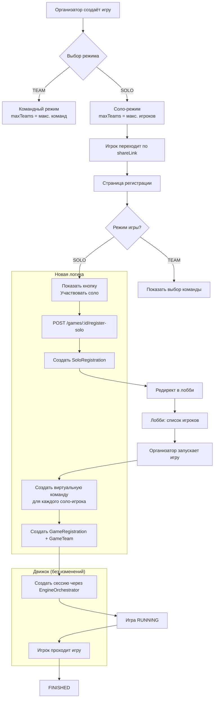
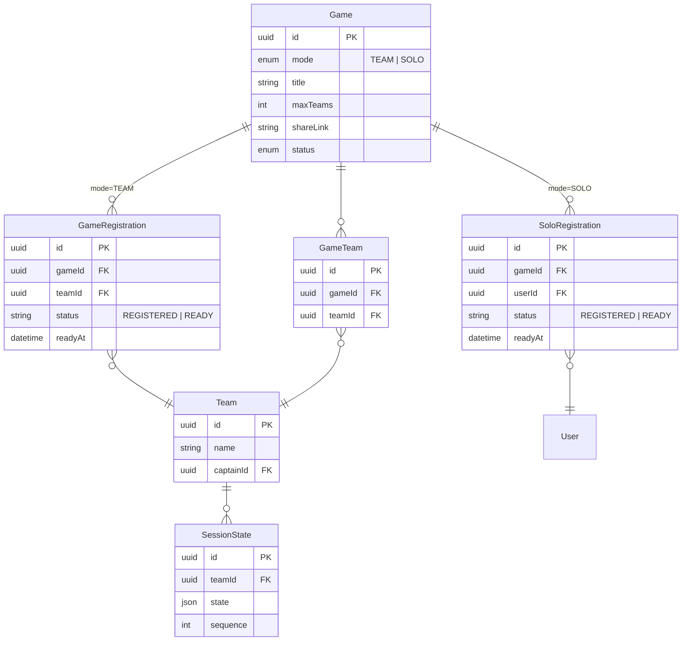

# План: Поддержка соло-режима (Solo Mode) в QuestForge

## 1. Проблема

Вся архитектура игрового процесса завязана на **команды** (`Team`, `TeamMember`, `GameTeam`, `GameRegistration`). Игрок **обязан** иметь или создать команду, чтобы участвовать в игре. Это исключает сценарий, когда игрок хочет пройти игру в одиночку.

**Текущий flow (только командный):**
```
Регистрация → Выбор команды → GameRegistration + GameTeam → Лобби → RUNNING → Сессия (teamId)
```

## 2. Целевая архитектура

Организатор при создании игры выбирает **режим**: `TEAM` (командный) или `SOLO` (индивидуальный). В соло-режиме каждый игрок регистрируется сам за себя, без команды.

**Целевой flow (соло):**
```
Регистрация → SoloRegistration (без teamId) → Лобби (список игроков) → RUNNING → Сессия (userId)
```

## 3. Ключевое архитектурное решение

### 3.1. Новая модель `SoloRegistration` (отдельная, не переиспользовать `GameRegistration`)

**Почему не сделать `teamId` опциональным в `GameRegistration`?**
- `GameRegistration` имеет `@@unique([gameId, teamId])` — уникальность по паре игра+команда
- Вся логика `setTeamReady()`, `getTeamsStatus()`, `areAllTeamsReady()` завязана на `teamId`
- `SessionState` привязан к `teamId` — движок ожидает `teamId` для сессии
- Смешивание соло и команд в одной таблице приведёт к каскадным изменениям во всех методах

**Решение:** Создать отдельную модель `SoloRegistration` с привязкой к `userId`, а для сессий соло-игроков создать **виртуальную команду** (одиночную) или передавать `userId` как `teamId`.

### 3.2. Виртуальная команда для соло-игроков

Чтобы минимально менять движок (`EngineOrchestrator`, `SessionState`), соло-игроку создаётся **одноразовая виртуальная команда** (типа `Team` с `captainId = userId` и только одним членом). Это позволяет:
- Переиспользовать `SessionState` (привязан к `teamId`)
- Переиспользовать `engineOrchestrator.startSession(teamId, ...)`
- Переиспользовать `getGameProgress()` (читает `SessionState` по `teamId`)
- Не менять `Event` модель (привязана к `teamId`)

**Альтернатива:** Сделать `SessionState.teamId` опциональным и добавить `SessionState.userId`. Но это потребует изменений в движке, event-store, плагинах — слишком高风险.

### 3.3. Ограничения

- Игра не может сменить режим после создания
- В соло-режиме `maxTeams` интерпретируется как `maxPlayers`
- В соло-режиме нет ready-статуса (игрок всегда ready после регистрации)
- В соло-режиме лобби показывает список игроков, а не команд

---

## 4. Пошаговый план изменений

### Шаг 1: Prisma-схема — добавить поле `mode` в `Game`

**Файл:** `prisma/schema.prisma`

```prisma
enum GameMode {
  TEAM
  SOLO
}

model Game {
  // ... существующие поля
  mode              GameMode         @default(TEAM) @map("mode")
  // ... остальные поля
}
```

**Миграция:** `npx prisma migrate dev --name add_game_mode`

### Шаг 2: Prisma-схема — создать модель `SoloRegistration`

```prisma
model SoloRegistration {
  id        String   @id @default(uuid()) @db.Uuid
  gameId    String   @map("game_id") @db.Uuid
  userId    String   @map("user_id") @db.Uuid
  status    String   @default("REGISTERED") // REGISTERED, READY
  readyAt   DateTime? @map("ready_at")
  createdAt DateTime @default(now()) @map("created_at")
  updatedAt DateTime @updatedAt @map("updated_at")
  game      Game     @relation(fields: [gameId], references: [id], onDelete: Cascade)
  user      User     @relation(fields: [userId], references: [id])

  @@unique([gameId, userId])
  @@index([gameId])
  @@index([userId])
  @@map("solo_registrations")
}
```

### Шаг 3: DTO — добавить `mode` в `CreateGameDto` и `UpdateGameDto`

**Файл:** `apps/api/src/modules/games/dto/create-game.dto.ts`

Добавить поле:
```typescript
@IsString()
@IsOptional()
@IsIn(['TEAM', 'SOLO'])
mode?: string; // По умолчанию 'TEAM'
```

**Файл:** `apps/api/src/modules/games/dto/update-game.dto.ts`

Аналогично добавить опциональное поле `mode`.

### Шаг 4: DTO — добавить `mode` в `PublicGameDto`, `PrivateGameDto`, `AdminGameDto`

**Файл:** `apps/api/src/modules/games/dto/public-game.dto.ts`
```typescript
mode!: string;
```

`PrivateGameDto` и `AdminGameDto` наследуют `PublicGameDto` — поле появится автоматически.

### Шаг 5: API-клиент (фронтенд) — добавить `mode` в `CreateGameRequest`

**Файл:** `apps/web/src/lib/api/client.ts`

```typescript
export interface CreateGameRequest {
  // ... существующие поля
  mode?: string; // 'TEAM' | 'SOLO'
}
```

### Шаг 6: `games.service.ts` — изменить `createGame()` — сохранять `mode`

**Файл:** `apps/api/src/modules/games/games.service.ts`

В методе `createGame()` добавить в `data`:
```typescript
mode: data.mode || 'TEAM',
```

### Шаг 7: `games.service.ts` — создать метод `registerSolo()`

Новый метод для регистрации соло-игрока:

```typescript
async registerSolo(gameId: string, userId: string) {
  const game = await this.findGameOrThrow(gameId);

  // Проверка: режим SOLO
  if (game.mode !== 'SOLO') {
    throw new BadRequestException({
      code: 'NOT_SOLO_MODE',
      message: 'Эта игра командная. Используйте регистрацию команды.',
    });
  }

  // Проверка: статус PUBLISHED или REGISTRATION_OPEN
  if (game.status !== GAME_STATUS.REGISTRATION_OPEN && game.status !== GAME_STATUS.PUBLISHED) {
    throw new BadRequestException({
      code: 'REGISTRATION_CLOSED',
      message: 'Регистрация на эту игру закрыта',
    });
  }

  // Проверка: игрок уже зарегистрирован
  const existing = await this.prisma.soloRegistration.findUnique({
    where: { gameId_userId: { gameId, userId } },
  });
  if (existing) {
    throw new BadRequestException({
      code: 'ALREADY_REGISTERED',
      message: 'Вы уже зарегистрированы на эту игру',
    });
  }

  // Проверка: maxPlayers (maxTeams) не превышен
  const registrationsCount = await this.prisma.soloRegistration.count({
    where: { gameId },
  });
  if (registrationsCount >= game.maxTeams) {
    throw new BadRequestException({
      code: 'GAME_FULL',
      message: 'Все места заняты',
    });
  }

  // Создаём регистрацию
  const registration = await this.prisma.soloRegistration.create({
    data: {
      gameId,
      userId,
      status: 'REGISTERED',
    },
    include: {
      user: {
        select: { id: true, name: true, avatarUrl: true },
      },
    },
  });

  this.logger.log(`User ${userId} registered solo for game ${gameId}`);

  return registration;
}
```

### Шаг 8: `games.service.ts` — изменить `startGame()` — поддержка соло

В методе `startGame()` после строки `const registrations = await this.prisma.gameRegistration.findMany(...)` добавить:

```typescript
// Для соло-режима — создаём виртуальные команды и сессии
if (game.mode === 'SOLO') {
  const soloRegistrations = await this.prisma.soloRegistration.findMany({
    where: { gameId },
    include: { user: { select: { id: true, name: true } } },
  });

  for (const reg of soloRegistrations) {
    try {
      // Создаём виртуальную команду для соло-игрока
      const soloTeam = await this.prisma.team.create({
        data: {
          name: `@${reg.user.name}`,
          slug: `solo-${reg.user.id}-${gameId}`.toLowerCase().replace(/[^a-z0-9]+/g, '-'),
          captainId: reg.user.id,
          members: {
            create: {
              userId: reg.user.id,
              role: 'CAPTAIN',
            },
          },
        },
      });

      // Регистрируем виртуальную команду на игру
      await this.prisma.gameRegistration.create({
        data: {
          gameId,
          teamId: soloTeam.id,
          status: 'READY', // Соло-игрок всегда ready
          readyAt: new Date(),
        },
      });

      await this.prisma.gameTeam.create({
        data: { gameId, teamId: soloTeam.id },
      });

      // Создаём сессию
      await this.engineOrchestrator.startSession(
        soloTeam.id,
        gameId,
        soloTeam.name,
        startNodeId,
      );
      this.logger.log(`Solo session started for user ${reg.user.id} in game ${gameId}`);
    } catch (err) {
      this.logger.error(`Failed to start solo session for user ${reg.user.id}: ${err}`);
    }
  }
} else {
  // Существующая логика для командного режима
  for (const reg of registrations) {
    // ... существующий код
  }
}
```

**Важно:** После создания виртуальных команд, `getMyTeamStatus()` и `getMyActiveRegistrations()` будут работать без изменений, так как они ищут `TeamMember` по `userId`.

### Шаг 9: `games.service.ts` — изменить `getMyTeamStatus()` — поддержка соло

Добавить проверку на `SoloRegistration` в начало метода:

```typescript
// Проверка: может быть соло-регистрация
const soloReg = await this.prisma.soloRegistration.findUnique({
  where: { gameId_userId: { gameId, userId } },
});

if (soloReg) {
  let sessionId: string | null = null;
  if (game.status === 'RUNNING') {
    // Ищем виртуальную команду соло-игрока
    const soloTeam = await this.prisma.team.findFirst({
      where: {
        captainId: userId,
        members: { some: { userId } },
        registrations: { some: { gameId } },
      },
    });
    if (soloTeam) {
      const snapshot = await this.prisma.sessionState.findFirst({
        where: { teamId: soloTeam.id },
        orderBy: { sequence: 'desc' },
      });
      const state = snapshot?.state as Record<string, unknown> | null;
      sessionId = (state?.sessionId as string) || null;
    }
  }

  return {
    registered: true,
    teamId: null, // Соло-игрок не имеет команды
    teamName: null,
    registrationStatus: soloReg.status,
    gameStatus: game.status,
    sessionId,
  };
}
```

### Шаг 10: `games.service.ts` — изменить `getMyActiveRegistrations()` — поддержка соло

Добавить запрос `SoloRegistration` параллельно с `TeamMember`:

```typescript
// Находим соло-регистрации
const soloRegistrations = await this.prisma.soloRegistration.findMany({
  where: {
    userId,
    game: {
      status: { in: ['PUBLISHED', 'REGISTRATION_OPEN', 'REGISTRATION_CLOSED', 'LOBBY', 'RUNNING'] },
      deletedAt: null,
    },
  },
  include: {
    game: {
      select: {
        id: true, title: true, shareLink: true, status: true,
        date: true, time: true, duration: true, city: true,
        allowEarlyStart: true,
      },
    },
  },
});

// Преобразуем соло-регистрации в тот же формат, что и командные
const soloResults = await Promise.all(
  soloRegistrations.map(async (reg) => {
    let sessionId: string | null = null;
    if (reg.game.status === 'RUNNING') {
      const soloTeam = await this.prisma.team.findFirst({
        where: {
          captainId: userId,
          registrations: { some: { gameId: reg.gameId } },
        },
      });
      if (soloTeam) {
        const snapshot = await this.prisma.sessionState.findFirst({
          where: { teamId: soloTeam.id },
          orderBy: { sequence: 'desc' },
        });
        const state = snapshot?.state as Record<string, unknown> | null;
        sessionId = (state?.sessionId as string) || null;
      }
    }

    // ... timer logic same as for teams

    return {
      gameId: reg.game.id,
      gameTitle: reg.game.title,
      shareLink: reg.game.shareLink,
      gameStatus: reg.game.status,
      teamId: null,
      teamName: 'Соло',
      sessionId,
      timer,
      city: reg.game.city,
      duration: reg.game.duration,
    };
  }),
);

// Объединяем с командными результатами
return [...teamResults, ...soloResults];
```

### Шаг 11: `games.service.ts` — изменить `getTeamsStatus()` — поддержка соло

Если `game.mode === 'SOLO'`, возвращать список соло-игроков вместо команд:

```typescript
async getTeamsStatus(gameId: string) {
  const game = await this.findGameOrThrow(gameId);

  if (game.mode === 'SOLO') {
    const soloRegs = await this.prisma.soloRegistration.findMany({
      where: { gameId },
      include: {
        user: { select: { id: true, name: true, avatarUrl: true } },
      },
      orderBy: { createdAt: 'asc' },
    });

    return soloRegs.map((r) => ({
      teamId: r.userId,
      team: { id: r.userId, name: r.user.name, slug: r.user.name, avatar: r.user.avatarUrl },
      status: r.status,
      readyAt: r.readyAt,
      registeredAt: r.createdAt,
    }));
  }

  // Существующая логика для командного режима
  // ...
}
```

### Шаг 12: `games.service.ts` — изменить `getGameProgress()` — поддержка соло

Аналогично `getTeamsStatus()` — если `SOLO`, искать виртуальные команды по `SoloRegistration`.

### Шаг 13: `games.controller.ts` — добавить эндпоинт `registerSolo()`

```typescript
@Post(':id/register-solo')
async registerSolo(
  @Param('id') gameId: string,
  @Req() req: Request,
) {
  const userId = req.user!.id;
  return this.gamesService.registerSolo(gameId, userId);
}
```

### Шаг 14: API-клиент (фронтенд) — добавить метод `registerSolo()`

**Файл:** `apps/web/src/lib/api/client.ts`

```typescript
async registerSolo(gameId: string): Promise<ApiResponse<{ id: string; gameId: string; userId: string; status: string }>> {
  return this.request(`/games/${gameId}/register-solo`, {
    method: 'POST',
  });
}
```

Экспортировать функцию:
```typescript
export const registerSolo = (gameId: string) => apiClient.registerSolo(gameId);
```

### Шаг 15: Страница создания игры — добавить выбор режима

**Файл:** `apps/web/src/app/organizer/games/create/page.tsx`

Добавить в `formData`:
```typescript
const [formData, setFormData] = useState({
  // ... существующие поля
  mode: 'TEAM', // 'TEAM' | 'SOLO'
});
```

Добавить в форму (после поля `maxTeams`):
```tsx
<div>
  <label className="label">Режим игры</label>
  <select
    name="mode"
    value={formData.mode}
    onChange={handleChange}
    className="input-field"
  >
    <option value="TEAM">Командный</option>
    <option value="SOLO">Соло (индивидуальный)</option>
  </select>
  <p className="text-xs text-text-secondary mt-1">
    {formData.mode === 'SOLO'
      ? 'Каждый игрок регистрируется сам за себя. Команды не используются.'
      : 'Игроки регистрируются командами. Требуется минимум 1 участник в команде.'}
  </p>
</div>
```

В `handleSubmit` передавать `mode`:
```typescript
const gameData: CreateGameRequest = {
  // ... существующие поля
  mode: formData.mode,
};
```

### Шаг 16: Страница регистрации — поддержка соло-режима

**Файл:** `apps/web/src/app/play/[shareLink]/page.tsx`

После загрузки игры (`gameData`) проверять `gameData.mode`:

```typescript
// Если режим SOLO — показываем кнопку "Участвовать соло"
if (gameData.mode === 'SOLO') {
  return (
    // ... Header
    <div className="card">
      <h1>{gameData.title}</h1>
      <p>{gameData.description}</p>
      <div className="flex flex-wrap gap-3 text-sm">
        <span>📍 {gameData.city}</span>
        <span>⏱️ {gameData.duration} мин</span>
        <span>👤 Соло-режим</span>
      </div>
      <button onClick={handleRegisterSolo} className="btn-primary w-full">
        Участвовать
      </button>
    </div>
  );
}
```

Логика `handleRegisterSolo`:
```typescript
const handleRegisterSolo = async () => {
  setRegistering(true);
  try {
    await registerSolo(game!.id);
    router.replace(`/play/${shareLink}/lobby`);
  } catch (err) {
    setError(err instanceof Error ? err.message : 'Ошибка регистрации');
  } finally {
    setRegistering(false);
  }
};
```

### Шаг 17: Страница лобби — поддержка соло-режима

**Файл:** `apps/web/src/app/play/[shareLink]/lobby/page.tsx`

После загрузки игры проверять `game.mode`:

- Если `SOLO`:
  - Скрыть выбор команды
  - Показывать список зарегистрированных игроков (из `getGameRegistrations`)
  - Убрать кнопку "Готов" (соло-игроки всегда ready)
  - Показывать таймер до старта

```tsx
{game.mode === 'SOLO' ? (
  <div>
    <h2 className="text-lg font-semibold mb-4">Участники ({teams.length})</h2>
    <div className="space-y-2">
      {teams.map((t) => (
        <div key={t.teamId} className="flex items-center gap-3 p-3 bg-surface-elevated rounded-lg">
          <div className="w-8 h-8 rounded-full bg-primary/20 flex items-center justify-center text-sm font-medium">
            {t.team.name[0]}
          </div>
          <span className="font-medium">{t.team.name}</span>
          <span className="ml-auto text-sm text-success">✅ Зарегистрирован</span>
        </div>
      ))}
    </div>
  </div>
) : (
  // Существующая командная логика
)}
```

### Шаг 18: Страница управления игрой (организатор) — поддержка соло

**Файл:** `apps/web/src/app/organizer/games/[id]/page.tsx`

- Показывать `mode` в информации об игре
- В секции команд показывать "Участники" вместо "Команды" для соло-режима
- Убрать колонку "Готов" для соло-режима

### Шаг 19: `MyActiveGames.tsx` и `ActiveGameBanner.tsx` — поддержка соло

Эти компоненты уже получают `teamName` из `getMyActiveRegistrations()`. Для соло будет `teamName: 'Соло'` — это нормально. Можно добавить иконку 👤 для соло.

### Шаг 20: `findOneByShareLink()` — добавить `mode` в ответ

**Файл:** `apps/api/src/modules/games/games.service.ts`

`mode` уже будет в ответе, так как Prisma возвращает все поля модели `Game`. Убедиться, что `PublicGameDto` включает `mode`.

### Шаг 21: `findOnePublic()` — добавить проверку `isRegistered` для соло

В методе `findOnePublic()` добавить проверку `SoloRegistration`:

```typescript
// Проверка: зарегистрирован ли пользователь (команда или соло)
let isRegistered = false;
if (userId) {
  // Существующая проверка через команды
  const teamRegistration = await this.prisma.gameRegistration.findFirst({
    where: {
      gameId,
      team: { members: { some: { userId } } },
    },
    select: { id: true },
  });
  isRegistered = !!teamRegistration;

  // Если не нашли через команды — проверяем соло
  if (!isRegistered) {
    const soloReg = await this.prisma.soloRegistration.findUnique({
      where: { gameId_userId: { gameId, userId } },
      select: { id: true },
    });
    isRegistered = !!soloReg;
  }
}
```

### Шаг 22: State Machine — добавить валидацию для соло

**Файл:** `apps/api/src/modules/games/state-machine/game-state-machine.ts`

В методе `canStart()` (или `areAllTeamsReady()`) учитывать, что в соло-режиме все игроки автоматически ready:

```typescript
private async areAllTeamsReady(gameId: string): Promise<boolean> {
  const game = await this.prisma.game.findUnique({
    where: { id: gameId },
    select: { mode: true },
  });

  if (game?.mode === 'SOLO') {
    // В соло-режиме все игроки считаются ready после регистрации
    return true;
  }

  // Существующая логика для командного режима
  // ...
}
```

### Шаг 23: Тесты

1. **Unit-тесты для `registerSolo()`:**
   - Успешная регистрация соло
   - Ошибка при командном режиме
   - Ошибка при повторной регистрации
   - Ошибка при заполненных местах

2. **Unit-тесты для `startGame()` с соло-режимом:**
   - Создание виртуальных команд
   - Создание сессий
   - Статус READY для соло-игроков

3. **Unit-тесты для `getMyTeamStatus()` с соло:**
   - Возврат `registered: true` для соло-игрока
   - `sessionId` при RUNNING

4. **Unit-тесты для `getMyActiveRegistrations()` с соло:**
   - Соло-регистрации в результатах

5. **Unit-тесты для `getTeamsStatus()` с соло:**
   - Возврат списка игроков вместо команд

---

## 5. Диаграмма: Flow для соло-режима



## 6. Диаграмма: Изменения в Prisma-схеме



## 7. Список файлов для изменений

### Prisma / Бэкенд (API)

| # | Файл | Изменение |
|---|------|-----------|
| 1 | `prisma/schema.prisma` | Добавить `enum GameMode`, поле `mode` в `Game`, модель `SoloRegistration` |
| 2 | `apps/api/src/modules/games/dto/create-game.dto.ts` | Добавить `mode?: string` |
| 3 | `apps/api/src/modules/games/dto/update-game.dto.ts` | Добавить `mode?: string` |
| 4 | `apps/api/src/modules/games/dto/public-game.dto.ts` | Добавить `mode!: string` |
| 5 | `apps/api/src/modules/games/games.service.ts` | `createGame()` — сохранять `mode` |
| 6 | `apps/api/src/modules/games/games.service.ts` | Новый метод `registerSolo()` |
| 7 | `apps/api/src/modules/games/games.service.ts` | `startGame()` — поддержка соло (виртуальные команды) |
| 8 | `apps/api/src/modules/games/games.service.ts` | `getMyTeamStatus()` — поддержка соло |
| 9 | `apps/api/src/modules/games/games.service.ts` | `getMyActiveRegistrations()` — поддержка соло |
| 10 | `apps/api/src/modules/games/games.service.ts` | `getTeamsStatus()` — поддержка соло |
| 11 | `apps/api/src/modules/games/games.service.ts` | `getGameProgress()` — поддержка соло |
| 12 | `apps/api/src/modules/games/games.service.ts` | `findOnePublic()` — проверка `isRegistered` для соло |
| 13 | `apps/api/src/modules/games/games.service.ts` | `areAllTeamsReady()` — соло всегда ready |
| 14 | `apps/api/src/modules/games/games.controller.ts` | Добавить эндпоинт `POST :id/register-solo` |
| 15 | `apps/api/src/modules/games/games.module.ts` | Проверить imports (возможно не нужно) |

### Фронтенд

| # | Файл | Изменение |
|---|------|-----------|
| 16 | `apps/web/src/lib/api/client.ts` | Добавить `mode` в `CreateGameRequest` |
| 17 | `apps/web/src/lib/api/client.ts` | Добавить метод `registerSolo()` |
| 18 | `apps/web/src/app/organizer/games/create/page.tsx` | Добавить выбор режима (TEAM/SOLO) |
| 19 | `apps/web/src/app/play/[shareLink]/page.tsx` | Поддержка соло-регистрации |
| 20 | `apps/web/src/app/play/[shareLink]/lobby/page.tsx` | Поддержка соло-лобби |
| 21 | `apps/web/src/app/organizer/games/[id]/page.tsx` | Отображение режима и участников |

### Тесты

| # | Файл | Изменение |
|---|------|-----------|
| 22 | `apps/api/test/unit/games.service.solo.test.ts` | Тесты для `registerSolo()`, `startGame()` соло, `getMyTeamStatus()` соло |

---

## 8. Риски и компромиссы

1. **Виртуальные команды:** Создание `Team` для каждого соло-игрока увеличивает количество записей в БД. Для игры с 50 соло-игроками будет создано 50 команд. Это приемлемо, так как команды soft-deleted.

2. **Дублирование кода:** `getMyActiveRegistrations()` будет содержать два параллельных запроса (команды + соло). Можно вынести общую логику в хелперы.

3. **Совместимость:** Существующие игры (без поля `mode`) получат значение по умолчанию `TEAM` — обратная совместимость обеспечена.

4. **Изменение движка:** Решение с виртуальными командами позволяет **не менять** `EngineOrchestrator`, `SessionState`, `EventStore`, плагины — все они продолжают работать с `teamId`.

5. **Лобби для соло:** Текущая страница лобби сильно завязана на команды. Для соло потребуется альтернативный рендер (условный `if (game.mode === 'SOLO')`).