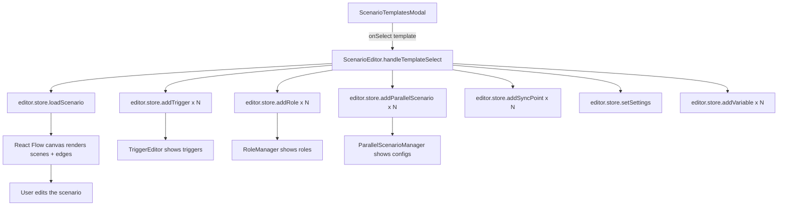

# План: Новые шаблоны и инструкция пользователя

## Общая архитектура

### Текущая проблема
Файл [`scenario-templates.ts`](apps/web/src/lib/scenario-templates/scenario-templates.ts) содержит 4 примитивных шаблона, которые не демонстрируют возможности редактора. Интерфейс [`ScenarioTemplate`](apps/web/src/lib/scenario-templates/scenario-templates.ts:5-15) содержит только `scenes` и `edges`.

### Решение
1. **Расширить `ScenarioTemplate`** — добавить поля для всех продвинутых фич
2. **Создать 9 новых шаблонов** — каждый демонстрирует конкретные возможности
3. **Удалить старые 4 шаблона**
4. **Добавить кнопку "Инструкция"** в модалку
5. **Создать страницу инструкции**

---

## 1. Расширение интерфейса ScenarioTemplate

**Файл:** [`apps/web/src/lib/scenario-templates/scenario-templates.ts`](apps/web/src/lib/scenario-templates/scenario-templates.ts)

Текущий интерфейс:
```typescript
export interface ScenarioTemplate {
  id: string;
  name: string;
  description: string;
  icon: string;
  color: string;
  difficulty: 'easy' | 'medium' | 'hard';
  estimatedTime: string;
  scenes: Scene[];
  edges: Edge[];
}
```

Новый интерфейс:
```typescript
export interface ScenarioTemplate {
  id: string;
  name: string;
  description: string;
  icon: string;
  color: string;
  difficulty: 'easy' | 'medium' | 'hard';
  estimatedTime: string;
  minPlayers?: string;        // NEW: "2-6", "6-12" и т.д.
  scenes: Scene[];
  edges: Edge[];
  // === NEW FIELDS ===
  triggers?: TriggerDefinition[];
  roles?: RoleDefinition[];
  parallelScenarios?: ParallelScenarioConfig[];
  syncPoints?: SyncPoint[];
  settings?: Partial<GameSettings>;
  variables?: VariableDefinition[];
  phaseConfig?: GamePhaseConfig;
  inventory?: InventoryItem[];
  crossScenarioComm?: CrossScenarioCommunication;
}
```

### Как шаблон применяется к редактору

В [`ScenarioEditor.tsx`](apps/web/src/components/editor-v2/ScenarioEditor.tsx:1106-1125) при выборе шаблона вызывается `onSelect(template)`, который загружает сцены и рёбра в store. Нужно также загружать:
- `triggers` → `store.addTrigger()` для каждого триггера
- `roles` → `store.addRole()` для каждой роли
- `parallelScenarios` → `store.addParallelScenario()` для каждого
- `syncPoints` → `store.addSyncPoint()` для каждого
- `settings` → `store.setSettings()`
- `variables` → `store.addVariable()` для каждой
- `inventory` → добавить в `settings.inventory`

---

## 2. Детальные спецификации шаблонов

### Шаблон 1: 🏙️ Схватка (Encounter)
| Поле | Значение |
|------|----------|
| **id** | `encounter-skvatka` |
| **name** | Схватка |
| **difficulty** | medium |
| **time** | 1-2 часа |
| **players** | 2-6 (команды) |
| **icon** | 🏙️ |
| **color** | `from-orange-500 to-red-500` |

**Сцены (7):**
1. **Старт** (`location`) — легенда, text-миссия "Напишите 'готов'"
2. **Точка 1** (`location`) — GPS-локация + text-миссия "Введите код с таблички"
3. **Точка 2** (`location`) — GPS-локация + QR-миссия "Отсканируйте QR на здании"
4. **Точка 3** (`location`) — GPS-локация + photo-миссия "Сфотографируйте объект"
5. **Точка 4** (`location`) — GPS-локация + code-миссия "Решите головоломку"
6. **Точка 5** (`location`) — GPS-локация + inventory_check "Введите все найденные коды"
7. **Финиш** (`location`) — финальная сцена

**Рёбра:** линейные, от Старта до Финиша

**Триггеры:**
- `onMissionComplete` (Точка 1-4) → `add_score` + бонус за скорость
- `onMissionComplete` (Точка 5) → `emit_event` "финал"

**Инвентарь:** `inventory_get` на каждой точке (код как предмет), `inventory_check` на точке 5

---

### Шаблон 2: 🧠 Мозговой штурм
| Поле | Значение |
|------|----------|
| **id** | `brainstorm` |
| **name** | Мозговой штурм |
| **difficulty** | easy |
| **time** | 30-60 мин |
| **players** | 1-10 |
| **icon** | 🧠 |
| **color** | `from-purple-500 to-pink-500` |

**Сцены (6):**
1. **Старт** (`location`) — правила, text "Напишите 'готов'"
2. **Раунд 1: Разминка** (`quiz`) — 5 choice-вопросов (по 30 сек)
3. **Раунд 2: Ребусы** (`quiz`) — 3 text-задания (ребусы)
4. **Раунд 3: Медиа** (`slide`) — вопросы по фото/видео
5. **Раунд 4: Ставки** (`quiz`) — choice с удвоением очков
6. **Финал** (`location`) — турнирная таблица, награждение

**Рёбра:** линейные

**LoopConfig:** на сцене Раунд 1 — `{ type: 'for', count: 5, counterVariable: 'round' }`

**Триггеры:**
- `onTimerEnd` → `show_notification` "Время вышло!"
- `onMissionComplete` → `add_score` (автоначисление)
- `onMissionComplete` (Раунд 4) → `set_variable` удвоение

**GamePhaseConfig:** фазы раунда (разминка → ребусы → медиа → ставки → финал)

---

### Шаблон 3: 📸 Фотоохота
| Поле | Значение |
|------|----------|
| **id** | `photohunt` |
| **name** | Фотоохота |
| **difficulty** | easy |
| **time** | 1-2 часа |
| **players** | 1-6 |
| **icon** | 📸 |
| **color** | `from-pink-500 to-rose-500` |

**Сцены (7):**
1. **Старт** (`location`) — тема фотоохоты "Цвета города"
2. **Задание 1** (`quiz`) — photo "Красный объект"
3. **Задание 2** (`quiz`) — photo "Необычная вывеска"
4. **Задание 3** (`quiz`) — photo "Креативное селфи"
5. **Задание 4** (`quiz`) — photo "Отражение"
6. **Голосование** (`custom`) — multiplayer voting
7. **Финиш** (`location`) — победитель

**Рёбра:** линейные

**MultiplayerMechanicConfig:** на сцене Голосование — `{ type: 'voting', duration: 120, autoComplete: true }`

**Триггеры:**
- `onMissionComplete` (Задания 1-4) → `show_notification` "Новое фото!"
- `onCustomEvent` "голосование_завершено" → `add_score` победителю

---

### Шаблон 4: 🗺️ Геокешинг (продвинутый)
| Поле | Значение |
|------|----------|
| **id** | `geocaching-advanced` |
| **name** | Геокешинг |
| **difficulty** | medium |
| **time** | 1-3 часа |
| **players** | 1-4 |
| **icon** | 🗺️ |
| **color** | `from-green-500 to-emerald-500` |

**Сцены (6):**
1. **Старт** (`location`) — получение карты и компаса (inventory_get)
2. **Тайник 1** (`location`) — GPS + QR → collect "ключ-1"
3. **Тайник 2** (`location`) — GPS + collect "карта"
4. **Тайник 3** (`location`) — GPS + code → collect "ключ-2"
5. **Тайник 4** (`location`) — GPS + inventory_check (ключ-1 + ключ-2)
6. **Финиш** (`location`) — клад найден!

**Рёбра:** линейные

**Условные переходы:** на вход в Тайник 4 — condition `inventory has ключ-1 AND inventory has ключ-2`

**Триггеры:**
- `onMissionFail` (Тайники) → `show_notification` подсказка
- `onItemGet` "ключ-1" → `show_notification` "Найден ключ 1/2"
- `onItemGet` "ключ-2" → `show_notification` "Найден ключ 2/2, идите к финальному тайнику!"

**Инвентарь:** `rusty_key`, `treasure_map`, `key_1`, `key_2` как предметы

---

### Шаблон 5: 🎯 Квиз-шоу
| Поле | Значение |
|------|----------|
| **id** | `quiz-show` |
| **name** | Квиз-шоу |
| **difficulty** | easy |
| **time** | 15-30 мин |
| **players** | 1-10 |
| **icon** | 🎯 |
| **color** | `from-yellow-500 to-orange-500` |

**Сцены (5):**
1. **Старт** (`location`) — приветствие, правила
2. **Раунды** (`loop`) — цикл из 5 раундов:
   - choice-вопрос
   - таймер 30 сек
   - голосование за лучший ответ
   - начисление очков
3. **Финальный раунд** (`quiz`) — удвоение ставок
4. **Турнирная таблица** (`slide`) — рейтинг
5. **Финиш** (`location`) — награждение

**Рёбра:** Старт → Раунды → Финальный раунд → Турнирная таблица → Финиш

**LoopConfig:** `{ type: 'for', count: 5, counterVariable: 'round' }`

**MultiplayerMechanicConfig:** voting (голосование за ответы)

**Триггеры:**
- `onMissionComplete` → `add_score`
- `onTimerEnd` → `show_notification` "Время вышло!"
- `onCustomEvent` "раунд_завершен" → `teleport` к следующему раунду

**GamePhaseConfig:** фазы раунда

---

### Шаблон 6: 🎭 Мафия
| Поле | Значение |
|------|----------|
| **id** | `mafia` |
| **name** | Мафия |
| **difficulty** | hard |
| **time** | 30-60 мин |
| **players** | 6-12 |
| **icon** | 🎭 |
| **color** | `from-gray-800 to-gray-600` |

**Сцены (5):**
1. **Старт** (`location`) — раздача ролей, text "Напишите 'готов'"
2. **Ночь** (`custom`) — параллельные сцены для каждой роли:
   - Мафия: голосование "Кого убить?"
   - Комиссар: выбор "Кого проверить?"
   - Доктор: выбор "Кого лечить?"
3. **День** (`custom`) — обсуждение + голосование на выбывание
4. **Цикл** (`loop`) — день/ночь пока не закончится игра
5. **Финиш** (`location`) — победа мирных или мафии

**Рёбра:** Старт → Ночь → День → Цикл → Финиш (с условием)

**Роли (4):**
- **Мирный** — `permissions: ['vote']`, `winCondition: allMafiaDead`
- **Мафия** — `permissions: ['vote', 'kill']`, `winCondition: allCiviliansDead`
- **Комиссар** — `permissions: ['vote', 'investigate']`, `winCondition: allMafiaDead`
- **Доктор** — `permissions: ['vote', 'heal']`, `winCondition: allMafiaDead`

**GamePhaseConfig:**
```typescript
{
  phases: [
    { id: 'night', name: 'Ночь', type: 'night', duration: 60, dayNightCycle: true, nextPhaseId: 'day', ... },
    { id: 'day', name: 'День', type: 'day', duration: 180, dayNightCycle: true, nextPhaseId: 'night', ... },
  ],
  cycleEnabled: true,
  cycleOrder: 'sequential',
  startPhaseId: 'night',
}
```

**ParallelScenarioConfig:** ночью — параллельные сцены для мафии, комиссара, доктора

**MultiplayerMechanicConfig:** voting (голосование на выбывание днём, выбор жертвы ночью)

**Триггеры:**
- `onRoleAssigned` → `show_notification` с описанием роли
- `onSceneEnter` "Ночь" → `emit_event` "ночь_началась"
- `onSceneEnter` "День" → `show_notification` "Кого убили прошлой ночью?"
- `onCustomEvent` "игра_закончена" → `teleport` к Финишу

---

### Шаблон 7: 🔍 Детектив
| Поле | Значение |
|------|----------|
| **id** | `detective` |
| **name** | Детектив |
| **difficulty** | medium |
| **time** | 40-60 мин |
| **players** | 1-6 |
| **icon** | 🔍 |
| **color** | `from-blue-700 to-indigo-700` |

**Сцены (8):**
1. **Старт** (`location`) — место преступления, осмотр
2. **Улика 1** (`location`) — inventory_get "Отпечатки"
3. **Улика 2** (`location`) — inventory_get "Записка"
4. **Улика 3** (`location`) — inventory_get "Оружие"
5. **Допрос** (`dialogue`) — диалог с подозреваемыми (ветвление)
6. **Дедукция** (`quiz`) — choice "Кто виновен?" (3 варианта)
7. **Финал А** (`location`) — виновный найден (правильный ответ)
8. **Финал Б** (`location`) — невиновный осуждён (неправильный ответ)

**Рёбра:**
- Старт → Улика 1 → Улика 2 → Улика 3 → Допрос → Дедукция
- Дедукция → Финал А (condition: choice correct)
- Дедукция → Финал Б (condition: choice incorrect)

**Инвентарь:** `fingerprints`, `note`, `weapon` как улики

**Триггеры:**
- `onItemGet` (все 3 улики) → `emit_event` "все_улики_собраны" + `show_notification` "Все улики собраны! Идите на допрос"
- `onMissionComplete` (Дедукция правильная) → `unlockAchievement` "Идеальный детектив"

**Achievement:** `{ id: 'perfect_detective', name: 'Идеальный детектив', description: 'Найдите виновного с первой попытки' }`

---

### Шаблон 8: 🏭 Экономическая стратегия
| Поле | Значение |
|------|----------|
| **id** | `economic-strategy` |
| **name** | Экономическая стратегия |
| **difficulty** | hard |
| **time** | 1-3 часа |
| **players** | 2-6 (команды) |
| **icon** | 🏭 |
| **color** | `from-amber-500 to-yellow-600` |

**Сцены (6):**
1. **Старт** (`location`) — выбор фракции/роли
2. **Добыча ресурсов** (`loop`) — цикл с таймером, collect-задания
3. **Крафт** (`custom`) — крафт предметов из ресурсов
4. **Торговля** (`custom`) — обмен между командами
5. **Аукцион** (`custom`) — редкие ресурсы
6. **Финиш** (`location`) — побеждает команда с наибольшим капиталом

**Рёбра:** Старт → Добыча → Крафт → Торговля → Аукцион → Финиш

**ParallelScenarioConfig:** 3 параллельных сценария (добыча, крафт, торговля) с синхронизацией

**CraftRecipe (3 рецепта):**
1. `wood_sword`: дерево(2) → меч
2. `iron_armor`: железо(3) + уголь(1) → броня
3. `potion`: трава(2) + вода(1) → зелье

**MultiplayerMechanicConfig:** auction (аукцион редких ресурсов)

**GlobalVariables:** `market_price_wood`, `market_price_iron`, `market_price_potion`

**GamePhaseConfig:** раунды экономики (утро-день-вечер)

---

### Шаблон 9: ⚔️ Battle Royale
| Поле | Значение |
|------|----------|
| **id** | `battle-royale` |
| **name** | Battle Royale |
| **difficulty** | hard |
| **time** | 1-2 часа |
| **players** | 4-20 |
| **icon** | ⚔️ |
| **color** | `from-red-700 to-orange-600` |

**Сцены (6):**
1. **Старт** (`location`) — выдача стартового лута (inventory_get)
2. **Раунды** (`loop`) — цикл:
   - Сужение зоны (триггер по таймеру)
   - Лутинг (collect/inventory_get)
   - PvP стычки (choice/голосования)
   - Крафт предметов
3. **Аукцион** (`custom`) — торговля лутом
4. **Финал** (`location`) — последний выживший

**Рёбра:** Старт → Раунды → Аукцион → Финал

**LoopConfig:** `{ type: 'while', condition: { operator: 'AND', conditions: [{ type: 'variable', operator: 'gt', left: 'alive_players', right: 1 }] }, maxIterations: 20 }`

**Инвентарь:** стартовый лут (weapon, armor, consumable), лутинг на сценах

**CraftRecipe:** крафт оружия/брони из лута

**MultiplayerMechanicConfig:** auction (торговля лутом)

**Триггеры:**
- `onTimerEnd` → `show_notification` "Зона сужается!" + `set_variable` уменьшение зоны
- `onCustomEvent` "игрок_выбыл" → `set_variable` alive_players -= 1
- `onVariableChange` "alive_players = 1" → `emit_event` "победа" + `teleport` к Финишу

**ParallelScenarioConfig:** параллельные сцены для разных зон карты

---

## 3. Кнопка "Инструкция" в модалке шаблонов

**Файл:** [`apps/web/src/components/editor-v2/ScenarioTemplatesModal.tsx`](apps/web/src/components/editor-v2/ScenarioTemplatesModal.tsx)

**Изменения:**
1. Добавить импорт `Link` из `next/link`
2. В footer модалки (после кнопки "Начать с пустого") добавить:
```tsx
<Link
  href="/help/editor-guide"
  target="_blank"
  className="btn-ghost text-sm flex items-center gap-1"
>
  📖 Инструкция по редактору
</Link>
```

---

## 4. Страница инструкции

**Файл:** [`apps/web/src/app/help/editor-guide/page.tsx`](apps/web/src/app/help/editor-guide/page.tsx)

**Тип:** статическая страница (Server Component, без 'use client')

**Структура:**

### 4.1. Введение
- Что такое редактор сценариев QuestForge
- Философия: не конструктор квестов, а операционная система для любых игр
- 6 примитивов: Scene, Action, State, Condition, Event, View

### 4.2. Быстрый старт
- Создание первого сценария
- Добавление сцен и связей
- Настройка миссий
- Предпросмотр и тестирование

### 4.3. Основные понятия
- **Сцены** — типы: location, quiz, dialogue, slide, custom, loop
- **Миссии** — типы: text, code, photo, gps, qr, choice, collect, dialogue, audio, video, image, inventory_get/spend/check, achievement
- **Переходы и связи** — auto, conditional, timer
- **Переменные** — глобальные и локальные, системные переменные

### 4.4. Продвинутые возможности
- **Система ролей** — создание ролей, permissions, win conditions
- **Конструктор условий** — Condition AST, AND/OR группы, операторы
- **Триггеры и события** — Trigger/Event System, 18 типов событий, 12 типов действий
- **Циклы** — for, while, forEach, защита от бесконечных циклов
- **Параллельные сценарии** — Multi-Scenario Architecture, SyncPoints
- **Инвентарь** — предметы, типы, редкость, стаки, вес
- **Крафт** — рецепты, ингредиенты, шанс успеха, кулдаун
- **Торговля** — обмен между командами, предложения
- **Фазы игры** — день/ночь, раунды, глобальные состояния
- **Мультиплеер** — голосования, аукционы, челленджи, одновременный выбор

### 4.5. AI-ассистент
- Как использовать AI для генерации сценариев
- Примеры промптов

### 4.6. Валидация и тестирование
- Панель валидации
- Тестовый режим
- Отладка триггеров

### 4.7. Публикация и экспорт
- Сохранение на сервер
- Экспорт в JSON
- Публикация в маркетплейс

### 4.8. Советы и лучшие практики
- Как проектировать сценарии
- Оптимизация производительности
- Типичные ошибки

---

## 5. Файлы для изменений

### Новые файлы:
| Файл | Описание |
|------|----------|
| [`apps/web/src/app/help/editor-guide/page.tsx`](apps/web/src/app/help/editor-guide/page.tsx) | Страница инструкции (Server Component) |

### Изменяемые файлы:
| Файл | Изменения |
|------|-----------|
| [`apps/web/src/lib/scenario-templates/scenario-templates.ts`](apps/web/src/lib/scenario-templates/scenario-templates.ts) | Полная замена: новый интерфейс + 9 шаблонов |
| [`apps/web/src/components/editor-v2/ScenarioTemplatesModal.tsx`](apps/web/src/components/editor-v2/ScenarioTemplatesModal.tsx) | Добавить кнопку "Инструкция" в footer |
| [`apps/web/src/components/editor-v2/ScenarioEditor.tsx`](apps/web/src/components/editor-v2/ScenarioEditor.tsx) | Обновить обработчик onSelect для загрузки triggers/roles/etc. |

---

## 6. Архитектура загрузки шаблона в редактор

При выборе шаблона в [`ScenarioEditor.tsx`](apps/web/src/components/editor-v2/ScenarioEditor.tsx:1106-1125) нужно:

```typescript
const handleTemplateSelect = (template: ScenarioTemplate) => {
  const store = useEditorStore.getState();
  
  // 1. Загружаем сцены и рёбра (уже есть)
  store.loadScenario({ scenes: template.scenes, edges: template.edges });
  
  // 2. Загружаем триггеры
  template.triggers?.forEach(t => store.addTrigger(t));
  
  // 3. Загружаем роли
  template.roles?.forEach(r => store.addRole(r));
  
  // 4. Загружаем параллельные сценарии
  template.parallelScenarios?.forEach(ps => store.addParallelScenario(ps));
  
  // 5. Загружаем точки синхронизации
  template.syncPoints?.forEach(sp => store.addSyncPoint(sp));
  
  // 6. Загружаем настройки
  if (template.settings) {
    store.setSettings({ ...store.settings, ...template.settings });
  }
  
  // 7. Загружаем переменные
  template.variables?.forEach(v => store.addVariable(v));
  
  // 8. Закрываем модалку
  setShowTemplates(false);
};
```

---

## 7. Диаграмма потока данных



---

## 8. Порядок выполнения

1. **Задача 1** — расширить `ScenarioTemplate` интерфейс (фундамент для всего)
2. **Задачи 2-10** — создать 9 шаблонов (можно параллельно, но лучше последовательно для консистентности)
3. **Задача 11** — кнопка "Инструкция" в модалке
4. **Задача 12** — страница инструкции
5. **Задача 13** — проверка сборки